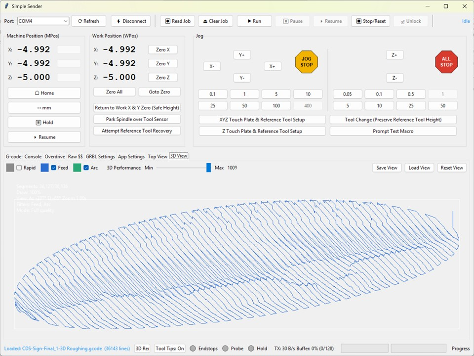
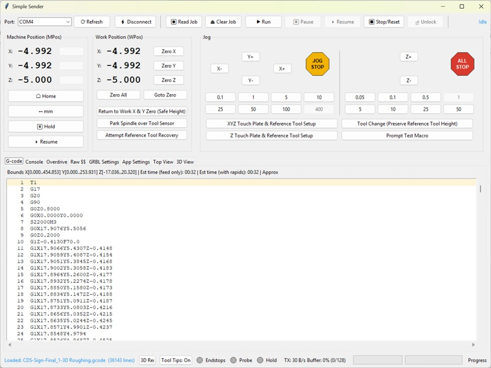
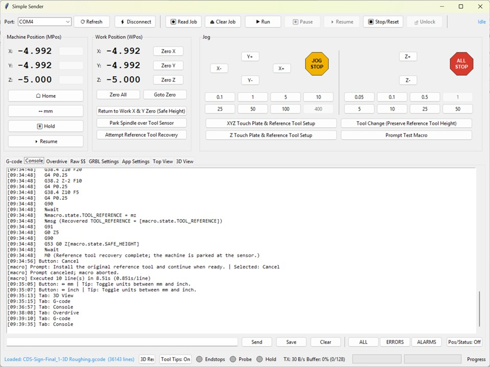
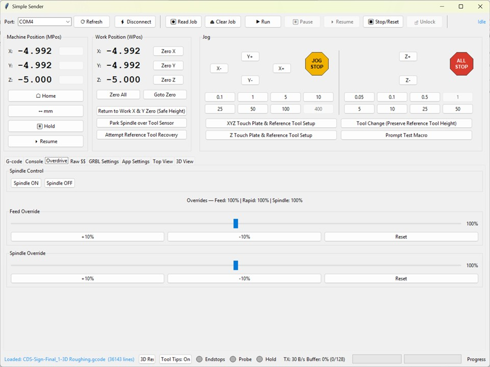
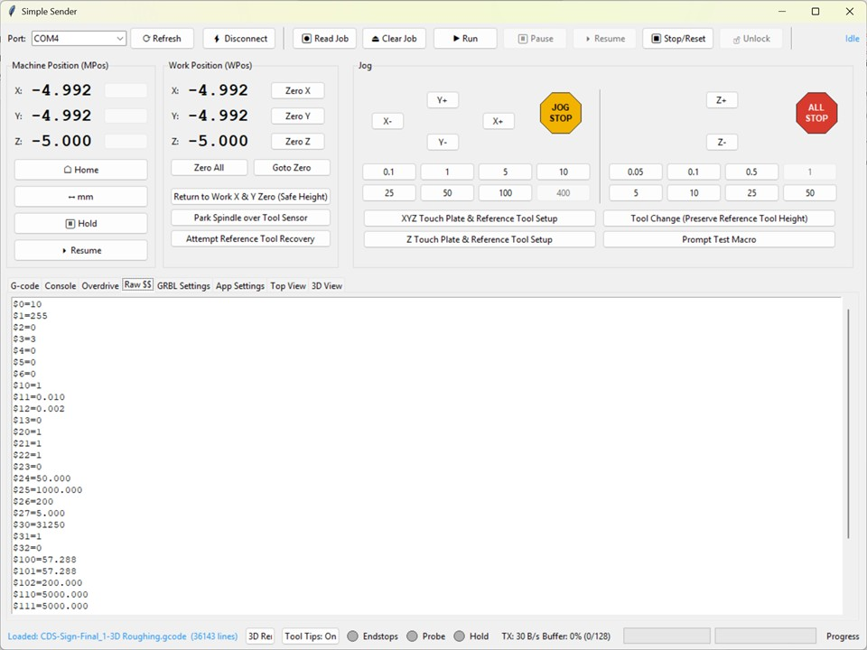
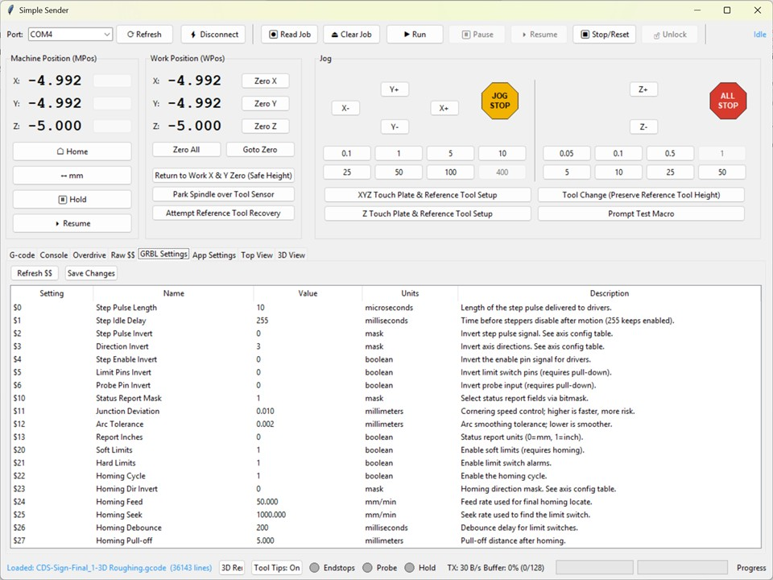
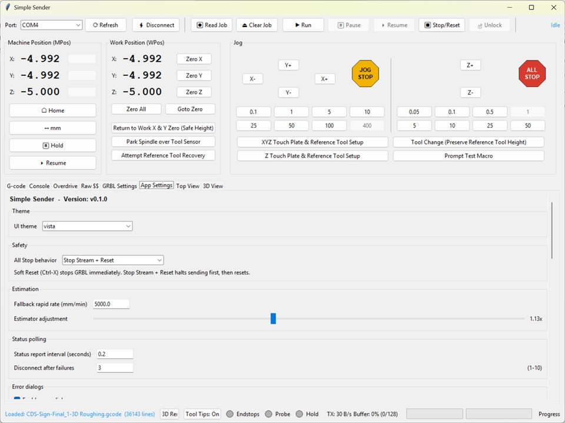
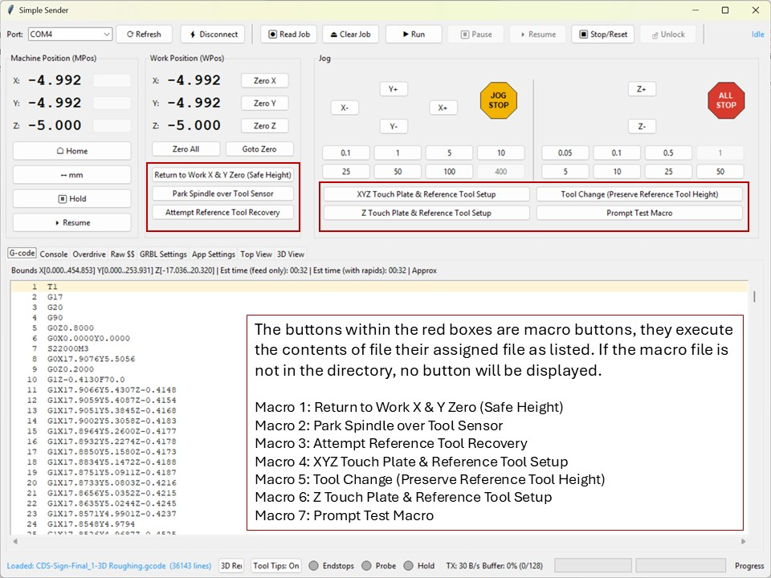

# Simple Sender - Full Manual

### Work in progress (alpha). Don't trust it until you've validated it a few times.

A minimal, reliable **GRBL 1.1h** sender for **3-axis** controllers. Built with **Python + Tkinter + pyserial**. This manual is the single place to learn, use, and troubleshoot the app.



> **Safety notice:** This is **alpha** software. Always test "in the air" with the spindle **off** before cutting material.

## Table of Contents
- [Overview](#overview)
- [Requirements & Installation](#requirements--installation)
- [Launching](#launching)
- [Safety Basics](#safety-basics)
- [Operation / Use Walkthrough](#operation--use-walkthrough)
- [Quick Start Workflow](#quick-start-workflow)
- [UI Tour](#ui-tour)
- [Core Behaviors](#core-behaviors)
- [Jobs, Files, and Streaming](#jobs-files-and-streaming)
- [Jogging & Units](#jogging--units)
- [Console & Manual Commands](#console--manual-commands)
- [GRBL Settings UI](#grbl-settings-ui)
- [Macros](#macros)
- [Estimation & 3D View](#estimation--3d-view)
- [Keyboard Shortcuts](#keyboard-shortcuts)
- [Joystick Bindings](#joystick-bindings)
- [Logs & Filters](#logs--filters)
- [Troubleshooting](#troubleshooting)
- [FAQ](#faq)
- [Appendix A: GRBL 1.1h Commands](#appendix-a-grbl-11h-commands)
- [Appendix B: GRBL 1.1h Settings](#appendix-b-grbl-11h-settings)
- [Appendix C: Macro Reference](#appendix-c-macro-reference)

## Overview
- Target: GRBL 1.1h, 3-axis.
- Character-count streaming with Bf-informed RX window; auto-compacts/splits long G-code lines to fit GRBL's 80-byte limit; live buffer fill and TX throughput.
- Alarm-safe: locks controls except unlock/home; Training Wheels confirmations for critical actions.
- Handshake: waits for banner + first status before enabling controls/$$.
- Read-only file load (Read G-code), clear/unload button, inline status/progress.
- Resume From... dialog to continue a job with modal re-sync and safety warnings.
- Performance mode: batches console updates, suppresses per-line RX logs during streaming, adapts status polling by state.
- Overdrive tab: spindle control plus feed/spindle override sliders (10-200%, 10% steps in GRBL 1.1h).
- Machine profiles for units + max rates; estimates prefer GRBL settings, then profile, then fallback.
- Idle status spam suppressed in console; filters for alarms/errors.
- Macros: left-click to run, right-click to preview.
- Auto-reconnect (configurable) to last port after unexpected disconnect.

## Requirements & Installation
- Python 3.x, Tkinter (bundled), pyserial, pygame (required for joystick bindings).

```powershell
python -m venv .venv
.\.venv\Scripts\Activate.ps1
pip install -r requirements.txt
```

Settings are stored in a per-user config folder (`%LOCALAPPDATA%\SimpleSender` on Windows or `$XDG_CONFIG_HOME/SimpleSender` on Linux). Override with `SIMPLE_SENDER_CONFIG_DIR`; if the directory cannot be created, the app falls back to `~/.simple_sender` or the app folder.

## Launching
```powershell
python main.py
```

## Safety Basics
- Test in air, spindle off.
- Configure homing/limits on the controller.
- Keep an e-stop/power cutoff reachable.
- ALL STOP behavior is configurable; use it for immediate halt.
- Only run trusted macro files.

## Operation / Use Walkthrough
This is a practical, end-to-end flow with rationale for key options.

1) **Connect and handshake**
   - Pick your COM port (auto-selects last if "Reconnect to last port on open" is enabled in App Settings).
   - Click Connect (Training Wheels may prompt). The app waits for the GRBL banner and first status before enabling controls and $$; this avoids startup races.
2) **Confirm machine readiness**
   - If the state is Alarm, use **Unlock ($X)** or **Home ($H)**. The top-bar Unlock is always available; it is safest to home if switches exist.
   - Use **Recover** to see alarm recovery steps and quick actions.
   - Verify limits/homing are configured in GRBL ($20/$21/$22) as needed.
   - Check DRO updates (MPos/WPos) to ensure status is flowing; idle status spam is muted in the console but still processed.
3) **Set units and jogging**
   - Use the unit toggle (mm/inch); jog commands insert the proper G20/G21.
   - Choose jog steps and test jogs with $J= moves; Jog Cancel (0x85) is available. Jogging is blocked during streaming/alarms.
4) **Load G-code**
   - Click **Read G-code**; file is read-only, comments/% lines stripped, chunked if large, and long lines are compacted or split to respect GRBL's 80-byte limit (unsplittable lines are rejected). Use **Clear G-code** to unload if needed.
   - Check the G-code viewer highlights and the 3D view (optional) for bounds sanity.
   - Review time/bounds estimates; if $110-112 are missing, set a fallback rapid rate or a Machine Profile in App Settings and adjust the estimate factor.
   - Use **Resume From...** to start at a specific line with modal re-sync if you need to continue a job.
5) **App safety options**
   - Training Wheels ON: confirms critical actions (run/pause/resume/stop/spindle/clear/unlock/connect).
   - ALL STOP mode: choose soft reset only, or stop-stream + reset (safer mid-job).
   - Auto-reconnect: enable if you want recovery after USB blips; disable for lab environments where auto-reconnect is not desired.
   - Performance mode: reduces console churn during streaming and adapts status polling; toggle it from the Interface block inside App Settings.
6) **Prepare the machine**
   - Home if required; set work offsets (Zero buttons use G92 by default). Enable persistent zeroing in App Settings > Zeroing to use G10 L20 offsets.
   - Position above stock; verify spindle control if using M3/M5 (or disable spindle in code for dry run).
   - Use the Overdrive tab to flip the spindle and fine-tune feed/spindle overrides via the slider controls plus +/-/reset shortcuts (10-200% range).
7) **Start and monitor**
   - Click **Run** (Training Wheels may prompt). Streaming uses character-counting flow control; buffer fill and TX throughput update as acks arrive.
   - Use **Pause/Resume** for feed hold/cycle start; **Stop/Reset** for soft reset; **ALL STOP** for immediate halt per your chosen mode.
8) **Alarms / errors**
   - On ALARM or error, streaming stops, queues clear, controls lock except Unlock/Home/ALL STOP. Use **Recover** to see a guided recovery panel.
   - Clear with $X/$H, re-home if needed, and resume or reload if appropriate.
9) **Settings and tuning**
   - Use GRBL Settings tab to refresh $$ (idle, not alarmed), edit values with numeric validation/ranges; pending edits highlight yellow until saved.
   - Raw $$ tab keeps the text capture.
10) **Macros**
   - Left-click to run; right-click to preview contents. Macros blocked during streaming/alarms; directives such as `%wait`, `%msg`, `%update`, `%if running`, `%if paused`, and `%if not running` guard how the macro executes.

## Quick Start Workflow
1) Launch, select port (auto-selects last if enabled), Connect.
2) Wait for GRBL banner + first status (Ready/Idle).
3) Read G-code file; optional Clear to unload.
4) Run (Training Wheels may confirm). Pause/Resume/Stop as needed.
5) Clear alarms with Unlock ($X) or Home ($H).

## UI Tour
- **Top bar:** Port picker, Refresh, Connect/Disconnect, Read G-code, Clear G-code, Run/Pause/Resume/Stop, Resume From..., Unlock, Recover, unit toggle (mm/inch).
- **Left panels:** MPos (Home/Unlock/Hold/Resume), WPos (Zero per-axis/All, Goto Zero), Jog pad (XY/Z, Jog Cancel, ALL STOP), step selectors, Macro buttons (if Macro-1..Macro-7 files exist).
- **Tabs:**
  - **G-code viewer:** Highlights sent/acked/current lines with subtle colors so you can track what has been queued, is in progress, and has already been acked.

    
  - **Console:** Log of GRBL traffic, filter buttons, and a manual command entry row with Pos/Status toggles for focused troubleshooting.

    
  - **Overdrive:** Spindle ON/OFF controls plus feed/spindle override sliders (10-200%) with a live override summary; feed/spindle sliders emit 10% real-time bytes (GRBL 1.1h limits).

    
  - **Raw $$:** Captures the raw settings dump from GRBL for quick copy/paste or archival.

    
  - **GRBL Settings:** Editable table with descriptions, tooltips, inline validation, and pending-change highlighting before you save values back to the controller.

    
  - **App Settings:** Banner showing `Simple Sender - Version: v1.2`, theme picker, ALL STOP mode, estimation factors/fallbacks + max-rate inputs, status polling controls, error dialog/job completion toggles, jogging defaults, macro scripting/keybinding toggles, zeroing mode, release checklist, current-line highlight mode, 3D-quality controls, Training Wheels, auto-reconnect, and the Interface block for Performance, button visibility, logging, and error-dialog controls.

    
  - **Top View:** Quick 2D plan trace of the loaded job with segment counts, view info, and the job-name overlay for fast bounds checks.

    
  - **3D View:** Rapid/Feed/Arc toggles, rotate/pan/zoom, save/load/reset view controls, and the full toolpath render that mirrors the Top View job marker.

    

- **Status bar:** Progress, buffer fill, TX throughput, status LEDs (Endstops/Probe/Hold), and the error-dialog status indicator (tooltips, 3D render, and keybinding toggles remain on the bar; logging/error-dialog controls moved into App Settings).

## Status Lights
- **Placement:** The LEDs sit inline with the status bar so they stay next to the logging/3D/keybinding toggles and provide a quick glance of machine triggers.
- **Meaning & data source:** GRBL 1.1h status reports include a `Pn:` token (e.g., `<Idle|Pn:XYZPDHRS|...>`). The indicators derive their state directly from those flags:
  - `X`, `Y`, `Z` light the **Endstops** indicator whenever those limit pins feed a high signal.
  - `P` (or `_macro_vars["PRB"]`) lights the **Probe** indicator, showing when a probe touch or macro-supplied probe result is active.
  - `H` or the textual **Hold** state lights the **Hold** LED while GRBL is paused/feed-hold.
- **How to use them:** Watch them before you jog to confirm no limits are stuck, rely on the Probe LED during probing macros, and note Hold when you issue `!`/`~`. They are purely informational; the rest of the UI still enforces streaming locks, alarms, and macro gating.

## Core Behaviors
- **Handshake:** Waits for GRBL banner or status + first status report before enabling controls/$$.
- **Training Wheels:** Confirms risky top-bar actions (connect/run/pause/resume/stop/spindle/clear/unlock) when enabled; debounced.
- **Auto-reconnect:** When not user-disconnected, retries last port with backoff; respects "Reconnect to last port on open".
- **Alarms:** ALARM:x, "[MSG:Reset to continue]", or status Alarm stop/clear queues, lock controls except Unlock/Home/ALL STOP; Recover button shows quick actions.
- **Performance mode:** Batches console updates, suppresses per-line RX logging during streaming, and adapts status polling by state.
- **Status polling:** Interval is configurable; consecutive status query failures trigger a disconnect.
- **Idle noise:** `<Idle|...>` not logged to console (still processed).

## Jobs, Files, and Streaming
- **Read G-code:** Strips BOM/comments/% lines; chunked loading for large files. Read-only; Clear unloads. Lines are validated for GRBL's 80-byte limit (including newline) and may be compacted or split in-memory; the file on disk is never modified.
- **Streaming:** Character-counting; uses Bf feedback to size the RX window; stops on error/alarm; buffer fill and TX throughput shown. Each line is counted with the trailing newline for buffer accounting.
- **Line length safety:** The loader first compacts lines (drops spaces/line numbers, trims zeros). If still too long, linear G0/G1 moves in G94 with X/Y/Z axes can be split into multiple segments; arcs, inverse-time moves, or unsupported axes must already fit or the load is rejected.
- **Stop / ALL STOP:** Stops queueing immediately, clears the sender buffers, and issues the configured real-time bytes. GRBL may still execute moves already in its own buffer; use a hardware E-stop for a hard cut.
- **Resume From...:** Resume at a line with modal re-sync (units, distance, plane, arc mode, feed mode, WCS, spindle/coolant, feed). Warns if G92 offsets are seen before the target line.
- **Progress:** Sent/acked/current highlighting (Processing highlights the line currently executing, i.e., the next line queued after the last ack; Sent shows the most recently queued line); status/progress bar; live estimate while running.
- **Completion alert:** When a job finishes streaming, a dialog summarizes the start/finish/elapsed wallclock so you know the file completed without monitoring the logs.

### Line length limitations and CAM guidance
- Long lines are only auto-split when they are linear G0/G1 moves in G94 with X/Y/Z axes. Arcs (G2/G3), inverse-time feed (G93), or lines with unsupported axes (A/B/C/U/V/W) must already be within 80 bytes, or the load is rejected.
- Recommended CAM post settings: disable line numbers if possible, reduce decimal places on coordinates (3-4 is usually enough for GRBL work), and avoid emitting long comment blocks or tool names inline with motion.
- If your CAM insists on long arc lines, consider switching to small linear segments (arc-to-line approximation) or reduce arc detail so each line fits under the limit.

## Jogging & Units
- $J= incremental jogs (G91) with unit-aware G20/G21; jog cancel RT 0x85.
- Unit toggle button flips mm/inch and label; jogs blocked during streaming/alarm.

## Console & Manual Commands
- Manual send blocked while streaming; during alarm only $X/$H allowed.
- Manual commands longer than GRBL's 80-byte limit are rejected.
- Filters: ALL / ERRORS / ALARMS plus a single Pos/Status toggle; when off those reports (and their carriage returns) are never written to the console, so you only see manual commands and errors unless you turn it back on.
- Performance mode batches console updates and suppresses per-line RX logs during streaming (alarms/errors still logged); toggle it from the App Settings Interface block.
- Manual command errors (e.g., from the console or settings writes) update the status bar with a source label and do not flip the stream state.
- Line-length errors include the original file line count and the non-empty cleaned line count; counts are reported as non-empty lines over the limit.
- Streaming errors pause the job (gSender-style) and report the file name, line number, and line text in the error status.
- Program pauses (M0/M1) and tool changes (M6) automatically pause the stream after the line is acknowledged.

## GRBL Settings UI
- Refresh $$ (idle, not alarmed, after handshake). Table shows descriptions; edits inline with numeric validation/ranges; pending edits highlighted until saved. Raw $$ tab holds capture.

## Macros
Macros live in `simple_sender/macros`, `macros/` beside `main.py`, or the directory that contains `main.py`. Look for files named `Macro-1`...`Macro-7` (legacy `Maccro-*` names and optional `.txt` extensions remain supported); the first line becomes the button label, the second line the tooltip, and every subsequent line executes when you run the macro. Macros are blocked while the controller is streaming, during alarms, or whenever the app disconnects, and they still respect Training Wheels confirmations.



### Execution & safety
Execution happens on a background worker that holds `_macro_lock`, so only one macro runs at a time. `_macro_send` waits for GRBL to finish each command (`wait_for_manual_completion`) and then polls for Idle before continuing. `%wait` uses a 30 s timeout (see `simple_sender/utils/constants.py`) while polling every 0.1 s, keeping commands synchronized. The runner aborts and releases the lock if GRBL raises an alarm, logging the offending line so you can recover.

`App Settings > Macros` exposes the `macros_allow_python` toggle. When scripting is disabled, any line that begins with `%` or `_`, contains `[`/`]`, or includes `=` raises a compile error, though raw GRBL commands still stream. When scripting is enabled you can run Python statements, execute `_` lines, and embed `[expression]` results directly into G-code.

Tool-reference macros store `TOOL_REFERENCE` from work Z (`wz`) because `G10 L20` writes the WCS Z offset. `%update` blocks until a fresh status report arrives, so `wx/wy/wz` are current before capture or adjustment. Before each macro run, the sender issues `$G`, waits for the modal update, snapshots the current modal state, and forces `G21` (mm) so the macros use their mm constants. The original units are restored automatically on completion; call `STATE_RETURN` (or `%state_return`) inside a macro to restore the full modal state (WCS/plane/units/distance/feedmode/spindle/coolant).

### Macro directives
| Directive | What it does | Example usage |
| --- | --- | --- |
| `%wait` | Pause until GRBL reports Idle before continuing; useful after long G1 moves so macros resume only when the controller is ready. | `G1 F3000 X10 Y10`<br>`%wait` |
| `%msg <text>` | Log `<text>` with the `[macro]` prefix; supports `[expression]` expansion for live values. | `%msg Probe wz=[wz]` |
| `%update` | Request a status report (`?`) and block until a fresh status arrives, so `[wx]`, `[wy]`, `[wz]`, `[curfeed]`, etc., reflect the latest controller state. | `%update` |
| `%if running` | Skip the current line unless a stream is already running (the app sets `_macro_vars["running"]` true for active or paused jobs). | `%if running G0 Z5` |
| `%if paused` | Execute the line only while streaming is paused, so recovery steps (e.g., retracting Z) stay blocked during active runs. | `%if paused G0 Z10` |
| `%if not running` | Skip the current line while a stream is active so setup steps only run when the controller is idle. | `%if not running G0 Z0` |

All directives above operate through the modal interpreter implemented in `main.py` and work with GRBL 1.1h because they merely gate G-code streaming or request standard status bytes (`?`). `%wait` relies on the GRBL Idle state reported by `<Idle|...>` lines, `%update` sends the conventional real-time status command, and `%msg` logs without touching the controller.

### Helper commands
| Command | Description | Example usage |
| --- | --- | --- |
| `M0`, `M00`, `PROMPT` | Show the macro prompt dialog. Customize `title=`, `msg=`/`message=`/`text=`, `buttons=`, `[btn(...)]`, `resume=`, `cancellabel=`, etc., and read `prompt_choice*` afterward. | `PROMPT message=Pause before X0 Y0? buttons=Continue|Abort` |
| `ABSOLUTE`, `ABS` | Send `G90` so the next moves use machine coordinates. | `ABSOLUTE` |
| `RELATIVE`, `REL` | Send `G91` for incremental jog sequences. | `REL` |
| `HOME` | Run homing, which issues the same `$H` or homing cycle as the UI buttons. | `HOME` |
| `OPEN [timeout_s]` | Connect if disconnected and wait for connection (default 10s). Useful for macros that need GRBL before streaming commands. | `OPEN 15` |
| `CLOSE [timeout_s]` | Disconnect when connected and wait for close (default 10s). | `CLOSE 5` |
| `HELP` | Show a fixed macro help dialog (no GRBL interaction). | `HELP` |
| `QUIT`, `EXIT` | Close the application cleanly. | `QUIT` |
| `LOAD <path>` | Load a specific G-code file (`app._load_gcode_from_path`), then let the macro stream it. | `LOAD C:\jobs\test.nc` |
| `UNLOCK` | Send `$X` to clear alarms, the same command used in the UI. | `UNLOCK` |
| `RESET` | Send soft reset (`Ctrl-X`). | `RESET` |
| `PAUSE`, `FEEDHOLD` | Hold the stream (`!`). | `PAUSE` |
| `RESUME`, `RUN` | Resume or start streaming (`~`). | `RUN` |
| `STOP` | Stop streaming and clear the queue (`stop_stream`). | `STOP` |
| `SAVE` | Unsupported; logs `[macro] SAVE is not supported.`. | `SAVE` |
| `SENDHEX <xx>` | Send raw real-time byte `0xXX`. | `SENDHEX 91` |
| `SAFE <value>` | Update `_macro_vars["safe"]`, a helper the UI uses for safe heights. | `SAFE 10` |
| `STATE_RETURN` | Restore the modal state snapshot captured when the macro started (WCS/plane/units/distance/feedmode/spindle/coolant); `%state_return` is accepted as shorthand. | `STATE_RETURN` |
| `SET0` | Send `G92 X0 Y0 Z0`. | `SET0` |
| `SETX`, `SETY`, `SETZ` | Zero a single axis with `G92`. | `SETZ 2` |
| `SET <X> <Y> <Z>` | Zero only the axes you specify. | `SET 0 50` |
| `!`, `~`, `?`, `Ctrl-X` | Send feed hold, cycle start, status request, or soft reset as real-time bytes. | `!` |

Each helper command forwards the equivalent GRBL real-time or `$` command, so they behave exactly as the buttons and manual console inputs do when connected to a GRBL 1.1h controller.

Lines that begin with `$`, `@`, `{`, `(`, or `;`, or that match `MACRO_GPAT` (`[A-Za-z]\s*[-+]?\d+.*`), stream verbatim as raw GRBL commands or comments, so you can reuse existing G-code without modification.

### System variables
Every macro shares access to `_macro_vars`. The following keys hold live data you can read or update in Python lines, `%msg`, or `[expression]` blocks:

| Variable | Meaning & example |
| --- | --- |
| `prbx`, `prby`, `prbz` | Last probe coordinates; retract with `G0 Z[prbz]` after a `G38.2` probe. |
| `prbcmd` | Probe command (`G38.2` by default); change it before sending custom probes. |
| `prbfeed` | Probe feed rate; use `[prbfeed]` inside a `G38.2 F[prbfeed]` line. |
| `errline` | Last macro line that triggered a compile/runtime failure; log it for diagnostics. |
| `wx`, `wy`, `wz` | Work coordinates (WPos); refer to them as `[wx]`, `[wy]`, `[wz]` when building expressions. |
| `mx`, `my`, `mz` | Machine coordinates (MPos); compare them against WPos to detect offsets. |
| `wa`, `wb`, `wc` | Auxiliary G-code axes (if the controller reports them). |
| `ma`, `mb`, `mc` | Auxiliary machine axes mirrors. |
| `wcox`, `wcoy`, `wcoz`, `wcoa`, `wcob`, `wcoc` | Work coordinate offsets (WCO); rebuild a move with `G0 X[wcox] Y[wcoy]`. |
| `curfeed`, `curspindle` | Feed/spindle from the `FS:` field; log `%msg FS=[curfeed]/[curspindle]`. |
| `_camwx`, `_camwy` | Camera/CAM coordinates from non-GRBL sources; helpful for vision-assisted macros. |
| `G` | List of modal G-code words the parser has seen; read it after hacks that change modal states. |
| `TLO` | Tool length offset; use `[TLO]` during touch-plate moves. |
| `motion`, `distance`, `plane`, `feedmode`, `arc`, `units`, `WCS`, `cutter`, `tlo`, `program`, `spindle`, `coolant` | Tokens that mirror the current modal context; include them in `%msg` for auditing. |
| `tool` | Current tool number; branch macros before a tool change. |
| `feed` | Last feed rate; log `%msg feed=[feed]` before altering overrides. |
| `rpm` | Estimated spindle RPM, derived from `FS` or override sliders. |
| `planner`, `rxbytes` | Planner buffer usage and remaining `Bf:` bytes; guard long moves with `if rxbytes < 30: %wait`. |
| `OvFeed`, `OvRapid`, `OvSpindle`, `_OvFeed`, `_OvRapid`, `_OvSpindle`, `_OvChanged` | Override values plus a flag that flips when sliders move; read them to slow macros when the user dials overrides down. |
| `diameter`, `cutfeed`, `cutfeedz`, `surface`, `thickness`, `stepz`, `stepover`, `safe` | Helper constants for tooling; update them from macros (`safe = 6`). |
| `state` | Latest GRBL state (`Idle`, `Run`, `Hold`, `Alarm`); `%if running` uses this indirectly. |
| `pins` | Pin summary from GRBL; check it before probing to ensure the probe pin is ready. |
| `msg` | Last `MSG` block; common after `G38` probes or startup messages. |
| `PRB` | Last structured probe report (mirrors `_macro_vars["PRB"]`). |
| `version`, `controller` | Firmware metadata; include it in logs for traceability. |
| `running` | `True` while a stream runs or is paused; `%if running` checks this state. |
| `paused` | `True` only while streaming is paused; `%if paused` gates lines that should execute during interruptions. |
| `prompt_choice`, `prompt_choice_label`, `prompt_choice_key`, `prompt_index`, `prompt_cancelled` | Results after `M0/M00/PROMPT`; branch logic accordingly. |
| `macro` | `types.SimpleNamespace(state=SimpleNamespace())`; store persistent values with `macro.state.last_probe = ...`. |

Add your own entries (e.g., `_macro_vars["my_flag"] = True`) when you want data to survive between lines or macros.

### Sharing variables between macros
Macros share `macro.state` across runs, so you can store a value in one macro and reuse or update it in another. Example:

```text
Save stock top
Store the current work Z so later macros can reuse it.
%macro.state.STOCK_TOP = wz
%msg Stored stock top (wz) in macro.state.STOCK_TOP
```

```text
Return to stock top + lift
Use the stored value, then adjust it for the next operation.
G90
G0 Z[macro.state.STOCK_TOP]
%macro.state.STOCK_TOP = macro.state.STOCK_TOP + 2.0
%msg Lifted; macro.state.STOCK_TOP updated
```

### Python expressions, loops, and new variables
When scripting is enabled, prefix a line with `_` or simply write a Python statement (`=`) to run it. The interpreter injects `app` and `os` so you can call `app._log(...)`, `app._call_on_ui_thread(...)`, or inspect `app.connected`. Square brackets evaluate Python expressions before streaming, such as `G0 Z[_macro_vars["safe"] + pass_num * 0.5]`.

Python loops behave like any other Python code:

```text
_safe_height = max(float(_macro_vars.get("safe", 3.0)), 4.0)
for pass_num in range(3):
    target = _safe_height + pass_num * 2.0
    _macro_vars["last_target"] = target
    %msg Pass [pass_num + 1]: raising to Z[target]
    G0 Z[target]
    %wait
```

This snippet shows math helpers, storing custom variables, logging with `%msg`, and waiting for each pass to complete.

### GUI prompts & blocking
`M0`, `M00`, and `PROMPT` block the macro until the operator chooses a button. Prompt tokens such as `buttons=Resume|Cancel`, `[btn(Continue)c]`, `resume=Go`, or `noresume` control which buttons appear, and the choice is stored in `_macro_vars`/`macro.prompt_choice*`. `%wait` blocks until Idle, `_macro_send` waits for completion plus `_macro_wait_for_idle()`, and the executor aborts if GRBL reports an alarm (logging the line) or a stream appears unexpectedly.

### Example macro (loop + prompt + GUI hooks)
```text
Safe park
Raise, loop, and prompt before parking at X0 Y0.
_safe_height = max(float(_macro_vars.get("safe", 3.0)), 5.0)
for index in range(2):
    target = _safe_height + index * 1.5
    _macro_vars["park_pass"] = index + 1
    %msg Pass [index + 1] moving to Z[target]
    G90
    G0 Z[target]
    %wait
PROMPT title=Continue buttons=Next Pass|Abort message=Run another pass?
G0 X0 Y0
%msg Parked after pass [prompt_choice_index + 1].
```

This routine combines loops, variable assignments, `%msg`, `%wait`, and a GUI prompt, and stores the pass number so later macros can inspect `park_pass`.

## Estimation & 3D View
- Estimates bounds, feed time, rapid time (uses $110-112, then machine profile, then fallback) with factor slider; shows "fallback" or "profile" when applicable. Live remaining estimate during streaming.
- 3D View: Rapid/Feed/Arc legend toggles, rotate/pan/zoom, live position marker, save/load/reset view; quality controls (draw limits, arc detail, lightweight preview) live in App Settings.

## Keyboard Shortcuts
- Configurable (up to 3-key sequences); conflicts flagged; ignored while typing; toggle from App Settings or the status bar. Training Wheels confirmations still apply.

## Joystick Bindings
- Pygame (the same pygame used by `ref/test.py`) must be installed before the app can talk to USB sticks; install dependencies with `python -m pip install -r requirements.txt` (or `python -m pip install pygame` if you skipped it), then start the sender from a console so you can watch the status messages while configuring bindings.
- App Settings -> Keyboard Shortcuts now has a Joystick testing frame above the table: it reports detected controllers, echoes the most recent event, and houses the `Refresh joystick list` button with the `Enable USB Joystick Bindings` toggle sitting to its right. When bindings are enabled and no joystick is present, newly plugged controllers are discovered automatically; use Refresh if you add or swap controllers while one is already connected.
- Click a row's `Joystick` column to listen (it momentarily shows "Listening for joystick input..."); the testing area logs the incoming joystick event and the cell records the button/axis/hat plus direction so the table shows which input is bound. Press `X Remove/Clear Binding` in the same row to drop a mapping.
- While the `Enable USB Joystick Bindings` toggle is on, the sender listens for joystick presses and triggers the matching action just like a keyboard shortcut; when you're done, toggle it off to stop polling. Every custom joystick binding is saved in the settings file so it survives restarts.
- When the toggle is left on before closing, the app now reopens with joystick capturing enabled automatically (just like auto-reconnecting to the last serial port), so you can pick up where you left off without another click.
- The Keyboard Shortcuts list now exposes six additional `X- (Hold)`, `X+ (Hold)`, `Y- (Hold)`, `Y+ (Hold)`, `Z- (Hold)`, and `Z+ (Hold)` entries. When you bind a joystick button to one of them and hold the button, the matching axis jogs continuously (the same feed rates as the jog buttons); the motion stops as soon as the button is released, giving you a "jog-to-hold" behavior from the joystick.
- The app now prevents a single joystick button/axis/hat from being assigned to more than one UI control - binding it again to another action automatically clears the prior assignment so there's no ambiguity in the list.
- Use `python ref/test.py` when you just want to confirm that pygame detects the controller before using the GUI.

## Logs & Filters
- Console filters cover ALL/ERRORS/ALARMS plus the combined Pos/Status switch that omits those reports entirely when disabled; idle status spam stays muted. GUI button logging toggle remains, and performance mode (toggled from App Settings > Interface) batches console output and suppresses RX logs while streaming; jog/ALL STOP hotkeys (Space/Enter defaults).

## Troubleshooting
- No ports: install driver, try another cable/port.
- Connect fails: verify port/baud 115200; close other apps.
- No $$: wait for ready/status; clear alarms; stop streaming.
- Alarm: use $X/$H; reset + re-home if needed.
- Streaming stops: check console for error/alarm; validate G-code for GRBL 1.1h.
- Load fails with 80-byte limit: check for long arcs/inverse-time moves or unsupported axes and re-post with shorter lines.
- 3D slow: toggle 3D render off.

## Pre-release Notes
1. Settings path resolution now comes from the shared `get_settings_path()` helper in `simple_sender/utils/config.py`, so UI settings and the settings store use the same fallback logic (`%LOCALAPPDATA%`/`$XDG_CONFIG_HOME` -> `~/.simple_sender`).
2. `main.py:391` - There is a single `MacroExecutor.notify_alarm` implementation again, which continues to set `_alarm_event` and log the contextual alarm snippet so macros unblock and the log shows which line triggered the alarm.
3. `main.py:4938` - `last_port` defaults to `None`, so the new `(self.settings.get("last_port") or "").strip()` guard ensures auto-reconnect processing no longer calls `.strip()` on `None` when no prior port has been saved yet.

## FAQ
- **4-axis or grblHAL?** Not supported (3-axis GRBL 1.1h only).
- **Why $$ deferred?** Avoids startup interleaving so the connection handshake completes before we refresh the settings table.
- **Why strict alarms?** Safety; matches ref senders.
- **Persistent offsets (G10)?** Swap zero commands if desired.

## License
GPL-3.0-or-later (c) 2026 Bob Kolbasowski


## Appendix A: GRBL 1.1h Commands
The sender exposes a curated subset of GRBL's real-time, system, and motion commands. Below is the syntax and an example for each group.

### Real-time bytes (no newline)
| Command | Syntax | Notes / Example |
| --- | --- | --- |
| Soft reset | `Ctrl-X` | Immediately halts motion and resets GRBL. Example: used by **Stop/Reset** and ALL STOP (reset mode). |
| Status report | `?` | Requests `<State|WPos|FS:...>` update (used by tooltips/estimations). |
| Feed hold | `!` | Pauses execution (used for **Pause**). |
| Cycle start / resume | `~` | Resumes execution after hold or start a job (used for **Resume**/**Run**). |
| Jog cancel | `0x85` | Stops a `$J=` jog (bound to **JOG STOP**). |
| Feed override +10%/-10%/reset | `0x91` / `0x92` / `0x90` | Matches the buttons in the Feed Override panel. |
| Spindle override +10%/-10%/reset | `0x9A` / `0x9B` / `0x99` | Tied to the Spindle Override controls. |

### System (`$`) commands
| Command | Syntax | Example |
| --- | --- | --- |
| Help / info | `$` | Prints current build/config hints in the console. |
| Print settings | `$$` | Captures settings table (refresh button). |
| Coordinate report | `$#` | Shows offsets and workspace coordinates (rarely used). |
| Build info | `$I` | Logs firmware version and capabilities. |
| Startup lines | `$N` | Lists GRBL startup macro lines. |
| Reset settings | `$RST=*`, `$RST=$`, `$RST=#` | Soft resets stored settings/config. |
| Unlock | `$X` | Clears alarms; exposed via **Unlock** buttons. |
| Home | `$H` | Runs the homing cycle from the UI. |
| Jog command | `$J=...` | Used by the jog pad/button macros; syntax `G91 X... Y... Z... F...`. |
| Check mode | `$C` | Only available when GRBL is idle; reports planner buffer. |
| Sleep | `$SLP` | Puts GRBL into low-power mode (not exposed by default). |

### Common G-code commands used via UI / macros
| Command | Syntax | Example | Notes |
| --- | --- | --- | --- |
| Absolute positioning | `G90` | `G90` before a `G0 X10` move | Ensures subsequent moves use machine coordinates. |
| Relative positioning | `G91` | `G91` before `$J=` jog | Temporarily switches to incremental mode. |
| Units | `G20` or `G21` | `G21` when working in millimeters | The unit toggle sends the proper command automatically. |
| Zero work coords | `G92` / `G10 L20` | `G92 X0 Y0 Z0` (zero all buttons) | Sender uses G92 by default; enable persistent zeroing to switch the buttons to `G10 L20`. |
| Motion | `G0`, `G1`, `G2`, `G3` | `G0 Z10` or `G2 X1 Y1 I0 J1` | Standard rapid/linear/arc commands used in macros. |
| Dwell | `G4` | `G4 P1` | Macro `%wait` uses similar concepts (but there is also the `%wait` directive). |
| Spindle on/off | `M3 S<rpm>` / `M5` | `M3 S12000` (button default) / `M5` | Spindle buttons log these commands via `attach_log_gcode`. |

Use the console or macros whenever you need a command that is not exposed via buttons - every `G` current GRBL command can be typed manually. The tables above capture the commands that the UI, macros, and override controls leverage most heavily.


## Appendix B: GRBL 1.1h Settings (selected)

- $0 Step pulse, us
- $1 Step idle delay, ms
- $2 Step port invert mask
- $3 Direction port invert mask
- $4 Step enable invert
- $5 Limit pins invert
- $6 Probe pin invert
- $10 Status report mask
- $11 Junction deviation, mm
- $12 Arc tolerance, mm
- $13 Report inches (0/1)
- $20 Soft limits (0/1)
- $21 Hard limits (0/1)
- $22 Homing enable (0/1)
- $23 Homing dir invert mask
- $24 Homing feed, mm/min
- $25 Homing seek, mm/min
- $26 Homing debounce, ms
- $27 Homing pull-off, mm
- $30 Max spindle speed, RPM
- $31 Min spindle speed, RPM
- $32 Laser mode (0/1)
- $100/$101/$102 Steps/mm (X/Y/Z)
- $110/$111/$112 Max rate, mm/min (X/Y/Z)
- $120/$121/$122 Max accel, mm/sec^2 (X/Y/Z)
- $130/$131/$132 Max travel, mm (X/Y/Z)

Use the Settings tab to edit; pending edits highlight in yellow until sent. Numeric validation and broad ranges are enforced; adjust as needed for your machine. 


## Appendix C: Macro Reference

| Macro | Purpose | When to use | When to avoid | Code notes |
| --- | --- | --- | --- | --- |
| Macro-1: Return to Work X & Y Zero (Safe Height) | Raises to a safe Z before moving to X0 Y0 so you can reset work coordinates without crashing. | When you need a quick safe return to the origin before setting offsets. | Avoid while actively executing a job; use only when motion is paused. | Defines `%macro.state.SAFE_HEIGHT` and uses `M5`, `G53 G0`, and `%wait` so moves execute away from the workpiece. |
| Macro-2: Park Spindle over Tool Sensor | Drives to the fixed probe location so you can clean the sensor or stage fixtures. | Park the spindle for maintenance or measurement after a job finishes. | Don't use while cutting or while the spindle is still rotating. | Stores `PROBE_X/Y_LOCATION` in `%macro.state` and issues `G53 G0` so the coordinates ignore any applied offsets. |
| Macro-3: Attempt Reference Tool Recovery | Re-probes the reference tool when the stored `TOOL_REFERENCE` is missing, then saves the result. | Run after a crash or failed recovery to restore the reference measurement. | Skip if `macro.state.TOOL_REFERENCE` already exists; the macro exits early if the reference is present. | Guards with `%if getattr(macro.state, "TOOL_REFERENCE", None) is not None` and stores `TOOL_REFERENCE` from `wz` (work Z) so `G10 L20` uses the correct WCS. |
| Macro-4: XYZ Touch Plate & Reference Tool Setup | Probes the touch plate (Z/X/Y) and captures the reference tool height for later restorations. | Use during initial calibration or whenever the touch plate setup changes. | Don't run during a production cycle; the routine assumes the tool is free to move to the plate. | Mixes fast and slow probing commands with `G92` offsets before updating `%macro.state.TOOL_REFERENCE` from `wz` (work Z). |
| Macro-5: Tool Change (Preserve Reference Tool Height) | Moves to the sensor, prompts for a tool swap, re-probes, and applies the stored reference height again. | Run every time you need to change tools without losing reference height. | Avoid if the reference tool hasn't been captured yet; the macro prompts you to run Macro-1/2/4 first. | Uses `%msg` + `PROMPT` to warn about missing references, then sends `G10 L20 Z[macro.state.TOOL_REFERENCE]` after probing to keep offsets consistent. |
| Macro-6: Z Touch Plate & Reference Tool Setup | Sets X/Y manually, runs a Z touch-plate probe, and restores the reference tool height. | Useful when job-specific positions require manual X/Y placement before probing Z. | Don't run if you expect the machine to maintain `wx/wy` automatically; it stores the start position in `%macro.state.START_X/Y`. | Captures `wx`/`wy`, probes Z with `G38.2`, stores `%macro.state.TOOL_REFERENCE` from `wz`, and logs the new height. |
| Macro-7: Prompt Test Macro | Validates the new modal/dialog helpers (default Resume/Cancel, `[btn(...)]` choices, and follow-up confirmations). | Run when you want to test the prompt UX or document how custom buttons behave. | Not for production motion; it's purely a UI verification script. | Demonstrates `[title(...)]`, `[btn(...)]`, and reads `macro.prompt_choice_key`/`macro.prompt_choice_label` in follow-up `%msg`/`PROMPT` lines. |
