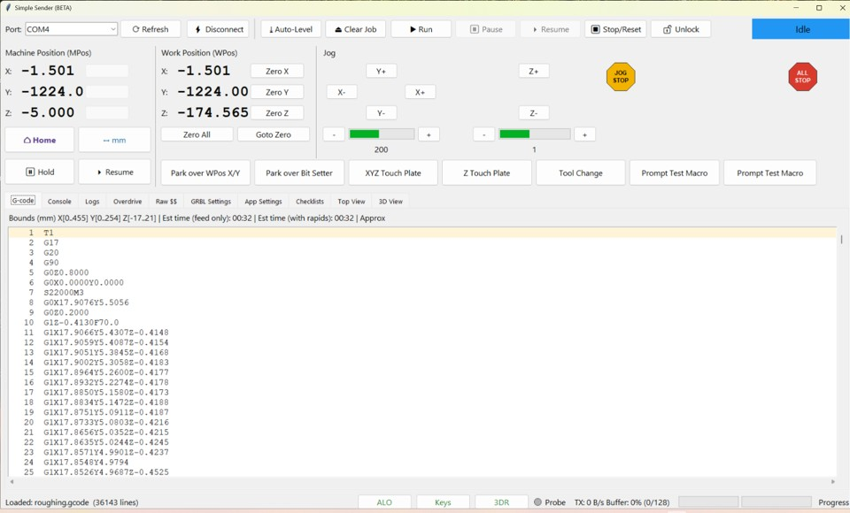
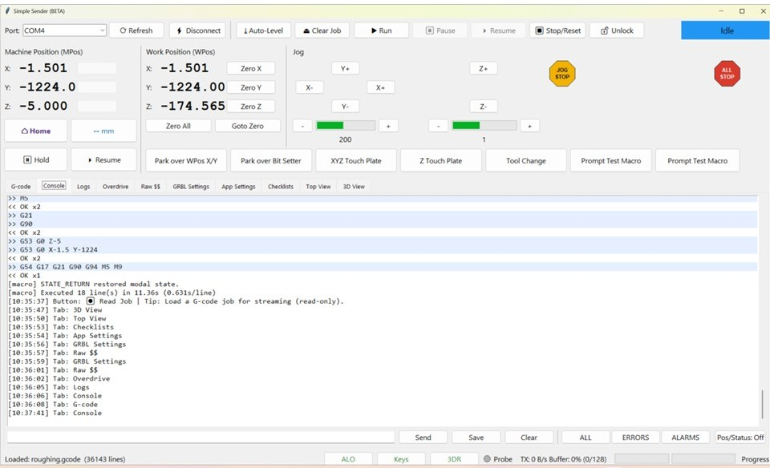
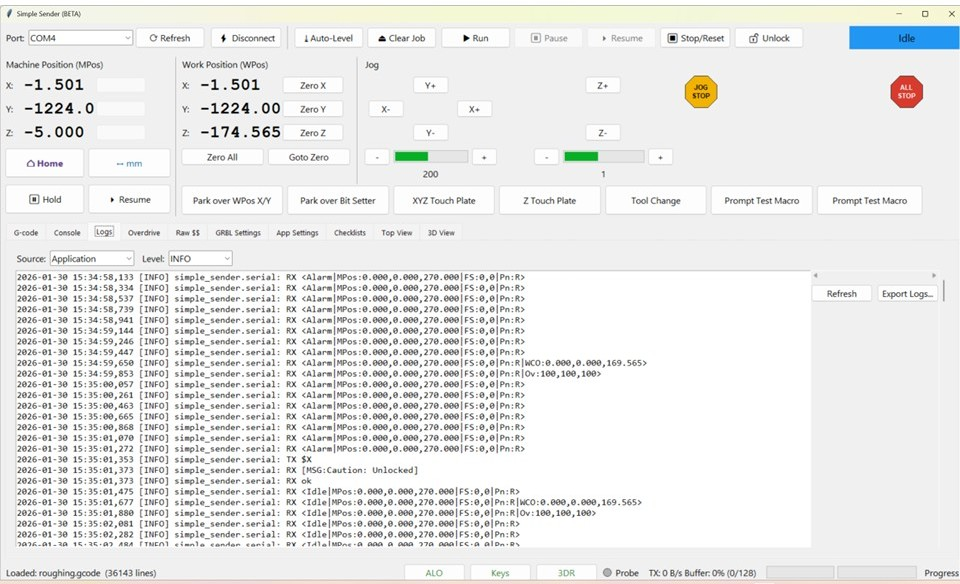
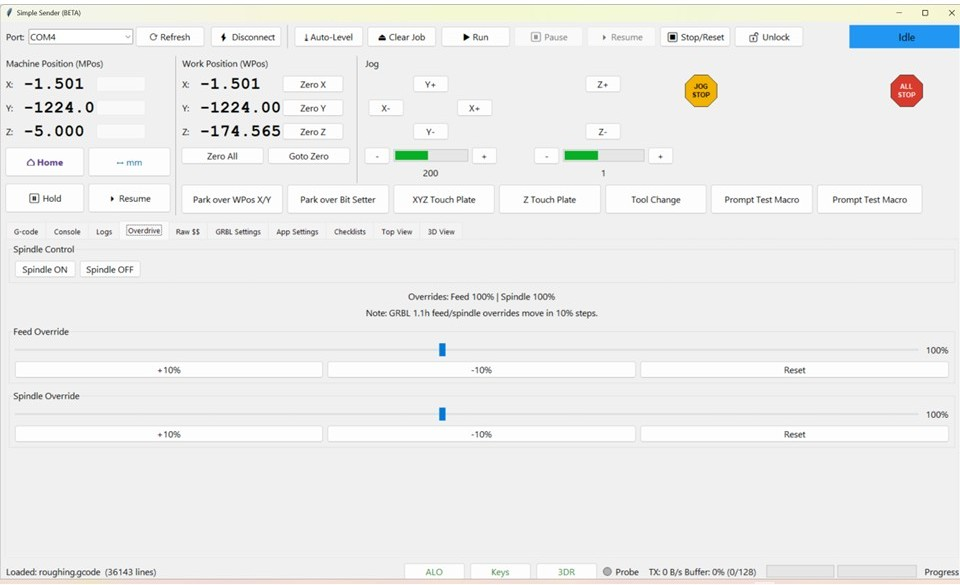
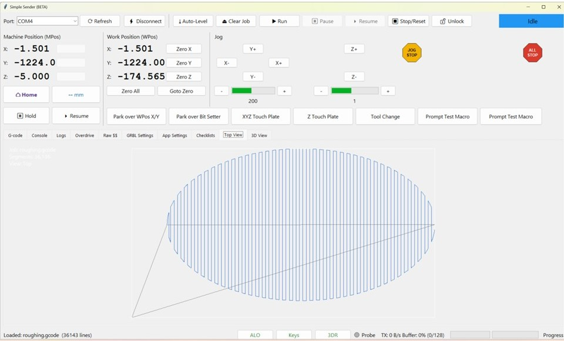
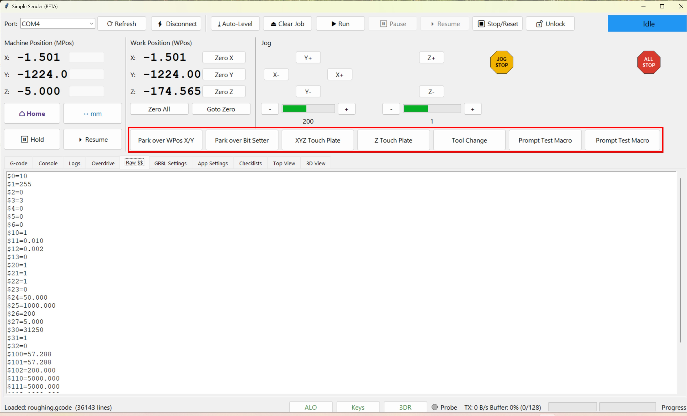

# Simple Sender - Full Manual

    

### Work in progress (beta). Don't trust it until you've validated it a few times.

A minimal **GRBL 1.1h** sender for **3-axis** controllers. Built with **Python + Tkinter + pyserial**. This manual is the single place to learn, use, and troubleshoot the app.


> **Safety notice:** This is **beta** software. Always test "in the air" with the spindle **off** before cutting material.

## Table of Contents
- [Overview](#overview)
- [Requirements & Installation](#requirements--installation)
- [Launching](#launching)
- [Safety Basics](#safety-basics)
- [Operation / Use Walkthrough](#operation--use-walkthrough)
- [Quick Start Workflow](#quick-start-workflow)
- [UI Tour](#ui-tour)
- [Core Behaviors](#core-behaviors)
- [Jobs, Files, and Streaming](#jobs-files-and-streaming)
- [Jogging & Units](#jogging--units)
- [Console & Manual Commands](#console--manual-commands)
- [GRBL Settings UI](#grbl-settings-ui)
- [Macros](#macros)
- [Estimation & 3D View](#estimation--3d-view)
- [Auto-Leveling](#auto-leveling)
- [Spoilboard Generator](#spoilboard-generator)
- [Probing Workflow](#probing-workflow)
- [Keyboard Shortcuts](#keyboard-shortcuts)
- [Joystick Bindings](#joystick-bindings)
- [Logs & Filters](#logs--filters)
- [Testing](#testing)
- [Module Layout](#module-layout)
- [Performance Profiling](#performance-profiling)
- [Troubleshooting](#troubleshooting)
- [Change Summary (since 1.2)](#change-summary-since-12)
- [FAQ](#faq)
- [Appendix A: GRBL 1.1h Commands](#appendix-a-grbl-11h-commands)
- [Appendix B: GRBL 1.1h Settings](#appendix-b-grbl-11h-settings)
- [Appendix C: Macro Reference](#appendix-c-macro-reference)
- [Appendix D: UI Field Appendix](#appendix-d-ui-field-appendix)

## Overview
- Target: GRBL 1.1h, 3-axis.
- Character-count streaming with Bf-informed RX window; auto-compacts/splits long G-code lines to fit GRBL's 80-byte limit; send-time ASCII/line-length checks; live buffer fill and TX throughput.
- Alarm-safe: locks controls except unlock/home; Training Wheels confirmations for critical actions.
- Handshake: waits for banner + first status before enabling controls/$$.
- Read-only file load (Read Job), clear/unload button, inline status/progress.
- Status bar shows streaming file name when a job is running.
- Top View 2D preview with live spindle position marker.
- Resume From... dialog to continue a job with modal re-sync and safety warnings (defaults to the last error line when present).
- Tooltips for every control; disabled buttons explain why (streaming, disconnected, alarm).
- Performance mode: batches console updates and suppresses per-line RX logs during streaming.
- Overdrive tab: spindle control, Spoilboard Generator, and feed/spindle override sliders (10-200%, 10% steps in GRBL 1.1h).
- Idle status spam suppressed in console; filters for alarms/errors.
- Run preflight safety gate checks readiness/bounds/validation before streaming, with explicit operator override.
- Diagnostics include session report export plus backup bundle import/export (settings, macros, checklists).
- Macros: left-click to run, right-click to preview, with in-app Macro Manager for edit/duplicate/reorder.
- Auto-reconnect (configurable) to last port after unexpected disconnect.

## Requirements & Installation
- Python 3.10+, Tkinter (bundled), pyserial, pygame (required for joystick bindings).

```powershell
python -m venv .venv
.\.venv\Scripts\Activate.ps1
pip install -r requirements.txt
```

Development dependencies are pinned in `requirements-dev.txt` to match the current toolchain.

Settings are stored in a per-user config folder (`%LOCALAPPDATA%\SimpleSender` or `%APPDATA%\SimpleSender` on Windows, or `$XDG_CONFIG_HOME/SimpleSender` on Linux). Override with `SIMPLE_SENDER_CONFIG_DIR`; if the directory cannot be created, the app falls back to `~/.simple_sender`, then a `SimpleSender` folder under your temp directory, and finally the app folder.

## Launching
```powershell
python main.py
```

## Safety Basics
- Test in air, spindle off.
- Configure homing/limits on the controller.
- Keep an e-stop/power cutoff reachable.
- ALL STOP behavior is configurable; use it for immediate halt.
- Only run trusted macro files.

## Operation / Use Walkthrough
This is a practical, end-to-end flow with rationale for key options.

1) **Connect and handshake**
   - Pick your COM port (auto-selects last if "Reconnect to last port on open" is enabled in App Settings).
   - Click Connect (Training Wheels may prompt). The button enters a short `Connecting...`/`Disconnecting...` pending state to prevent double-click races, and the app waits for the GRBL banner and first status before enabling controls and $$.
2) **Confirm machine readiness**
   - If the state is Alarm, use **Unlock ($X)** or **Home ($H)**. The top-bar Unlock is always available; it is safest to home if switches exist.
   - Use **Recover** to see alarm recovery steps and quick actions.
   - Verify limits/homing are configured in GRBL ($20/$21/$22) as needed.
   - Check DRO updates (MPos/WPos) to ensure status is flowing; idle status spam is muted in the console but still processed.
3) **Set units and jogging**
   - Use the unit toggle (mm/inch); jog commands insert the proper G20/G21.
   - Choose jog steps and test jogs with $J= moves; Jog Cancel (0x85) is available. Jogging is blocked during streaming/alarms.
   - For first-time setup, use Safe mode in App Settings > Jogging to set conservative jog feeds and step sizes.
4) **Load G-code**
   - Click **Read Job** (auto-switches to the G-code tab after selection); file is read-only, comments/% lines stripped, chunked if large, and long lines are compacted or split to respect GRBL's 80-byte limit (unsplittable lines are rejected). After a job loads, the same button flips to **Auto-Level** for quick access; **Clear Job** returns it to **Read Job**.
   - Check the G-code viewer highlights and the 3D view (optional) for bounds sanity.
   - Review time/bounds estimates; if $110-112 are missing, set a fallback rapid rate or a Machine Profile in App Settings and adjust the estimate factor.
   - Optional: run the Preflight check in **App Settings > Diagnostics** to catch validation issues before running.
   - Use **Resume From...** to start at a specific line with modal re-sync if you need to continue a job.
5) **App safety options**
   - Training Wheels ON: confirms critical actions (run/pause/resume/stop/spindle/clear/unlock/connect).
   - ALL STOP mode: choose soft reset only, or stop-stream + reset (safer mid-job).
   - Auto-reconnect: enable if you want recovery after USB blips; disable for lab environments where auto-reconnect is not desired.
   - Performance mode: reduces console churn during streaming; toggle it from the Interface block inside App Settings.
  6) **Prepare the machine**
     - Home if required; set work offsets (Zero buttons use G92 by default). Enable persistent zeroing in App Settings > Zeroing to use G10 L20 offsets.
     - Position above stock; verify spindle control if using M3/M5 (or disable spindle in code for dry run).
     - For dry runs, enable **Dry run: disable spindle/coolant/tool changes while streaming** in the **Checklists** tab > Safety.
     - Use the Overdrive tab to flip the spindle, generate spoilboard surfacing G-code, and fine-tune feed/spindle overrides via the slider controls plus +/-/reset shortcuts (10-200% range).
  7) **Start and monitor**
     - Click **Run** (Training Wheels may prompt). Before streaming starts, a preflight safety gate checks job/controller readiness and bounds; when failures are present, operators can choose to stop or explicitly override and continue.
     - Streaming uses character-counting flow control; buffer fill and TX throughput update as acks arrive. The Run confirmation includes a G-code validation report (unsupported codes, GRBL warnings, long lines, modal hazards). For large streaming files, validation only appears when "Validate streaming (large) G-code files" is enabled in App Settings; otherwise the report is unavailable.
     - Use **Pause/Resume** for feed hold/cycle start; **Stop/Reset** for soft reset; **ALL STOP** for immediate halt per your chosen mode.
8) **Alarms / errors**
   - On ALARM or error, streaming stops, queues clear, controls lock except Unlock/Home/ALL STOP. Use **Recover** to see a guided recovery panel.
   - Clear with $X/$H, re-home if needed, and resume or reload if appropriate.
   - When enabled, non-blocking GRBL popups show timestamp, code number, and definition for known `ALARM:x` / `error:x` responses. Duplicate popups are deduped by code for the configured interval.
9) **Settings and tuning**
   - Use GRBL Settings tab to refresh $$ (idle, not alarmed), edit values with numeric validation/ranges; pending edits highlight yellow until saved.
   - Raw $$ tab keeps the text capture.
10) **Macros**
   - Left-click to run; right-click to preview contents. Macros blocked during streaming/alarms; directives such as `%wait`, `%msg`, `%update`, `%if running`, `%if paused`, and `%if not running` guard how the macro executes.

## Quick Start Workflow
1) Launch, select port (auto-selects last if enabled), Connect.
2) Wait for GRBL banner + first status (Ready/Idle).
3) Read Job file; optional Clear Job to unload.
4) Run (Training Wheels may confirm). Pause/Resume/Stop as needed.
5) Clear alarms with Unlock ($X) or Home ($H).

## UI Tour
- **Top bar:** Port picker, Refresh, Connect/Disconnect, Read Job / Auto-Level (same button; Auto-Level appears after a job is loaded), Clear Job, Run/Pause/Resume/Stop, Resume From..., Unlock, Recover, unit toggle (mm/inch).

- **Hints:** Hover any control for tooltips; disabled controls include the reason (not connected, streaming, alarm, etc.). Tooltips auto-wrap and clamp to the visible screen so long hints (including GRBL settings text) stay on-screen. After clicking a control, its tooltip stays hidden until you move off that control and hover it again.

- **Left panels:** MPos (Home/Unit toggle/Hold/Resume), WPos (Zero per-axis/All, Goto Zero), Jog pad (XY/Z, Jog Cancel, ALL STOP), step selectors (-/+ with indicator), Macro buttons (if Macro-1..Macro-8 files exist).

- **Tabs:**
  - **G-code viewer:** Highlights sent/acked/current lines with subtle colors so you can track what has been queued, is in progress, and has already been acked.

    
  
  - **Console:** Log of GRBL traffic, filter buttons, and a manual command entry row with Pos/Status toggles for focused troubleshooting.
  
    
    
  - **Logs:** Read-only viewer for application/serial/UI/error logs with source + level filters and export.
  
    

  - **Overdrive:** Spindle ON/OFF controls, a Spoilboard Generator button, plus feed/spindle override sliders (10-200%) with a live override summary; feed/spindle sliders emit 10% real-time bytes (GRBL 1.1h limits).
  
    
    
  - **Raw $$:** Captures the raw settings dump from GRBL for quick copy/paste or archival.
  
    
    
  - **GRBL Settings:** Editable table with descriptions, tooltips, inline validation, and pending-change highlighting before you save values back to the controller.

    
    
  - **App Settings:** Version banner plus sections for Interface (fullscreen, Resume/Recover buttons, Auto-Level toggle, performance mode, GUI logging, status indicators, status-bar quick buttons + quick toggles), Theme (theme, UI scale, scrollbar width, tooltips + duration, numeric keypad), Viewer (current-line highlight + 3D streaming refresh), Jogging defaults + Safe mode, Zeroing mode, Keyboard shortcuts + joystick safety, Macro scripting, Estimation, Auto-Level presets, Diagnostics (preflight check/gate tools, session report export, backup bundle import/export, streaming validation + threshold), Safety (ALL STOP, dry run sanitize, homing watchdog), Safety Aids (Training Wheels, reconnect on open), Status polling, Error dialogs, and Linux-only System power controls.
  
    
  
  - **Checklists:** Release/run checklists loaded from `checklist-*.chk` files, including the Release/Run checklist dialogs and the status-bar Release quick button.
  
    
    
  - **Top View:** Quick 2D plan trace of the loaded job with segment counts, view info, and the job-name overlay for fast bounds checks.
  
    
    
  - **3D View:** Rapid/Feed/Arc toggles, 3D Performance slider (quality vs speed), rotate/pan/zoom, save/load/reset view controls, and the full toolpath render that mirrors the Top View job marker.
  
    
  
- **Status bar:** Progress, buffer fill, TX throughput, status LEDs (Endstops/Probe/Hold), the error-dialog status indicator, and quick buttons for Tips, 3D Render (3DR), Keys, Auto-Level Overlay (ALO), and Release (toggleable in App Settings; logging/error-dialog controls live there too).

## Status Lights
- **Placement:** The LEDs sit inline with the status bar so they stay next to the quick buttons (Tips, 3D Render, Keys, Auto-Level Overlay, Release) and provide a quick glance of machine triggers.
- **Meaning & data source:** GRBL 1.1h status reports include a `Pn:` token (e.g., `<Idle|Pn:XYZPDHRS|...>`). The indicators derive their state directly from those flags:
  - `X`, `Y`, `Z` light the **Endstops** indicator whenever those limit pins feed a high signal.
  - `P` (or `_macro_vars["PRB"]`) lights the **Probe** indicator, showing when a probe touch or macro-supplied probe result is active.
  - `H` or the textual **Hold** state lights the **Hold** LED while GRBL is paused/feed-hold.
- **How to use them:** Watch them before you jog to confirm no limits are stuck, rely on the Probe LED during probing macros, and note Hold when you issue `!`/`~`. They are purely informational; the rest of the UI still enforces streaming locks, alarms, and macro gating.

## Core Behaviors
- **Handshake:** Waits for GRBL banner or status + first status report before enabling controls/$$.
- **Connect lifecycle:** Connect/Disconnect enters a temporary pending state (`Connecting...` / `Disconnecting...`) so repeated clicks do not start overlapping workers.
- **Training Wheels:** Confirms risky top-bar actions (connect/run/pause/resume/stop/spindle/clear/unlock) when enabled; debounced.
- **Auto-reconnect:** When not user-disconnected, retries last port with backoff; respects "Reconnect to last port on open".
- **Alarms:** ALARM:x, "[MSG:Reset to continue]", or status Alarm stop/clear queues, lock controls except Unlock/Home/ALL STOP; Recover button shows quick actions.
- **GRBL popups:** Optional non-blocking alarm/error popup includes code definitions; auto-dismiss and dedupe intervals are configurable in App Settings > Error dialogs.
- **Performance mode:** Batches console updates and suppresses per-line RX logging during streaming.
- **Diagnostics:** Preflight check summarizes bounds/validation, Run enforces the preflight safety gate (with operator override prompt), diagnostics export captures recent status/console history, and backup bundles cover settings/macros/checklists (App Settings > Diagnostics).
- **Status polling:** Interval is configurable; consecutive status query failures trigger a disconnect.
- **Idle noise:** `<Idle|...>` not logged to console (still processed).
- **Tooltips:** Available for all buttons/fields; disabled controls append a reason. Tooltips are wrapped and screen-bounded. After clicking a widget, that widget's tooltip is suppressed until the pointer leaves and re-enters. Toggle with the Tips button in the status bar or App Settings.

## Jobs, Files, and Streaming
- **Read Job:** Strips BOM/comments/% lines; chunked loading for large files. Read-only; Clear unloads. The G-code tab becomes active after you pick a file. After a job loads, the same toolbar button becomes **Auto-Level**; **Clear Job** returns it to **Read Job**. For normal (non-streaming) loads, lines are validated for GRBL's 80-byte limit (including newline) and may be compacted or split in-memory; the file on disk is never modified. For streaming (large) loads triggered by file size or line count (tunable in App Settings > Diagnostics), the same compaction/splitting rules are applied and the sender streams from a processed temp file so Resume From... still works.
- **Streaming:** Character-counting; uses Bf feedback to size the RX window; stops on error/alarm; buffer fill and TX throughput shown. Each line is counted with the trailing newline for buffer accounting, and outbound lines are rejected if they exceed 80 bytes or contain non-ASCII characters.
- **Top View / 3D for large files:** Streaming loads build a Top View preview from the full file with a capped segment count to keep the UI responsive. The 3D view is disabled by default in streaming mode; the 3D Render (3DR) toggle prompts before enabling a full 3D render.
- **Line length safety:** For non-streaming loads, the loader first compacts lines (drops spaces/line numbers, trims zeros). If still too long, linear G0/G1 moves in G94 with X/Y/Z axes can be split into multiple segments; arcs, inverse-time moves, or unsupported axes must already fit or the load is rejected. Streaming loads use the same compaction/splitting rules; unsplittable lines are rejected if they exceed 80 bytes, and send-time checks enforce the limit. Auto-level output is post-processed to meet the 80-byte limit before it reloads.
- **System commands:** GRBL system commands (lines starting with `$`, e.g., `$H`) are rejected in job files; run them from the UI or a macro instead.
- **Stop / ALL STOP:** Stops queueing immediately, clears the sender buffers, and issues the configured real-time bytes. GRBL may still execute moves already in its own buffer; use a hardware E-stop for a hard cut.
- **Resume From...:** Resume at a line with modal re-sync (units, distance, plane, arc mode, feed mode, WCS, spindle/coolant, feed). Warns if G92 offsets are seen before the target line. If a stream error occurred, the dialog defaults to that line.
- **Progress:** Sent/acked/current highlighting (Processing highlights the line currently executing, i.e., the next line queued after the last ack; Sent shows the most recently queued line); status/progress bar; live estimate while running.
- **Completion alert:** When enabled, the job-complete dialog summarizes the start/finish/elapsed wallclock and flashes the progress bar until acknowledged; you can also enable a completion beep.

### Line length limitations and CAM guidance
- Long lines are only auto-split when they are linear G0/G1 moves in G94 with X/Y/Z axes. Arcs (G2/G3), inverse-time feed (G93), or lines with unsupported axes (A/B/C/U/V/W) must already be within 80 bytes, or the load is rejected.
- Recommended CAM post settings: disable line numbers if possible, reduce decimal places on coordinates (3-4 is usually enough for GRBL work), and avoid emitting long comment blocks or tool names inline with motion.
- If your CAM insists on long arc lines, consider switching to small linear segments (arc-to-line approximation) or reduce arc detail so each line fits under the limit.

## Jogging & Units
- $J= incremental jogs (G91) with unit-aware G20/G21; jog cancel RT 0x85.
- Joystick hold-jog bindings (`X/Y/Z +/- (Hold)`) send one long jog command per press, then stop with jog-cancel on release.
- Hold-jog distance targets remaining travel when GRBL max travel (`$130/$131/$132`) and machine position are known; otherwise a conservative long move is used and release still cancels motion.
- If joystick communication/backend is lost during hold-jog (device unplugged, backend failure, polling error, or bindings disabled), the active jog is cancelled immediately.
- Unit toggle button flips mm/inch and label; jogs blocked during streaming/alarm.
- Safe mode (App Settings > Jogging) sets conservative jog feeds and steps for first-time setup.

## Console & Manual Commands
- Manual send blocked while streaming; during alarm only $X/$H allowed.
- Manual commands longer than GRBL's 80-byte limit are rejected; non-ASCII commands are rejected.
- Filters: ALL / ERRORS / ALARMS plus a single Pos/Status toggle; when off those reports (and their carriage returns) are never written to the console, so you only see manual commands and errors unless you turn it back on.
- Performance mode batches console updates and suppresses per-line RX logs during streaming (alarms/errors still logged); toggle it from the App Settings Interface block.
- Manual command errors (e.g., from the console or settings writes) update the status bar with a source label and do not flip the stream state.
- Line-length errors include the original file line count and the non-empty cleaned line count; counts are reported as non-empty lines over the limit.
- Streaming errors pause the job (gSender-style) and report the file name, line number, and line text in the error status.
- Program pauses (M0/M1) and tool changes (M6) automatically pause the stream after the line is acknowledged.
- Console Save pre-fills a timestamped filename (`simple_sender_console_YYYYMMDD_HHMMSS.txt`) for touch-friendly export.

## GRBL Settings UI
- Refresh $$ (idle, not alarmed, after handshake). The table is scrollable, shows descriptions, supports inline numeric validation/ranges, and keeps pending edits highlighted until saved. Raw $$ tab holds capture.

## Macros
Macros live in `simple_sender/macros`, `macros/` beside `main.py`, or the directory that contains `main.py`. Look for files named `Macro-1`...`Macro-8` (legacy `Maccro-*` names and optional `.txt` extensions remain supported).

Macro file header format:
- Line 1: button label.
- Line 2: tooltip text.
- Line 3: button color (`#RRGGBB`, `#RGB`, named color like `red`, or `color: ...`/`color=...`). Leave blank if unused.
- Line 4: button text color (`#RRGGBB`, `#RGB`, named color, or `text_color: ...`/`foreground: ...`/`fg: ...`). Leave blank if unused.
- Remaining lines: executed macro body.

Macros are blocked while the controller is streaming, during alarms, or whenever the app disconnects, and they still respect Training Wheels confirmations. If the macro file is not in the directory, no button will be displayed.
`App Settings > Macros` also provides `Probe Z start (machine, mm)` and `Probe safety margin (mm)` values used by the touch-plate/tool-reference flows, plus **Open Macro Manager** for in-app editing, duplication, and reordering of Macro-1..Macro-8.



### Execution & safety
Execution happens on a background worker that holds `_macro_lock`, so only one macro runs at a time. `_macro_send` waits for GRBL to finish each command (`wait_for_manual_completion`) and then polls for Idle before continuing. `%wait` uses a 30 s timeout (see `simple_sender/utils/constants.py`) while polling every 0.1 s, keeping commands synchronized. The runner aborts and releases the lock if GRBL raises an alarm, logging the offending line so you can recover.

Macro scripting remains fully open, and runtime hardening is applied around it: line-level failures are logged with line numbers, audit entries (`[macro][audit]`) record raw/evaluated/outcome details (with GUI logging enabled), and timeout guards can abort stalled runs. By default both macro timeouts are disabled (`0`), and you can tune them in App Settings > Macros (line timeout and total timeout).

`App Settings > Macros` exposes the `macros_allow_python` toggle. When scripting is disabled, only plain G-code lines plus `%wait/%msg/%update` directives and comment-only `key=value` lines are allowed; `_` lines, `[expression]`, and assignments inside non-comment lines are blocked. When scripting is enabled you can run Python statements, execute `_` lines, and embed `[expression]` results directly into G-code.

Tool-reference macros store `TOOL_REFERENCE` from work Z (`wz`) because `G10 L20` writes the WCS Z offset. `%update` blocks until a fresh status report arrives, so `wx/wy/wz` are current before capture or adjustment. Before each macro run, the sender issues `$G`, waits for the modal update, snapshots the current modal state, and forces `G21` (mm) so the macros use their mm constants. The original units are restored automatically on completion; call `STATE_RETURN` (or `%state_return`) inside a macro to restore the full modal state (WCS/plane/units/distance/feedmode/spindle/coolant).

### Macro directives
| Directive | What it does | Example usage |
| --- | --- | --- |
| `%wait` | Pause until GRBL reports Idle before continuing; useful after long G1 moves so macros resume only when the controller is ready. | `G1 F3000 X10 Y10`<br>`%wait` |
| `%msg <text>` | Log `<text>` with the `[macro]` prefix; supports `[expression]` expansion for live values. | `%msg Probe wz=[wz]` |
| `%update` | Request a status report (`?`) and block until a fresh status arrives, so `[wx]`, `[wy]`, `[wz]`, `[curfeed]`, etc., reflect the latest controller state. | `%update` |
| `%if running` | Skip the current line unless a stream is already running (the app sets `_macro_vars["running"]` true for active or paused jobs). | `%if running G0 Z5` |
| `%if paused` | Execute the line only while streaming is paused, so recovery steps (e.g., retracting Z) stay blocked during active runs. | `%if paused G0 Z10` |
| `%if not running` | Skip the current line while a stream is active so setup steps only run when the controller is idle. | `%if not running G0 Z0` |

All directives above operate through the macro executor (`simple_sender/macro_executor.py`) and work with GRBL 1.1h because they merely gate G-code streaming or request standard status bytes (`?`). `%wait` relies on the GRBL Idle state reported by `<Idle|...>` lines, `%update` sends the conventional real-time status command, and `%msg` logs without touching the controller.

### Helper commands
| Command | Description | Example usage |
| --- | --- | --- |
| `M0`, `M00`, `PROMPT` | Show the macro prompt dialog. Customize `title=`, `msg=`/`message=`/`text=`, `buttons=`, `[btn(...)]`, `resume=`, `cancellabel=`, etc., and read `prompt_choice*` afterward. | `PROMPT message=Pause before X0 Y0? buttons=Continue|Abort` |
| `ABSOLUTE`, `ABS` | Send `G90` so the next moves use machine coordinates. | `ABSOLUTE` |
| `RELATIVE`, `REL` | Send `G91` for incremental jog sequences. | `REL` |
| `HOME` | Run homing, which issues the same `$H` or homing cycle as the UI buttons. | `HOME` |
| `OPEN [timeout_s]` | Connect if disconnected and wait for connection (default 10s). Useful for macros that need GRBL before streaming commands. | `OPEN 15` |
| `CLOSE [timeout_s]` | Disconnect when connected and wait for close (default 10s). | `CLOSE 5` |
| `HELP` | Show a fixed macro help dialog (no GRBL interaction). | `HELP` |
| `QUIT`, `EXIT` | Close the application cleanly. | `QUIT` |
| `LOAD <path>` | Load a specific G-code file (`app._load_gcode_from_path`), then let the macro stream it. | `LOAD C:\jobs\test.nc` |
| `UNLOCK` | Send `$X` to clear alarms, the same command used in the UI. | `UNLOCK` |
| `RESET` | Send soft reset (`Ctrl-X`). | `RESET` |
| `PAUSE`, `FEEDHOLD` | Hold the stream (`!`). | `PAUSE` |
| `RESUME`, `RUN` | Resume or start streaming (`~`). | `RUN` |
| `STOP` | Stop streaming and clear the queue (`stop_stream`). | `STOP` |
| `SAVE` | Unsupported; logs `[macro] SAVE is not supported.`. | `SAVE` |
| `SENDHEX <xx>` | Send raw real-time byte `0xXX`. | `SENDHEX 91` |
| `SAFE <value>` | Update `_macro_vars["safe"]`, a helper the UI uses for safe heights. | `SAFE 10` |
| `STATE_RETURN` | Restore the modal state snapshot captured when the macro started (WCS/plane/units/distance/feedmode/spindle/coolant); `%state_return` is accepted as shorthand. | `STATE_RETURN` |
| `SET0` | Send `G92 X0 Y0 Z0`. | `SET0` |
| `SETX`, `SETY`, `SETZ` | Zero a single axis with `G92`. | `SETZ 2` |
| `SET <X> <Y> <Z>` | Zero only the axes you specify. | `SET 0 50` |
| `!`, `~`, `?`, `Ctrl-X` | Send feed hold, cycle start, status request, or soft reset as real-time bytes. | `!` |

Each helper command forwards the equivalent GRBL real-time or `$` command, so they behave exactly as the buttons and manual console inputs do when connected to a GRBL 1.1h controller.

Lines that begin with `$`, `@`, `{`, `(`, or `;`, or that match `MACRO_GPAT` (`[A-Za-z]\s*[-+]?\d+.*`), stream verbatim as raw GRBL commands or comments, so you can reuse existing G-code without modification.

### System variables
Every macro shares access to `_macro_vars`. The following keys hold live data you can read or update in Python lines, `%msg`, or `[expression]` blocks:

| Variable | Meaning & example |
| --- | --- |
| `prbx`, `prby`, `prbz` | Last probe coordinates; retract with `G0 Z[prbz]` after a `G38.2` probe. |
| `prbcmd` | Probe command (`G38.2` by default); change it before sending custom probes. |
| `prbfeed` | Probe feed rate; use `[prbfeed]` inside a `G38.2 F[prbfeed]` line. |
| `errline` | Last macro line that triggered a compile/runtime failure; log it for diagnostics. |
| `wx`, `wy`, `wz` | Work coordinates (WPos); refer to them as `[wx]`, `[wy]`, `[wz]` when building expressions. |
| `mx`, `my`, `mz` | Machine coordinates (MPos); compare them against WPos to detect offsets. |
| `wa`, `wb`, `wc` | Auxiliary G-code axes (if the controller reports them). |
| `ma`, `mb`, `mc` | Auxiliary machine axes mirrors. |
| `wcox`, `wcoy`, `wcoz`, `wcoa`, `wcob`, `wcoc` | Work coordinate offsets (WCO); rebuild a move with `G0 X[wcox] Y[wcoy]`. |
| `curfeed`, `curspindle` | Feed/spindle from the `FS:` field; log `%msg FS=[curfeed]/[curspindle]`. |
| `_camwx`, `_camwy` | Camera/CAM coordinates from non-GRBL sources; helpful for vision-assisted macros. |
| `G` | List of modal G-code words the parser has seen; read it after hacks that change modal states. |
| `TLO` | Tool length offset; use `[TLO]` during touch-plate moves. |
| `motion`, `distance`, `plane`, `feedmode`, `arc`, `units`, `WCS`, `cutter`, `tlo`, `program`, `spindle`, `coolant` | Tokens that mirror the current modal context; include them in `%msg` for auditing. |
| `tool` | Current tool number; branch macros before a tool change. |
| `feed` | Last feed rate; log `%msg feed=[feed]` before altering overrides. |
| `rpm` | Estimated spindle RPM, derived from `FS` or override sliders. |
| `planner`, `rxbytes` | Planner buffer usage and remaining `Bf:` bytes; guard long moves with `if rxbytes < 30: %wait`. |
| `OvFeed`, `OvRapid`, `OvSpindle`, `_OvFeed`, `_OvRapid`, `_OvSpindle`, `_OvChanged` | Override values plus a flag that flips when sliders move; read them to slow macros when the user dials overrides down. |
| `diameter`, `cutfeed`, `cutfeedz`, `surface`, `thickness`, `stepz`, `stepover`, `safe` | Helper constants for tooling; update them from macros (`safe = 6`). |
| `state` | Latest GRBL state (`Idle`, `Run`, `Hold`, `Alarm`); `%if running` uses this indirectly. |
| `pins` | Pin summary from GRBL; check it before probing to ensure the probe pin is ready. |
| `msg` | Last `MSG` block; common after `G38` probes or startup messages. |
| `PRB` | Last structured probe report (mirrors `_macro_vars["PRB"]`). |
| `version`, `controller` | Firmware metadata; include it in logs for traceability. |
| `running` | `True` while a stream runs or is paused; `%if running` checks this state. |
| `paused` | `True` only while streaming is paused; `%if paused` gates lines that should execute during interruptions. |
| `prompt_choice`, `prompt_choice_label`, `prompt_choice_key`, `prompt_index`, `prompt_cancelled` | Results after `M0/M00/PROMPT`; branch logic accordingly. |
| `macro` | `types.SimpleNamespace(state=SimpleNamespace())`; store persistent values with `macro.state.last_probe = ...`. |

Add your own entries (e.g., `_macro_vars["my_flag"] = True`) when you want data to survive between lines or macros.

### Sharing variables between macros
Macros share `macro.state` across runs, so you can store a value in one macro and reuse or update it in another. Example:

```text
Save stock top
Store the current work Z so later macros can reuse it.
%macro.state.STOCK_TOP = wz
%msg Stored stock top (wz) in macro.state.STOCK_TOP
```

```text
Return to stock top + lift
Use the stored value, then adjust it for the next operation.
G90
G0 Z[macro.state.STOCK_TOP]
%macro.state.STOCK_TOP = macro.state.STOCK_TOP + 2.0
%msg Lifted; macro.state.STOCK_TOP updated
```

### Python expressions, loops, and new variables
When scripting is enabled, prefix a line with `_` or simply write a Python statement (`=`) to run it. The interpreter injects `app` and `os` so you can call `app._log(...)`, `app._call_on_ui_thread(...)`, or inspect `app.connected`. Square brackets evaluate Python expressions before streaming, such as `G0 Z[_macro_vars["safe"] + pass_num * 0.5]`.

Python loops behave like any other Python code:

```text
_safe_height = max(float(_macro_vars.get("safe", 3.0)), 4.0)
for pass_num in range(3):
    target = _safe_height + pass_num * 2.0
    _macro_vars["last_target"] = target
    %msg Pass [pass_num + 1]: raising to Z[target]
    G0 Z[target]
    %wait
```

This snippet shows math helpers, storing custom variables, logging with `%msg`, and waiting for each pass to complete.

### GUI prompts & blocking
`M0`, `M00`, and `PROMPT` block the macro until the operator chooses a button. Prompt tokens such as `buttons=Resume|Cancel`, `[btn(Continue)c]`, `resume=Go`, or `noresume` control which buttons appear, and the choice is stored in `_macro_vars`/`macro.prompt_choice*`. `%wait` blocks until Idle, `_macro_send` waits for completion plus `_macro_wait_for_idle()`, and the executor aborts if GRBL reports an alarm (logging the line) or a stream appears unexpectedly.

### Example macro (loop + prompt + GUI hooks)
```text
Safe park
Raise, loop, and prompt before parking at X0 Y0.
_safe_height = max(float(_macro_vars.get("safe", 3.0)), 5.0)
for index in range(2):
    target = _safe_height + index * 1.5
    _macro_vars["park_pass"] = index + 1
    %msg Pass [index + 1] moving to Z[target]
    G90
    G0 Z[target]
    %wait
PROMPT title=Continue buttons=Next Pass|Abort message=Run another pass?
G0 X0 Y0
%msg Parked after pass [prompt_choice_index + 1].
```

This routine combines loops, variable assignments, `%msg`, `%wait`, and a GUI prompt, and stores the pass number so later macros can inspect `park_pass`.

## Estimation & 3D View
- Estimates bounds, feed time, rapid time (uses $110-112, then machine profile, then fallback) with factor slider; shows "fallback" or "profile" when applicable. Live remaining estimate during streaming.
- 3D View: Rapid/Feed/Arc legend toggles, 3D Performance slider (quality vs speed), rotate/pan/zoom, live position marker, save/load/reset view; streaming refresh interval lives in App Settings > Viewer. For streaming (large) loads, 3D rendering is off by default and the 3D Render (3DR) toggle prompts before enabling a full preview.
- Renderer: Tk Canvas (no OpenGL backend in this build).

## Auto-Leveling
Auto-leveling probes the job bounds and builds a height map to compensate for surface variation. It then applies that map to the loaded job, writes a leveled `-AL` G-code file, and reloads that file as the active job.

### Availability
- Requires a loaded, file-backed G-code job; bounds come from the parser/Top View.
- Streaming loads are supported; if the leveled file is large, it may reload in streaming preview mode.
- Auto-level is disabled for files that already end in `-AL` (load the original file to re-level).
- You can open Auto-Level while disconnected to review settings; **Start Probe** stays disabled until connected, GRBL is ready, and no alarm is active.
- Auto-Level can be disabled in App Settings > Interface to keep the toolbar in Read Job mode.

### How it works
1) The app reads the parsed job bounds.
2) It builds an adaptive probe grid using your margin/spacing settings.
3) It probes each grid point and records a height map.
4) The job is leveled by adjusting Z along the toolpath (arcs are converted to line segments; rapids are left unchanged).
5) The leveled file is post-processed to enforce GRBL's 80-byte limit (compaction and G0/G1 splitting). Comments and blank lines are preserved; inline comments may move to their own comment lines when a motion line is shortened.
6) The leveled G-code file is loaded as the active job (auto-saved by default).

### Step-by-step
1) Load a job with **Read Job** (the button flips to **Auto-Level**).
2) Open **Auto-Level** and review the grid preview and probe settings.
3) Connect to the controller and clear alarms; verify the probe input works.
4) Set Z0 to the surface plane and confirm Safe Z, probe depth, and feed.
5) Click **Start Probe** and monitor progress.
6) Click **Apply to Job** to generate and load the leveled `-AL` file.
7) Run the leveled job, or use **Save Leveled** to keep a copy in a new location.

### Quick checklist
- Job loaded and bounds look correct in Top View.
- Probe wired and tested; alarms cleared; GRBL status ready.
- Z0 set on the surface; Safe Z clears clamps/fixtures.
- Probe depth/feed set conservatively for your material.
- Dry run the leveled job in air before cutting.

### Buttons and outputs
- **Start Probe:** begins probing. Disabled until connected, GRBL is ready, and no alarms are active.
- **Apply to Job:** writes a leveled file and loads it; the original job is kept so you can revert.
- **Revert Job:** restores the original job.
- **Save Leveled:** writes the leveled job to disk (useful if you want a second copy in a new location).
- **Save Map / Load Map:** stores or reuses a height map; once loaded you can apply without re-probing.
- Auto-level saves `original-AL.gcode` (or `original-AL-#.gcode` if needed) in the same folder before loading it. The file starts with a `(Auto-Level from <name>)` header comment and retains source comments/blank lines when possible. If the folder is not writable, it falls back to a temporary file and warns you to save a copy.

### Presets and settings
- App Settings > Auto-Level defines job-size thresholds and preset spacing/interpolation.
- The job area selects the Small or Large preset; Custom applies between thresholds.
- Margin expands the probe area; min/max spacing and max points limit the adaptive grid.

### Avoidance areas
- The Auto-Level dialog uses tabs; configure no-probe circles in **Avoidance Areas**.
- Each area includes an optional note plus X/Y center and radius (mm). Use **Read Position** to populate X/Y from the current WPos.
- Enabled areas block probe points inside or on the circle; those points are marked invalid and excluded from interpolation.
- If no avoidance areas are enabled, **Start Probe** warns and lets you cancel to configure them first.

### Limitations and safety notes
- Requires G90, G94, and G17. G91 and G93 are rejected.
- Arcs are converted to line segments during leveling; rapids are not modified.
- Large leveled files may reload in streaming preview mode (stats are limited until fully loaded).
- Always test in the air first and confirm probe wiring before running a full grid.

## Spoilboard Generator
Use the Overdrive tab's **Spoilboard** button to generate a surfacing program without opening a CAM tool.

### Inputs
- Width X
- Height Y
- Tool Diameter
- Stepover %
- Feed XY
- Feed Z
- Spindle RPM (default `18000`)
- Start X
- Start Y

### Assumptions and motion flow
- Assumes the spindle is already positioned at your desired work Z plane before running the program.
- Start sequence:
  - switch to relative and raise Z by `10 mm`
  - switch to absolute and rapid to lower-left (`Start X`, `Start Y`)
  - start spindle at the specified RPM
  - switch to relative and feed-plunge down `10 mm` to return to the original Z plane
  - switch to absolute and run surfacing passes
- End sequence:
  - switch to relative and raise Z by `10 mm`
  - switch to absolute, stop spindle, and end program (`M30`)

### Post-generate options
After generation, a blocking modal appears:
- **Read G-code**: loads generated code directly into the viewer using the normal load pipeline (no file write).
- **Save G-code**: opens Save dialog with default filename `surfacing-YYYYMMDD-HHMMSS.nc`, default folder set to the app log directory, and writes to disk without auto-loading.
- **Cancel**: closes the modal and discards the generated program.

## Probing Workflow
This is a practical, repeatable probing flow for setting work offsets (X/Y/Z) and optionally running Auto-Level. Adjust the numbers for your machine and tooling.

### Step-by-step (touch plate / probe)
1) **Home and clear alarms**
   - Home the machine if you use homing switches, or at minimum verify GRBL is Idle.
   - Clear alarms with **Unlock ($X)** or **Home ($H)** so probing commands are accepted.
2) **Set up material and tool**
   - Mount the stock securely; install the tool you plan to cut with.
   - Connect the probe plate/clip and verify the **Probe** LED is off before contact.
3) **Set units and work XY**
   - Choose mm/inch (unit toggle) so probing and offsets are consistent.
   - Jog to your XY origin and use **Zero X** / **Zero Y** (or **Zero All**).
   - If you use persistent zeroing (App Settings > Zeroing), the app will use `G10 L20`; otherwise it uses `G92`.
4) **Probe Z (touch plate)**
   - Jog above the plate; set a **Safe Z** that clears clamps.
   - Run a probe move (via a macro or the console), for example:
     - `G38.2 Z-10.000 F100.000` (probe down 10 mm at 100 mm/min)
   - On touch, set Z0 using the plate thickness:
     - `G92 Z<plate_thickness>` (default zeroing mode), or
     - `G10 L20 Z<plate_thickness>` (persistent offsets)
   - Retract to Safe Z and remove the probe plate/clip.
5) **Verify work XYZ**
   - Jog back to the surface and confirm WPos Z ~= 0 at the work plane.
   - If you need XY re-zero, re-jog and re-zero X/Y.
6) **Optional: Auto-Level the job**
   - Load the job, open **Auto-Level**, confirm Safe Z / depth / feed / grid.
   - Click **Start Probe**, then **Apply to Job** to load the leveled file.
7) **Dry run and cut**
   - Do a dry run in air, then run the job with the spindle enabled.

### Macro shortcuts
If you prefer guided probing, the macro set includes touch-plate and reference-tool helpers (see the Macro table below):
- **Macro-3**: XYZ touch plate + reference tool setup.
- **Macro-4**: Z touch plate + reference tool setup.
- **Macro-5**: No-touch-plate reference capture for manual XYZ zero workflows.
- **Macro-6**: Tool change after a reference is established.

## Keyboard Shortcuts
- Configurable (up to 3-key sequences); conflicts flagged; ignored while typing; toggle from App Settings or the status bar. Training Wheels confirmations still apply.

## Joystick Bindings
- Pygame (the same pygame used by `ref/test.py`) must be installed before the app can talk to USB sticks; install dependencies with `python -m pip install -r requirements.txt` (or `python -m pip install pygame` if you skipped it), then start the sender from a console so you can watch the status messages while configuring bindings.
- App Settings -> Keyboard Shortcuts now has a Joystick testing frame above the table: it reports detected controllers, echoes the most recent event, and houses the `Refresh joystick list` button with the `Enable USB Joystick Bindings` toggle sitting to its right. When bindings are enabled and no joystick is present, newly plugged controllers are discovered automatically; use Refresh if you add or swap controllers while one is already connected. The same frame includes a "Stop joystick hold when app loses focus" safety toggle.
- Optional safety hold: enable **Require safety hold for joystick actions**, then click **Set Safety Button** to capture a hold-to-enable button; **Clear Safety Button** removes it and the status line shows the current binding.
- Click a row's `Joystick` column to listen (it momentarily shows "Listening for joystick input..."); the testing area logs the incoming joystick event and the cell records the button/axis/hat plus direction so the table shows which input is bound. Press `X Remove/Clear Binding` in the same row to drop a mapping.
- While the `Enable USB Joystick Bindings` toggle is on, the sender listens for joystick presses and triggers the matching action just like a keyboard shortcut; when you're done, toggle it off to stop polling. Every custom joystick binding is saved in the settings file so it survives restarts.
- The Live input state panel reports joystick axes/buttons/hats and the latest keyboard input while testing; hot-plug status updates when devices connect/disconnect.
- When the toggle is left on before closing, the app now reopens with joystick capturing enabled automatically (just like auto-reconnecting to the last serial port), so you can pick up where you left off without another click.
- The Keyboard Shortcuts list now exposes six additional `X- (Hold)`, `X+ (Hold)`, `Y- (Hold)`, `Y+ (Hold)`, `Z- (Hold)`, and `Z+ (Hold)` entries. When one is held, the sender issues a single long jog move at the jog feed and stops it on release with jog-cancel (`0x85`) for smoother motion on lower-power hosts.
- If USB joystick communication drops during a hold jog (unplug/hot-plug loss, backend failure, or polling exception), the sender automatically issues the same jog stop/cancel path.
- The app now prevents a single joystick button/axis/hat from being assigned to more than one UI control - binding it again to another action automatically clears the prior assignment so there's no ambiguity in the list.
- Use `python ref/test.py` when you just want to confirm that pygame detects the controller before using the GUI.

## Logs & Filters
- Console filters cover ALL/ERRORS/ALARMS plus the combined Pos/Status switch that omits those reports entirely when disabled; idle status spam stays muted. GUI button logging toggle remains, and performance mode (toggled from App Settings > Interface) batches console output and suppresses RX logs while streaming.
- The **Logs** tab (and **View Logs...** in App Settings > Interface) shows the rotating log files with Source (Application/Serial/UI/Errors/All) and Level (DEBUG..CRITICAL) filters. Use **Refresh** to reload and **Export Logs...** to save a zip bundle for support.

## Testing
Dev dependencies (tests + type checking):
```powershell
python -m pip install -r requirements-dev.txt
```

Tests are grouped by scope:
- `tests/unit/`: core logic (parser, worker, settings, autolevel).
- `tests/integration/`: streaming workflows.
- `tests/ui/`: UI/state handling (Tkinter-backed tests will skip if Tcl/Tk is unavailable).

Run the suite:
```powershell
python -m pytest
```
Current baseline in this repository (validated on February 21, 2026): full suite passes locally; Tk-dependent tests may be skipped when Tcl/Tk is unavailable.

Run a subset:
```powershell
# Unit
python -m pytest tests/unit

# Integration
python -m pytest tests/integration

# UI
python -m pytest tests/ui
```

Coverage:
```powershell
python -m pytest --cov=simple_sender --cov-report=term-missing --cov-report=html
```

Critical-path coverage gate (same check used by `run_tests.bat`):
```powershell
python -m pytest tests --cov=simple_sender --cov-report=xml --cov-report=term
python tools/check_core_coverage.py coverage.xml
```

Type checking (mypy):
```powershell
python -m mypy
```

Validate mypy target manifest and README count note:
```powershell
python tools/check_mypy_targets.py --expected-count 148
```

One-command local gate:
```powershell
run_tests.bat
```

Import stability check (same gate used in CI):
```powershell
python -c "import simple_sender.ui.settings"
```

Optional pre-commit hooks (mypy manifest + mypy):
```powershell
python -m pip install pre-commit
pre-commit install
pre-commit run --all-files
```

Release history and validated baselines are tracked in `CHANGELOG.md`.

## Module Layout
- `simple_sender/application.py`: main `App` class (`tk.Tk`) plus startup wiring (settings, serial availability metadata, and explicit installation of methods from `application_*.py` helper modules).
- `simple_sender/application_*.py`: focused app helper modules (actions, controls, lifecycle, layout, gcode, status, UI events/toggles, input bindings, state UI, toolpath) imported and installed onto `App`; these helpers now import their UI dependencies directly (instead of routing through `ui/app_exports.py`).
- `simple_sender/ui/`: feature-focused UI modules (tabs, settings, toolpath, input bindings, dialogs).
- `simple_sender/ui/main_tabs.py`: tab construction + tab-change handlers (G-code/Console/Logs/Overdrive/App Settings/Checklists/3D).
- `simple_sender/ui/viewer/gcode_viewer.py`: G-code viewer widget and run-reset helper.
- `simple_sender/ui/all_stop.py`: ALL STOP action + layout positioning helper.
- `simple_sender/ui/events/router.py`: UI state updates from GRBL events (includes streaming lock helper).
- `simple_sender/ui/app_commands.py`: UI commands (connect/load/run) + serial dependency check.
- `simple_sender/ui/dro.py`: DRO formatting and row builders (testable via injected ttk helpers).
- `simple_sender/ui/autolevel_dialog/dialog_controller.py`: Auto-Level dialog controller (dialog lifecycle, callbacks, probe/apply orchestration, and UI wiring).
- `simple_sender/ui/autolevel_dialog/__init__.py`: thin compatibility wrappers for `show_auto_level_dialog()` and `_apply_auto_level_to_path()`.
- `simple_sender/ui/dialogs/spoilboard_generator.py`: Spoilboard surfacing generator dialog + in-memory/read-save-cancel flow.
- `simple_sender/grbl_worker*.py`: GRBL connection, streaming, status polling, and commands.
- `simple_sender/types.py`: shared protocols and stream-state value objects (`StreamQueueItem`, `StreamPendingItem`, `ManualPendingItem`) used by the worker pipeline.
- `simple_sender/macro_executor.py`: macro parsing, safety gates, and prompt integration.

## Performance Profiling
Local-only profiling tools live in `tools/profile_performance.py` and `tools/memory_profile.py`, with baselines recorded in `ref/perf_baselines.md`. These are meant for manual runs, not CI.

```powershell
# Streaming scan timings (large files)
python tools/profile_performance.py --mode streaming --sizes 1000,10000,100000 --validate-streaming

# Full load pipeline timings (small files)
python tools/profile_performance.py --mode full --sizes 1000,10000 --arc-every 20

# Split-only timings (large files)
python tools/profile_performance.py --mode split --sizes 1000,10000,100000

# Streaming split timings (preserve raw comments)
python tools/profile_performance.py --mode split-stream --sizes 1000,10000,100000 --preserve-raw

# Memory baselines
python tools/memory_profile.py --mode streaming --sizes 1000,10000,100000 --validate-streaming
python tools/memory_profile.py --mode full --sizes 1000,10000 --arc-every 20
```

## Troubleshooting
- No ports: install driver, try another cable/port.
- Connect fails: verify port/baud 115200; close other apps.
- No $$: wait for ready/status; clear alarms; stop streaming.
- Alarm: use $X/$H; reset + re-home if needed.
- Streaming stops: check console for error/alarm; validate G-code for GRBL 1.1h.
- Load fails with 80-byte limit: check for long arcs/inverse-time moves or unsupported axes and re-post with shorter lines.
- 3D slow: toggle 3D render off.
- Need a support bundle: use App Settings > Diagnostics > Export session diagnostics, or export a backup bundle for full settings/macro/checklist transfer.

## Change Summary (since 1.2)
- Auto-leveling: added RMS roughness + outlier stats in the height map summary.
- Auto-leveling: optional spiral (center-out) probe order in addition to serpentine.
- Auto-leveling: fixed dialog initialization error when opening after loading a job.
- Checklists tab loads `checklist-*.chk` files from the macros folder; Release/Run dialogs use the same files.
- Diagnostics export bundles recent console/status history plus current settings; preflight check flags bounds/validation issues.
- Auto-leveling now produces a `-AL` file, enforces GRBL's 80-byte limit in the output, and blocks re-leveling an already leveled file.
- Streaming validation for large files is configurable, and streaming loads now preserve comments/blank lines when auto-leveling rewrites lines.
- Streaming loads now compact/split lines to enforce the 80-byte limit while keeping Resume From... available.
- Streaming send-time checks now reject overlong or non-ASCII lines, and Resume From... defaults to the last stream error line.
- Validation allows G90.1 but emits a GRBL 1.1h warning when it appears.
- GRBL system commands (`$...`) are rejected inside job files to prevent unsafe startup actions mid-job.
- Safe mode profile added for conservative jog feeds/steps; unit-aware conversion fixes safe-mode use in inch mode.
- Homing watchdog grace period is configurable to avoid disconnects during long homing cycles.
- GRBL settings capture is more resilient: queued refresh after streaming, console `$$` routes through the refresh path, and Raw $$ always completes on the final `ok`.
- Status history is stored for diagnostics export; console logging is throttled in performance mode.
- Run now enforces a preflight safety gate before streaming and presents an operator override prompt when blocking failures are detected.
- App Settings > Diagnostics now supports backup bundle export/import for settings, macros, and checklists.
- App Settings > Macros now includes a built-in Macro Manager and probe safety inputs (Probe Z start and safety margin) used by touch-plate/tool-reference macros.
- Console Save now pre-fills a timestamped filename for touch-first workflows.
- GRBL Settings tab/table now supports scrolling for easier review on smaller displays.
- `App` now inherits only `tk.Tk`; app helper methods from `application_*.py` are installed explicitly to avoid MRO coupling from multiple inheritance.
- GRBL stream pending/queue payloads now use dataclass value objects (`StreamQueueItem`, `StreamPendingItem`, `ManualPendingItem`) instead of positional tuples.
- Auto-Level dialog flow has been decomposed into a dedicated controller module (`ui/autolevel_dialog/dialog_controller.py`) while preserving public entry points in `ui/autolevel_dialog/__init__.py`.
- Overdrive tab now includes a Spoilboard Generator that builds surfacing G-code in-memory and prompts Read/Save/Cancel after generation.

## Pre-release Notes
1. Settings path resolution now comes from the shared `get_settings_path()` helper in `simple_sender/utils/config.py`, so UI settings and the settings store use the same fallback logic (`%LOCALAPPDATA%`/`%APPDATA%`/`$XDG_CONFIG_HOME` -> `~/.simple_sender`).
2. `MacroExecutor.notify_alarm` lives in `simple_sender/macro_executor_runtime.py` and still sets `_alarm_event` while logging the alarm snippet so macros unblock and the log shows which line triggered the alarm.
3. Auto-reconnect uses `(self.settings.get("last_port") or "").strip()` in `simple_sender/application.py` and `simple_sender/ui/app_commands.py` to guard against `None` values from older settings files.
4. `App` mixin `TYPE_CHECKING` stubs are intentionally curated (not exhaustive): they cover mixin methods referenced by `App.__init__`, and a unit test now enforces this contract.
5. Static typing gates currently run mypy against 148 source files (the explicit `files =` list in `mypy.ini`, verified on 2026-02-21), and local/CI hooks now enforce `--expected-count 148`.
6. CI now applies the same critical-path coverage threshold gate as `run_tests.bat` by running `tools/check_core_coverage.py` on `coverage.xml`.

## FAQ
- **4-axis or grblHAL?** Not supported (3-axis GRBL 1.1h only).
- **Why $$ deferred?** Avoids startup interleaving so the connection handshake completes before we refresh the settings table.
- **Why strict alarms?** Safety; matches ref senders.
- **Persistent offsets (G10)?** Swap zero commands if desired.

## License
GPL-3.0-or-later (c) 2026 Bob Kolbasowski


## Appendix A: GRBL 1.1h Commands
The sender exposes a curated subset of GRBL's real-time, system, and motion commands. Below is the syntax and an example for each group.

### Real-time bytes (no newline)
| Command | Syntax | Notes / Example |
| --- | --- | --- |
| Soft reset | `Ctrl-X` | Immediately halts motion and resets GRBL. Example: used by **Stop/Reset** and ALL STOP (reset mode). |
| Status report | `?` | Requests `<State|WPos|FS:...>` update (used by tooltips/estimations). |
| Feed hold | `!` | Pauses execution (used for **Pause**). |
| Cycle start / resume | `~` | Resumes execution after hold or start a job (used for **Resume**/**Run**). |
| Jog cancel | `0x85` | Stops a `$J=` jog (bound to **JOG STOP**). |
| Feed override +10%/-10%/reset | `0x91` / `0x92` / `0x90` | Matches the buttons in the Feed Override panel. |
| Spindle override +10%/-10%/reset | `0x9A` / `0x9B` / `0x99` | Tied to the Spindle Override controls. |

### System (`$`) commands
| Command | Syntax | Example |
| --- | --- | --- |
| Help / info | `$` | Prints current build/config hints in the console. |
| Print settings | `$$` | Captures settings table (refresh button). |
| Coordinate report | `$#` | Shows offsets and workspace coordinates (rarely used). |
| Build info | `$I` | Logs firmware version and capabilities. |
| Startup lines | `$N` | Lists GRBL startup macro lines. |
| Reset settings | `$RST=*`, `$RST=$`, `$RST=#` | Soft resets stored settings/config. |
| Unlock | `$X` | Clears alarms; exposed via **Unlock** buttons. |
| Home | `$H` | Runs the homing cycle from the UI. |
| Jog command | `$J=...` | Used by the jog pad/button macros; syntax `G91 X... Y... Z... F...`. |
| Check mode | `$C` | Only available when GRBL is idle; reports planner buffer. |
| Sleep | `$SLP` | Puts GRBL into low-power mode (not exposed by default). |

### Common G-code commands used via UI / macros
| Command | Syntax | Example | Notes |
| --- | --- | --- | --- |
| Absolute positioning | `G90` | `G90` before a `G0 X10` move | Ensures subsequent moves use machine coordinates. |
| Relative positioning | `G91` | `G91` before `$J=` jog | Temporarily switches to incremental mode. |
| Units | `G20` or `G21` | `G21` when working in millimeters | The unit toggle sends the proper command automatically. |
| Zero work coords | `G92` / `G10 L20` | `G92 X0 Y0 Z0` (zero all buttons) | Sender uses G92 by default; enable persistent zeroing to switch the buttons to `G10 L20`. |
| Motion | `G0`, `G1`, `G2`, `G3` | `G0 Z10` or `G2 X1 Y1 I0 J1` | Standard rapid/linear/arc commands used in macros. |
| Dwell | `G4` | `G4 P1` | Macro `%wait` uses similar concepts (but there is also the `%wait` directive). |
| Spindle on/off | `M3 S<rpm>` / `M5` | `M3 S12000` (button default) / `M5` | Spindle buttons log these commands via `attach_log_gcode`. |

Use the console or macros whenever you need a command that is not exposed via buttons - every `G` current GRBL command can be typed manually. The tables above capture the commands that the UI, macros, and override controls leverage most heavily.


## Appendix B: GRBL 1.1h Settings (selected)

- $0 Step pulse, us
- $1 Step idle delay, ms
- $2 Step port invert mask
- $3 Direction port invert mask
- $4 Step enable invert
- $5 Limit pins invert
- $6 Probe pin invert
- $10 Status report mask
- $11 Junction deviation, mm
- $12 Arc tolerance, mm
- $13 Report inches (0/1)
- $20 Soft limits (0/1)
- $21 Hard limits (0/1)
- $22 Homing enable (0/1)
- $23 Homing dir invert mask
- $24 Homing feed, mm/min
- $25 Homing seek, mm/min
- $26 Homing debounce, ms
- $27 Homing pull-off, mm
- $30 Max spindle speed, RPM
- $31 Min spindle speed, RPM
- $32 Laser mode (0/1)
- $100/$101/$102 Steps/mm (X/Y/Z)
- $110/$111/$112 Max rate, mm/min (X/Y/Z)
- $120/$121/$122 Max accel, mm/sec^2 (X/Y/Z)
- $130/$131/$132 Max travel, mm (X/Y/Z)

Use the Settings tab to edit; pending edits highlight in yellow until sent. Numeric validation and broad ranges are enforced; adjust as needed for your machine. 


## Appendix C: Macro Reference

The macro panel supports `Macro-1` through `Macro-8`; the repository currently ships `Macro-1` through `Macro-8`.

| Macro | Purpose | When to use | When to avoid | Code notes |
| --- | --- | --- | --- | --- |
| Macro-1: Park over WPos X/Y | Raises to a configured safe machine Z and returns to WCS X0/Y0 without changing offsets. | Safe return to job origin between operations or before setup steps. | Avoid while a stream is active; it's a manual setup macro. | Uses `G53` for machine-safe lift, then `G0 X0 Y0`, and ends with `STATE_RETURN`. |
| Macro-2: Park over Bit Setter | Moves to configured fixed sensor coordinates for cleaning/inspection/staging. | Parking over the fixed sensor outside active cutting. | Avoid while cutting or with spindle running. | Uses `%macro.state.PROBE_X_LOCATION/PROBE_Y_LOCATION` plus `G53` moves and `STATE_RETURN`. |
| Macro-3: XYZ Touch Plate | Probes Z/X/Y on the touch plate, then captures reference tool height on the fixed sensor. | Initial setup and full XYZ touch-plate calibration workflows. | Avoid during production runs; requires plate/clip interaction and operator prompts. | Includes `PROMPT`/`M0`, staged probing (`G38.2`/`G38.4`), `%update`, stores `macro.state.TOOL_REFERENCE = wz`, and computes probe travel from `$132` plus configured probe start/margin. |
| Macro-4: Z Touch Plate | Probes touch-plate Z only, then captures reference tool height on the fixed sensor. | Z-only calibration when X/Y edge probing is not needed. | Avoid if XY edge probing is required for your setup. | Similar to Macro-3 but skips X/Y edge probing; still updates `TOOL_REFERENCE` from `wz` and uses the same `$132`-based probe-distance calculation. |
| Macro-5: No Touch Plate | Captures reference tool height on the fixed sensor without touch-plate probing. | Workflows where XYZ work zero was set manually and only reference capture is needed. | Avoid if touch-plate probing is required for your setup. | Uses configured sensor coordinates, computes `$132`-based probe travel with safety margin, probes staged Z touches, then stores `macro.state.TOOL_REFERENCE = wz`. |
| Macro-6: Tool Change | Re-probes after a tool swap and reapplies the stored reference tool height. | Tool changes after a reference tool has already been captured. | Avoid before `macro.state.TOOL_REFERENCE` exists (macro aborts early). | Guards with `%if ... TOOL_REFERENCE is None: raise RuntimeError(...)`, computes probe travel from `$132` + probe start - safety margin, probes at sensor, then applies `G10 L20 Z[...]`. |
| Macro-7: Prompt Test Macro | Exercises default and custom macro prompts/dialog choices. | Verifying prompt UI behavior and choice-variable plumbing. | Not intended for machine motion workflows. | Demonstrates `M0`, `PROMPT`, custom `[title(...)]`/`[btn(...)]`, and logs `macro.prompt_choice_*`. |
| Macro-8: Prompt Test Macro | Same as Macro-7 (duplicate shipped sample). | Backup/sample prompt test slot. | Not intended for machine motion workflows. | Current repository copy matches Macro-7 content. |

## Appendix D: UI Field Appendix
Macro UI is included below along with the rest of the interface.
- Numeric entries: tapping a numeric field opens a modal keypad that matches the field's input rules (digits, decimal, sign) when enabled in App Settings. Done applies, Cancel restores.

### Top Toolbar
- Port selector (dropdown): chooses the serial port used by Connect; list comes from Refresh.
- Refresh: rescans serial ports and repopulates the port list.
- Connect/Disconnect: opens or closes the selected port; shows `Connecting...` / `Disconnecting...` while workers run, then waits for banner/status before enabling controls.
- Read Job / Auto-Level: reads a G-code file into the viewer; after a job loads and Auto-Level is enabled, it opens the Auto-Level dialog instead.
- Clear Job: unloads the current job and resets previews/state.
- Run: starts streaming the loaded job to GRBL.
- Pause: issues feed hold during a running job.
- Resume: resumes after a pause or hold.
- Stop/Reset: stops streaming and soft-resets GRBL per the configured ALL STOP behavior.
- Resume From...: opens the resume dialog to start at a specific line with optional modal re-sync.
- Unlock: sends $X to clear alarms (top-bar shortcut).
- Recover: opens the alarm recovery dialog when an alarm is active.
- Machine state label: shows GRBL state (Disconnected/Idle/Run/Hold/Alarm, etc).

### Position + Jog Panel
- MPos X/Y/Z readouts: live machine position from GRBL status.
- Home: runs the homing cycle ($H) when available.
- Units toggle: switches modal units (G20/G21); blue text indicates report units tracking via $13.
- Hold: issues feed hold (!).
- Resume: resumes motion (~).
- WPos X/Y/Z readouts: live work position from GRBL status.
- Zero X/Y/Z: zeroes each axis using G92 or G10 L20 depending on persistent zeroing.
- Zero All: zeroes all axes in the current work coordinate system.
- Goto Zero: rapid move to WCS X0 Y0.
- Jog X+/X-/Y+/Y-: jogs by the selected XY step using the current jog feed.
- Jog Z+/Z-: jogs by the selected Z step using the Z jog feed.
- JOG STOP: cancels an active jog (RT 0x85) and stops pending jogs.
- Tool reference label: displays the stored tool reference height used by probing workflows.
- ALL STOP: immediate stop using the selected ALL STOP behavior.
- XY Step adjuster (-/+ with indicator): sets the XY jog step value used by the jog pad.
- Z Step adjuster (-/+ with indicator): sets the Z jog step value used by the jog pad.

### Macro Panel (Jog Area)
- Macro buttons (1-8): one button per existing `Macro-<n>` file; buttons appear in a single row and left-click runs the macro.
- Header color lines: line 3 sets button background color and line 4 sets button text color (either line may be blank).
- Right-click preview: opens a read-only preview of the selected macro.
- Tooltips: show the second line of each macro file as a hint.
- Blocking rules: macros are blocked while streaming, during alarms, or while disconnected (warning dialog shown).

### G-code Tab
- Estimate/Bounds label: read-only summary of parsed bounds and time estimates; updates with settings and GRBL rates.
- G-code viewer: read-only text view with line numbers and sent/acked/current highlights.

### Console Tab
- Console log: read-only GRBL traffic log with filters.
- Command entry: manual command input; blocked while streaming or when alarms restrict input.
- Send: sends the command entry contents to GRBL.
- Save: writes the current console log to a text file with a prefilled timestamped filename.
- Clear: clears the console log.
- Filters ALL/ERRORS/ALARMS: filter the console display by severity.
- Pos/Status toggle: includes or omits status/position reports from the console view and log.

### Logs Tab
- Log viewer: read-only view of application/serial/UI/error logs.
- Source filter: Application/Serial/UI/Errors/All.
- Level filter: DEBUG/INFO/WARNING/ERROR/CRITICAL.
- Refresh: reloads log files (last ~1000 lines).
- Export Logs: writes a zip bundle for support.

### Overdrive Tab
- Spindle ON: turns the spindle on at the default RPM (`M3 S<default>`).
- Spindle OFF: turns the spindle off (M5).
- Spoilboard: opens the Spoilboard Generator dialog for surfacing program creation.
- Override summary: read-only summary of current feed/spindle overrides.
- Feed override slider: sets feed override target (10-200%).
- Feed +10%/-10%/Reset: adjusts feed override in 10% GRBL steps.
- Spindle override slider: sets spindle override target (10-200%).
- Spindle +10%/-10%/Reset: adjusts spindle override in 10% GRBL steps.

### Spoilboard Generator Dialog
- Width X / Height Y: surfacing rectangle dimensions (mm).
- Tool Diameter: cutter diameter used to derive row spacing.
- Stepover %: percentage of tool diameter used for stepover.
- Feed XY / Feed Z: cutting and plunge feed rates.
- Spindle RPM: spindle speed for `M3`.
- Start X / Start Y: lower-left origin for the surfacing rectangle.
- Generate: builds G-code in-memory and opens the Read/Save/Cancel modal.
- Read G-code: loads generated program into the G-code tab without writing to disk.
- Save G-code: saves to a user-selected path with timestamped default filename.
- Cancel: aborts with no load/save side effects.

### Raw $$ Tab
- Raw $$ text view: read-only capture of the last settings dump from GRBL.

### GRBL Settings Tab
- Refresh $$: requests a fresh $$ dump and populates the table.
- Save Changes: sends edited settings back to GRBL in sequence.
- Settings table: scrollable columns for Setting/Name/Value/Units/Description; double-click Value to edit with validation.
- Edited highlight: rows with pending edits are highlighted until saved or reverted.

### App Settings: Theme
- UI theme (dropdown): selects the ttk theme; some themes apply fully after restart.
- UI scale: numeric scale factor (0.5-3.0) applied immediately; use Apply after typing.
- Apply: applies the UI scale entry.
- Scrollbar width: sets a global scrollbar width (default/wide/wider/widest).
- Enable tooltips: toggles hover tips across the app (clicked controls suppress their tooltip until pointer leave/re-enter).
- Tooltip display duration (sec): auto-hide timer (0 keeps tooltips visible).
- Enable numeric keypad popups: shows or hides the touch keypad on numeric fields.
- Recommendation: increase UI scale and keep the keypad enabled on touchscreens; use 0 seconds if you want persistent hints.

### App Settings: Estimation
- Fallback rapid rate: used for estimates when $110-112 are unavailable.
- Estimator adjustment slider: multiplies the estimate (1.00x is default).
- Max rates X/Y/Z: manual max rates used for estimates when GRBL rates are not available.
- Recommendation: set max rates from your GRBL $110-$112 values and adjust the factor only if estimates are consistently off.

### App Settings: Status Polling
- Status report interval: seconds between status requests.
- Disconnect after failures: consecutive status query failures before disconnecting.
- Recommendation: keep the default interval unless you need fewer updates on a slow connection.

### App Settings: Error Dialogs
- Enable error dialogs: toggles modal error popups.
- Minimum interval: minimum seconds between dialogs.
- Burst window: time window for burst detection.
- Max dialogs per window: cap before suppression begins.
- Show GRBL alarm/error popups: toggles non-blocking GRBL code popups.
- GRBL popup auto-dismiss (seconds): auto-close delay for GRBL popups (`0` disables auto-close).
- GRBL popup dedupe interval (seconds): minimum time before the same `ALARM:x` / `error:x` popup can show again.
- Show job completion dialog: toggles completion summary popup.
- Play reminder beep on completion: toggles completion beep.
- Recommendation: keep dialogs enabled; tune popup dedupe/auto-dismiss to reduce noise while preserving visibility.

### App Settings: Macros
- Allow macro scripting (Python/eval): enables Python-style macro directives; when disabled, only plain G-code lines plus `%wait/%msg/%update` directives and comment-only `key=value` lines are allowed.
- Line timeout (sec): maximum time allowed for each macro line (`0` disables; old-style behavior).
- Total timeout (sec): maximum time allowed for a full macro run (`0` disables; old-style behavior).
- Probe Z start (machine, mm): machine-coordinate approach Z for tool-reference probing macros (typically `-5`).
- Probe safety margin (mm): subtracted from `$132` travel when computing probe distance for Macro-3/4/5/6.
- Open Macro Manager: edit headers/body, duplicate one slot to another, and reorder Macro-1..Macro-8 without leaving the app.
- Recommendation: leave scripting off unless you trust the macro source.

### App Settings: Zeroing
- Use persistent zeroing (G10 L20): switches zeroing buttons from G92 to G10 L20.
- Recommendation: use persistent zeroing when you want offsets to survive resets; use G92 for temporary offsets.

### App Settings: Jogging
- Default jog feed (X/Y): baseline jog speed for XY.
- Default jog feed (Z): baseline jog speed for Z.
- Apply safe mode: sets conservative jog feeds and steps for first use (1000/200 mm/min and 1.0/0.1 mm).
- Recommendation: use Safe mode for first-time setup or new machines.

### App Settings: Keyboard Shortcuts
- Enabled: toggles shortcut processing.
- Shortcut table: rows map UI actions to key sequences and joystick bindings.
- Key column editor: captures up to three keys for a shortcut.
- Joystick column capture: listens for joystick input to bind.
- Remove/Clear Binding: clears the selected row binding.
- Joystick testing: status labels show detected devices and last input.
- Refresh joystick list: rescans for connected joysticks.
- Enable USB Joystick Bindings: toggles joystick polling and bindings; turning it off stops any active hold jog immediately.
- Require safety hold for joystick actions: requires holding a safety button to allow joystick actions.
- Set Safety Button: captures the safety-hold joystick button.
- Clear Safety Button: clears the safety binding.
- Stop joystick hold when app loses focus: ends held jog actions when focus leaves the window.
- USB device-loss safety: if the joystick backend/device disappears during a hold jog, the app cancels the active jog.
- Live input state: read-only labels for current joystick/keyboard activity.
- Recommendation: enable safety hold and stop-on-focus-loss when using a joystick.

### App Settings: Viewer
- Current line highlight (dropdown): selects whether Current highlights Processing (acked) or Sent (queued) lines.
- 3D view streaming refresh (sec): minimum interval between 3D redraws while streaming (0.05 - 2.0).
- Recommendation: increase the refresh interval if the 3D view stutters during streaming.

### App Settings: Interface
- Start in fullscreen: opens the app in fullscreen on next launch.
- Show "Resume From..." button: toggles the toolbar button.
- Show "Recover" button: toggles the alarm recovery button.
- Enable Auto-Level: shows Auto-Level in the toolbar after a job loads.
- Performance mode: batches console updates and reduces streaming log chatter.
- Log GUI button actions: includes GUI actions in the console log.
- View Logs...: opens the log viewer with source/level filters and export.
- Status indicators (Endstops/Probe/Hold): toggles each LED in the status bar.
- Status bar quick buttons (Tips, 3D Render, Keys, Auto-Level Overlay, Release): toggles each status-bar quick button.
- Status bar quick toggles (Tips, 3D Render, Keys, Auto-Level Overlay): immediate action buttons to flip the corresponding feature.
- Recommendation: keep the indicators on and only hide quick buttons you never use.

### App Settings: Auto-Level Presets
- Small max area: area threshold (mm^2) that selects the Small preset.
- Large min area: area threshold (mm^2) that selects the Large preset.
- Small/Large/Custom base spacing: base probe spacing for each preset.
- Small/Large/Custom interpolation: interpolation method for each preset (bilinear or bicubic).
- Recommendation: decrease spacing for more accuracy, increase it for faster probing; Custom applies between the thresholds.

### App Settings: Diagnostics
- Preflight check (Run check): scans the loaded job for bounds/validation warnings.
- Run preflight gate: Run now enforces the same checks and shows an operator override prompt on blocking failures.
- Export session diagnostics (Save report): saves console/status history and settings to a text report.
- Backup bundle (Export/Import): archives or restores settings, macros, and checklist files in one zip.
- Validate streaming (large) G-code files: enables validation pass for large files.
- Streaming line threshold: cleaned line count that forces streaming mode (0 disables).
- Recommendation: keep streaming validation enabled if you rely on warnings; raise the threshold if you want more files to load in full mode.

### App Settings: Safety
- All Stop behavior (dropdown): selects ALL STOP mode (soft reset vs stop+reset).
- Dry run sanitize: strips spindle/coolant/tool-change commands while streaming.
- Suspend watchdog during homing: disables watchdog during $H.
- Homing watchdog grace (seconds): delay before watchdog resumes after homing.
- Recommendation: use Soft Reset for emergencies and Stop Stream + Reset when you want a gentler stop.

### App Settings: Safety Aids
- Training Wheels: confirm top-bar actions.
- Reconnect to last port on open: auto-connect on startup when possible.
- Recommendation: keep Training Wheels on for new machines or operators.

### App Settings: System (Linux only)
- Shutdown: powers off the system after confirmation.
- Reboot: reboots the system after confirmation.

### Checklists Tab: Checklists
- Checklist items: checkbox list loaded from checklist-*.chk files.

### Auto-Level Dialog: Settings Tab
- Profile (dropdown): chooses Small/Large/Custom preset for spacing/interpolation.
- Preset (dropdown): loads a saved Auto-Level preset.
- Preset Save/Delete: saves or removes the current preset.
- Margin: expands the probing area around the job bounds.
- Base spacing: baseline grid spacing before adaptive adjustments.
- Min spacing: minimum adaptive spacing.
- Max spacing: maximum adaptive spacing.
- Max points: optional cap for total probe points.
- Probe order (dropdown): Serpentine (bottom-left) or Spiral (center) path.
- Safe Z: clearance height between probe moves.
- Probe depth: depth to probe below surface.
- Probe feed: probe speed.
- Retract Z: lift after probing each point.
- Settle time: dwell after retract before next move.
- Interpolation (dropdown): bilinear or bicubic height map interpolation.
- Preview text: read-only summary of grid and settings.
- Bounds/map/stats text: read-only summary of job bounds and height map stats.

### Auto-Level Dialog: Avoidance Areas Tab
- Area enabled checkbox: toggles each avoidance circle.
- Note: optional label for the avoidance area.
- Y/X: center coordinates for the avoidance circle.
- Radius: radius of the avoidance circle.
- Read Position: fills X/Y from current position.

### Auto-Level Dialog: Actions
- Status line: read-only status updates during probe/apply.
- Progress bar: probe progress indicator.
- Start Probe: begins probing the grid.
- Apply to Job: applies the height map to the loaded job.
- Save Leveled: writes the leveled G-code to disk.
- Save Map: saves the height map JSON.
- Load Map: loads a height map JSON.
- Revert Job: reloads the original job.
- Close/Cancel: closes the dialog or cancels an active probe.

### Auto-Level Preset Prompt
- Continue (selected preset): applies the recommended preset.
- Continue (Custom): overrides to the Custom preset.
- Cancel: closes without applying.

### Resume From Dialog
- Line number: 1-based line to resume from.
- Use last acked: sets the line to the last acknowledged line + 1.
- Send modal re-sync: toggles preamble commands before resuming.
- Preview text: read-only summary of modal re-sync.
- Warning text: warns if G92 offsets exist before the target line.
- Start Resume: begins streaming from the selected line.
- Cancel: closes without changes.

### Macro Preview Dialog
- Title: shows the macro name being previewed.
- Macro text: read-only contents of the macro (excluding the header lines).
- Close: closes the preview.

### Macro Manager Dialog
- Macro list: slot overview for Macro-1..Macro-8 and source file paths.
- Name/tooltip/color/text-color/body editor: edits macro header and content in-place.
- Save/Delete: writes or removes the selected macro file in the active writable macro directory.
- Duplicate: copies one macro slot to a different slot.
- Reorder: moves macro contents between slots while keeping numbered naming.

### Macro Prompt Dialog
- Message: macro-supplied prompt text.
- Choice buttons: macro-defined options; clicking one returns the choice to the macro.
- Close window: returns the macro-defined cancel choice.

### Alarm Recovery Dialog
- Unlock ($X): clears the alarm.
- Home ($H): runs homing after unlocking.
- Reset: sends a soft reset (Ctrl-X).
- Close: closes the dialog.

### Status Bar
- Status text: current connection/job status.
- Progress bar: percent of job completed.
- Buffer fill bar: current GRBL RX buffer usage.
- Throughput label: current transmit throughput.
- Error dialog status: shows error dialog suppression state.
- Endstops/Probe/Hold LEDs: reflect GRBL pin/status flags.
- Tips, 3D Render (3DR), Keys, Auto-Level Overlay (ALO), Release: quick buttons to toggle tips, 3D rendering, keybindings, auto-level overlay, and the release checklist.

### Top View Tab
- Toolpath canvas: read-only top view preview with job name, segment count, and optional Auto-Level overlay.
- Position marker: live machine position overlay (read-only).

### 3D View Tab
- Rapid/Feed/Arc toggles: show or hide motion classes in the 3D preview.
- 3D Performance slider: trades preview fidelity for speed.
- Save View: stores the current 3D camera/view state.
- Load View: restores the saved 3D view state.
- Reset View: returns the 3D view to defaults.

