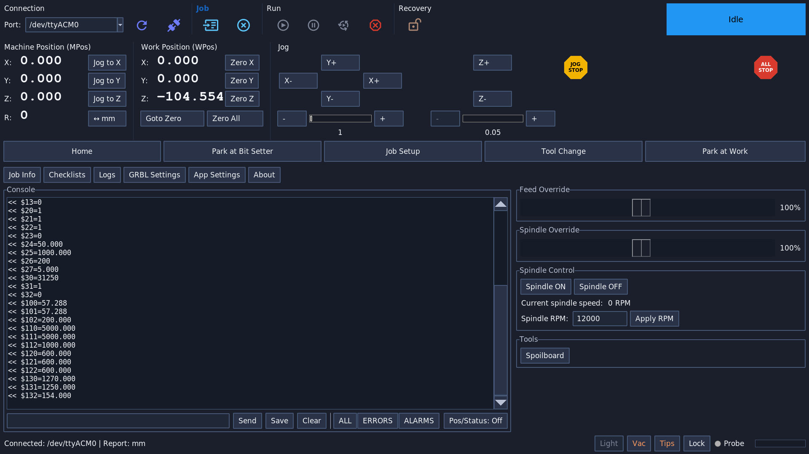

# Simple Sender - Full Manual

    

Simple Sender is designed to be a dependable, operator-friendly GRBL sender that focuses on a clean, practical workflow that stays responsive, runs well on modest hardware, and helps operators work safely, efficiently, and with confidence.


Current stable release: `3.0.11`. This is the current release-ready baseline.

## Design Objectives and Key Features

Simple Sender was built to make everyday CNC work easier, clearer, and more dependable. Its core features are designed to help the operator spend less time fighting software and more time getting work done:

- Runs well on affordable hardware such as a Raspberry Pi 4, so a dedicated machine computer does not have to be expensive. It stays focused on practical GRBL 1.1h use, with an emphasis on clarity, dependability, and everyday usefulness over clutter and unnecessary complexity.
- Designed for easy touchscreen use at the machine, making daily operation more natural and convenient.
- Streams very large G-code files reliably, helping long or complex jobs run smoothly.
- Can automatically control Kasa-connected accessories such as a shop vacuum or light, reducing manual steps in the shop.
- Lets you view and change GRBL settings directly from the Simple Sender interface, while built-in tooltips help explain settings and options so new users can learn the software more easily.
- Built to make multi-tool jobs easier, with tool reference and offset handling that helps keep tool changes accurate and less stressful. It supports normally open bit setters, uses a multi-check probing process to help improve measurement consistency, and allows touch plate and probe settings to be adjusted through the interface so it can work with many different GRBL 1.1h machines. It also includes Vectric post processors in both inch and millimeter versions, along with a guided tool-change workflow that helps the operator through the process and then resumes the job.
- Supports keyboard shortcuts, joysticks, and gamepads, so machine control can be faster and more comfortable.
- Includes Job Setup safeguards to help catch problems before a job begins.
- Offers a Dry Run option that lets you walk through a job without turning on the spindle, helping you check setup and motion before cutting for real.
- Includes a spoilboard tool that makes spoilboard surfacing easier, helping simplify a common maintenance task.
- Supports user-editable checklists that help the operator follow repeatable setup and release steps more consistently. Collapsible checklist sections, startup and release dialogs, and a quick-access Release button make important steps easier to review and less likely to be missed.
- Supports macros for repeatable setup steps and common operator workflows, helping save time and reduce mistakes. The built-in macro editor also makes it easier to customize those routines without editing files by hand.

> **Safety notice:** Always test "in the air" with the spindle **off** before cutting material.

## Table of Contents
- [Overview](#overview)
- [Requirements & Installation](#requirements--installation)
- [Update Safety](#update-safety)
- [Launching](#launching)
- [Safety Basics](#safety-basics)
- [Operation / Use Walkthrough](#operation--use-walkthrough)
- [Quick Start Workflow](#quick-start-workflow)
- [UI Tour](#ui-tour)
- [Core Behaviors](#core-behaviors)
- [Jobs, Files, and Streaming](#jobs-files-and-streaming)
- [Jogging & Units](#jogging--units)
- [Console & Manual Commands](#console--manual-commands)
- [GRBL Settings UI](#grbl-settings-ui)
- [Macros](#macros)
- [VCarve Pro Post-Processors](#vcarve-pro-post-processors)
- [Estimation](#estimation)
- [Spoilboard Generator](#spoilboard-generator)
- [Probing Workflow](#probing-workflow)
- [Keyboard Shortcuts](#keyboard-shortcuts)
- [Joystick Bindings](#joystick-bindings)
- [Kasa Plug (Linux)](#kasa-plug-linux)
- [Logs & Filters](#logs--filters)
- [Testing](#testing)
- [Release Checklist](#release-checklist)
- [Module Layout](#module-layout)
- [Performance Profiling](#performance-profiling)
- [Performance Notes](#performance-notes)
- [Known Limitations](#known-limitations)
- [Troubleshooting](#troubleshooting)
- [Change Summary (since 1.2)](#change-summary-since-12)
- [FAQ](#faq)
- [Appendix A: GRBL 1.1h Commands](#appendix-a-grbl-11h-commands)
- [Appendix B: GRBL 1.1h Settings](#appendix-b-grbl-11h-settings-selected)
- [Appendix C: Workflow and Macro Reference](#appendix-c-workflow-and-macro-reference)
- [Appendix D: UI Field Appendix](#appendix-d-ui-field-appendix)

## Technical Overview
- Target: GRBL 1.1h, 3-axis.
- Character-count streaming with a Bf-informed RX window; auto-compacts/splits long G-code lines to fit GRBL's 80-byte limit; send-time ASCII/line-length checks; live buffer fill and TX throughput.
- Alarm-safe: locks controls except unlock/home; Training Wheels confirmations for critical actions.
- Handshake: waits for banner + first status before enabling controls/$$.
- Read-only file load (Read Job) through the shared file-dialog path, clear/unload button, inline status/progress. On Linux, Tk file dialogs use the current theme plus temporary scaling/min-size safeguards so they stay readable on Pi/Openbox touchscreen setups, and default to `/root/CNC_Jobs` unless **App Settings > Theme > Linux File Dialog Default Path** points somewhere else.
- Header metadata support (`SSMETA ...`) parsed from the job file header (bounded read) and surfaced in the Job Info view.
- Status bar shows streaming file name when a job is running.
- Lean sender UX: no Top View/Spatial rendering paths in the runtime load pipeline.
- Run safety gate for Job Setup: Run checks the current tool-reference offset state and warns with **Job Setup Not Completed** when setup is invalid.
- Tooltips for normal controls and settings fields; disabled controls explain why (streaming, disconnected, alarm). The About popup intentionally keeps tooltips off so the reference view stays uncluttered.
- Performance mode: batches console updates and suppresses per-line RX logs during streaming.
- Right-side lower controls: spindle control, Spoilboard Generator, and feed/spindle override sliders remain visible alongside the Console (10-200% GRBL override range).
- Idle status spam suppressed in console; filters for alarms/errors.
- Preflight check tool summarizes readiness/bounds/validation on demand from App Settings.
- Diagnostics include session report export, one-click diagnostics ZIP export, and backup bundle import/export (settings, macros, checklists).
- Macros: protected built-in workflow buttons stay fixed, while the 5 user-macro slots can be edited/duplicated/reordered in the in-app Macro Manager.
- Directives in streamed files (`VACUUM_ON`, `VACUUM_OFF`, `TC:<tool name>`) are handled internally and never forwarded to GRBL.
- Auto-reconnect (configurable) to last port after unexpected disconnect.

## Requirements & Installation
- Python 3.11+, Tkinter (bundled), pyserial, pygame (required for joystick bindings), and python-kasa (used for Kasa Plug control on Linux).

```powershell
python -m venv .venv
.\.venv\Scripts\Activate.ps1
pip install -r requirements.txt
```

Development dependencies are pinned in `requirements-dev.txt` to match the current toolchain.

Settings are stored in the per-user Simple Sender app-data folder: `%LOCALAPPDATA%\simple-sender-data` (or `%APPDATA%\simple-sender-data`) on Windows, and `$XDG_CONFIG_HOME/simple-sender-data` on Linux. Override the supported location with `SIMPLE_SENDER_CONFIG_DIR` when you need a custom settings directory.

## Update Safety
- Do not sync, overwrite, or partially update a live running Simple Sender install.
- Close the application first, or reboot/shutdown the Pi before syncing updates to the runtime files.
- The runtime marker/duplicate-instance guard exists to block unsafe overlapping runtime conditions. It is a safety check, not a hot-update workflow.

### Recommended: Samba share setup on Raspberry Pi / Linux

If you run Simple Sender on a Raspberry Pi in the shop, Samba can make job transfer much easier. With Samba installed on the Pi, your Windows Vectric PC can see the machine as a normal network share, so you can save G-code directly to it without using USB sticks.

This is optional, but it fits the intended Pi-based shop workflow very well.

This example Samba configuration is meant for use behind or inside a protected network environment. It is intentionally convenience-first and is not very secure. If that is a concern for your install, do some research first and adjust the Samba configuration to align with your security posture before using it.

#### 1) Install Samba

```bash
sudo apt update
sudo apt install -y samba samba-common-bin
```

#### 2) Back up the current Samba config

```bash
sudo cp /etc/samba/smb.conf /etc/samba/smb.conf.bak
```

#### 3) Edit `/etc/samba/smb.conf`

```bash
sudo nano /etc/samba/smb.conf
```

Example configuration:

```ini
[global]
   workgroup = WORKGROUP
   server role = standalone server

   # Name (helps Windows browsing)
   netbios name = SIMPLE-SENDER
   server string = Simple Sender

   # Logging: keep it light
   logging = file
   log file = /var/log/samba/log.%m
   max log size = 1000
   log level = 1

   # Don't involve PAM / unix password syncing (not needed for a simple share)
   obey pam restrictions = no
   unix password sync = no
   pam password change = no

   # Guest mapping: keep behavior simple
   map to guest = Bad User

   # Disable printing/spool subsystems (saves background work)
   load printers = no
   printing = bsd
   printcap name = /dev/null
   disable spoolss = yes

   # Small performance improvements for LAN file copy + directory browsing
   socket options = TCP_NODELAY IPTOS_LOWDELAY
   use sendfile = yes
   aio read size = 1
   aio write size = 1
   getwd cache = yes

   # Reduce extra metadata/ACL chatter when you don't need Windows ACLs
   ea support = no
   store dos attributes = no
   map acl inherit = no
   vfs objects =
   inherit acls = no

   # Optional: lock Samba to Wi-Fi only
   # interfaces = wlan0 lo
   # bind interfaces only = yes

[SIMPLE-SENDER]
   comment = Simple Sender shared files
   path = /root

   browseable = yes
   read only = no
   guest ok = yes

   force user = root
   force group = root

   create mask = 0777
   directory mask = 0777
   force create mode = 0777
   force directory mode = 0777

   # Less chatty / faster browsing from Windows Explorer
   veto files = /.DS_Store/Thumbs.db/desktop.ini/
   delete veto files = yes
```

#### 4) Test the Samba config

```bash
testparm
```

If `testparm` reports no errors, continue.

#### 5) Restart and enable Samba

```bash
sudo systemctl restart smbd nmbd
sudo systemctl enable smbd nmbd
```

#### 6) Access the share from Windows

In Windows File Explorer, open:

```text
\\SIMPLE-SENDER\SIMPLE-SENDER
```

Or use the Pi's IP address:

```text
\\192.168.x.x\SIMPLE-SENDER
```

You can then save G-code files directly from Vectric to the Pi over the network.

#### Notes

- This example shares `/root` because that matches the current single-purpose shop setup shown here. If your Simple Sender jobs live somewhere else, change `path = /root` to the folder you actually want to share.
- `guest ok = yes` keeps access simple on a trusted home or shop LAN, but it is less secure than using authenticated Samba users.
- `force user = root` is convenient for a dedicated machine, but it is intentionally convenience-first. If you want a tighter setup later, move shared files into a dedicated folder and use a non-root user.
- This configuration is best treated as an internal, protected-network setup. If that does not match your environment, research the Samba options you need and modify the configuration to fit your security posture.
- If Windows browsing is unreliable, connecting by IP address is often the quickest workaround.
- If you uncomment the `interfaces` lines, make sure the interface name matches your Pi (`wlan0`, `eth0`, etc.).

## Launching
```powershell
python main.py
```

## Safety Basics
- Test in air, spindle off.
- Configure homing/limits on the controller.
- Keep an e-stop/power cutoff reachable.
- ALL STOP behavior is configurable; use it for immediate halt.
- Only run trusted macro files.

## Operation / Use Walkthrough
This is a practical end-to-end flow, with rationale for the key options.

1) **Connect and handshake**
   - Pick your COM port (auto-selects last if "Reconnect to last port on open" is enabled in App Settings).
   - Click Connect (Training Wheels may prompt). The button enters a short `Connecting...`/`Disconnecting...` pending state to prevent double-click races, and the app waits for the GRBL banner and first status before enabling controls and $$.
2) **Confirm machine readiness**
   - If the state is Alarm, use **Unlock ($X)** or **Home ($H)**. The top-bar Unlock is always available; it is safest to home if switches exist.
   - Verify limits/homing are configured in GRBL ($20/$21/$22) as needed.
   - Check DRO updates (MPos/WPos) to ensure status is flowing; idle status spam is muted in the console but still processed.
3) **Set units and jogging**
   - Use the unit toggle (mm/inch); jog commands insert the proper G20/G21.
   - Choose jog steps and test jogs with $J= moves; Jog Cancel (0x85) is available. Jogging is blocked during streaming/alarms.
   - For first-time setup, use Safe mode in App Settings > Jogging to set conservative jog feeds and step sizes.
4) **Load G-code**
   - Click **Read Job** to open the shared OS file picker. On Linux, the app temporarily raises Tk dialog scaling, applies the current dialog theme, and enforces a minimum dialog size so the chooser stays readable under Pi/Openbox touchscreen setups. Linux dialogs default to `/root/CNC_Jobs` unless **App Settings > Theme > Linux File Dialog Default Path** is set to another valid folder; invalid paths fall back safely. Loaded jobs remain read-only; comments/% lines are stripped, and long lines are compacted or split to respect GRBL's 80-byte limit (unsplittable lines are rejected).
   - Check the job dimensions/estimate block for bounds sanity before running.
   - Review time/bounds estimates; if $110-112 are missing, set a fallback rapid rate and manual X/Y/Z max rates in **App Settings > Estimation**, then adjust the estimate factor if needed.
   - Optional: run the Preflight check in **App Settings > Diagnostics** to catch validation issues before running.
5) **App safety options**
   - Training Wheels ON: confirms critical actions (run/pause/resume/stop/spindle/clear/unlock/connect).
   - ALL STOP mode: both modes halt the active stream first; Soft Reset always sends `Ctrl-X`, while Stop Stream + Reset avoids an extra reset when stop already performed one.
   - Auto-reconnect: enable if you want recovery after USB blips; disable for lab environments where auto-reconnect is not desired.
   - Performance mode: reduces console churn during streaming; toggle it from **App Settings > Interface**.
6) **Prepare the machine**
   - Home if required; set work offsets (Zero buttons use G92 by default). Enable persistent zeroing in App Settings > Zeroing to use G10 L20 offsets.
   - Run the built-in **Job Setup** workflow for this machine session and confirm the tool reference label is populated before starting production cuts.
   - Position above stock; verify spindle control if using M3/M5 (or disable spindle in code for dry run).
   - For dry runs, enable **Dry run: strip spindle/coolant/M6/S/T from streamed G-code** in **App Settings > Safety**. Sender-side `TC:<tool name>` directives still run the built-in tool-change flow.
   - Use the always-visible right-side controls to flip the spindle, generate spoilboard surfacing G-code, and fine-tune feed/spindle overrides via the slider controls (10-200% range).
7) **Start and monitor**
   - Click **Run** (Training Wheels may prompt). If no valid tool reference is present for the session, the app shows **Job Setup Not Completed** with **Start Anyway** and **Cancel**. If Dry Run is enabled, Run prompts first with explicit choices: continue in Dry Run, switch to Normal Run and start, or cancel.
   - When `SSMETA` tool metadata is present, the Start Job confirmation keeps `Toolpaths` and `Tools` as separate truthful lists. It does not invent one-to-one pairings between them, and it no longer shows a stale G-code validation line.
   - After confirmation, streaming starts immediately and keeps run-path checks lean; use Preflight and Job Info when you want extra review before cutting.
   - Streaming uses character-counting flow control; buffer fill and TX throughput update as acks arrive, and Start/Run never blocks on a separate manual deep-validation pass.
   - Use **Pause/Resume** for feed hold/cycle start; **Stop/Reset** for soft reset; **ALL STOP** for immediate halt per your chosen mode.
8) **Alarms / errors**
   - On ALARM or error, streaming stops, queues clear, controls lock except Unlock/Home/ALL STOP.
   - Clear with $X/$H, re-home if needed, and resume or reload if appropriate.
   - When enabled, non-blocking GRBL popups show timestamp, code number, and definition for known `ALARM:x` / `error:x` responses. Duplicate popups are deduped by code for the configured interval.
9) **Settings and tuning**
   - Use the GRBL Settings popup to view the last captured `$$` snapshot or refresh `$$` (idle, not alarmed); pending edits highlight yellow until saved.
   - If enabled, the optional Raw $$ popup button opens the raw settings capture.
10) **Macros**
       - Left-click to run; right-click to sample contents. Macros blocked during streaming/alarms; directives such as `%wait`, `%msg`, `%update`, `%if running`, `%if paused`, and `%if not running` guard how the macro executes.

## Quick Start Workflow
1) Launch, select port (auto-selects last if enabled), Connect.
2) Wait for GRBL banner + first status (Ready/Idle).
3) Read Job file; optional Clear Job to unload.
4) Run the built-in **Job Setup** workflow and verify the tool reference label is populated.
5) Run (Training Wheels may confirm). If setup state is missing/invalid, either rerun Job Setup or choose Start Anyway intentionally. If Dry Run is enabled, choose run mode explicitly from the pre-start Dry Run prompt.
6) Clear alarms with Unlock ($X) or Home ($H).

## UI Tour
- **Top bar:** Port picker, Refresh, Connect/Disconnect, Read Job, Clear Job, Run/Pause/Resume/Stop, Unlock.

- **Hints:** Most controls show tooltips; disabled controls include the reason (not connected, streaming, alarm, etc.). Tooltips auto-wrap and clamp to the visible screen so long hints (including GRBL settings text) stay on-screen. After clicking a control, its tooltip stays hidden until you move off that control and hover it again. The About popup intentionally disables tooltips so reading and search results stay unobstructed.

- **Left panels:** MPos (unit toggle), WPos (Zero per-axis/All, Goto Zero), Jog pad (XY/Z, Jog Cancel, ALL STOP), step selectors (-/+ with indicator), Macro row (the 5 protected built-in workflow buttons first, then only populated user-macro buttons).

- **Lower area:**
  
  The lower display is a persistent split view instead of a tab strip. The left column has a popup/access button row above **Console**, and the right column has the always-visible override/control pane. **Job Info**, **Checklists**, **Logs**, **Raw $$**, **GRBL Settings**, **App Settings**, and **About** appear on the left in that order when available. The popups stay large, dark-themed, and reusable.
  
  **Job Info:** Read-only, scrollable job/metadata summary opened in a large popup. Shows `SSMETA` header fields (when present) plus quick-scan metrics (file size, line counters, estimate/confidence, dimensions/confidence, and separate `Toolpaths` / `Tools` lists when the metadata provides them). If metadata is already available from the load pipeline, the first popup open renders it immediately without requiring a reload or reopen.
  
  **Console:** Persistent log of GRBL traffic, filter buttons, and a manual command entry row with a Pos/Status view toggle for focused troubleshooting.
  
  **Logs:** Optional read-only viewer for application/serial/UI/error logs with source + level filters and export. It opens as a large popup, is hidden by default in the lower control row, and is also available through **View Logs...** in App Settings.
  
  **Right-side controls:** Persistent spindle ON/OFF controls, current spindle-speed readout, saved spindle-RPM entry + Apply button, a Spoilboard Generator button, and touch-sized feed/spindle override sliders (10-200%). The sliders still drive GRBL's 10% override steps internally, but the visible UI is slider/value based.
  
  **Raw $$:** Optional raw settings-dump capture for quick copy/paste or archival. It opens in the GRBL Settings popup on the Raw $$ page, is hidden by default in the lower control row, and is controlled by **Show Raw $$ Button**.
  
  **GRBL Settings:** Editable table with descriptions, tooltips, inline validation, and pending-change highlighting before you save values back to the controller. It opens in a large popup, and if the post-connect `$$` snapshot has already been captured, the first popup open renders that cached data immediately.
  
  **App Settings:** Version banner, a built-in Search filter, and a Basic/Advanced view selector above grouped sections for Interface (fullscreen, optional App Settings popup preloading on next launch, performance mode, GUI logging, auxiliary-button visibility, status indicators, status-bar quick buttons + quick actions), Theme (theme, UI scale, Linux file-dialog scale on Linux, scrollbar width, tooltips + duration, numeric keypad), Jogging defaults + Safe mode + jog DRO smoothing, Zeroing mode, Keyboard shortcuts + joystick safety, Kasa Plug (Linux-only), Macro scripting, Estimation, Diagnostics (bundle export for everyone plus a Developer Options toggle that reveals preflight, runtime telemetry, session report export, backup bundles, perf-test preset, and large-file thresholds), Safety (ALL STOP, dry run sanitize, homing watchdog), Safety Aids (Training Wheels, reconnect on open), Status polling, Error dialogs, and System controls (`Close Application` on all platforms, plus Linux-only `Shutdown`, `Reboot`, and `Pi profile`). It opens in a large popup.

  **About:** Large read-only operator reference popup with built-in search, Previous/Next navigation, live match counts, and the same practical workflow/reference material described in this README. Tooltips are intentionally disabled inside this popup so the document stays easy to read.
  
  **Checklists:** Optional checklist popup loaded from `checklist-*.chk` files, including collapsible checklist titles, the Release/Start Job checklist dialogs, and the status-bar Release quick button. The lower-row Checklists button is shown by default.
  
  **Status bar:** Progress, buffer fill, TX throughput, status LEDs (Endstops/Probe/Hold), the error-dialog status indicator, an always-available Lock button, and quick buttons for Tips, Keys, Vac, Light, and Release (toggleable in App Settings; logging/error-dialog controls live there too).

## Status Lights
- **Placement:** The LEDs sit inline with the status bar so they stay next to the quick buttons (Tips, Keys, Release) and provide a quick glance of machine triggers.
- **Meaning & data source:** GRBL 1.1h status reports include a `Pn:` token (e.g., `<Idle|Pn:XYZPDHRS|...>`). The indicators derive their state directly from those flags:
  - `X`, `Y`, `Z` light the **Endstops** indicator whenever those limit pins feed a high signal.
  - `P` (or `_macro_vars["PRB"]`) lights the **Probe** indicator, showing when a probe touch or macro-supplied probe result is active.
  - `H` or the textual **Hold** state lights the **Hold** LED while GRBL is paused/feed-hold.
- **How to use them:** Watch them before you jog to confirm no limits are stuck, rely on the Probe LED during probing macros, and note Hold when you issue `!`/`~`. They are purely informational; the rest of the UI still enforces streaming locks, alarms, and macro gating.

## Core Behaviors
- **Handshake:** Waits for GRBL banner or status + first status report before enabling controls/$$.
- **Connect lifecycle:** Connect/Disconnect enters a temporary pending state (`Connecting...` / `Disconnecting...`) so repeated clicks do not start overlapping workers.
- **Training Wheels:** Confirms risky top-bar actions (connect/run/pause/resume/stop/spindle/clear/unlock) when enabled; debounced.
- **Auto-reconnect:** When not user-disconnected, retries last port with backoff; respects "Reconnect to last port on open".
- **Alarms:** ALARM:x, "[MSG:Reset to continue]", or status Alarm stop/clear queues, lock controls except Unlock/Home/ALL STOP.
- **GRBL popups:** Optional non-blocking alarm/error popup includes code definitions. Duplicate popups are deduped by the configured interval, and current alarm/error popups stay visible until the operator dismisses them.
- **Performance mode:** Batches console updates and suppresses per-line RX logging during streaming.
- **Status-path smoothing:** Streaming status updates now use adaptive position-update coalescing under UI queue pressure to reduce rare Tk event spikes while preserving final-position/progress correctness.
- **Diagnostics:** Preflight check summarizes bounds/validation, diagnostics exports include both a text report and a diagnostics ZIP (session report, performance report, runtime metrics, connection timeline, logs, settings snapshot), and backup bundles cover settings/macros/checklists (App Settings > Diagnostics). Backup-bundle import validates settings through the same repair/import path used elsewhere, warns when imported values were repaired, and requires explicit confirmation before overwriting colliding macro/checklist assets.
- **Preflight boundary:** Job preflight evaluation lives in `simple_sender/services/preflight_service.py` and diagnostics now call that service directly.
- **Kasa Plug:** Available on Linux only; the Kasa settings/actions are hidden or forced off on non-Linux platforms.
- **Status polling:** Interval is configurable; consecutive status query failures trigger a disconnect.
- **Idle noise:** `<Idle|...>` not logged to console (still processed).
- **Tooltips:** Available for normal buttons/fields and settings tables; disabled controls append a reason. Tooltips are wrapped and screen-bounded. After clicking a widget, that widget's tooltip is suppressed until the pointer leaves and re-enters. The About popup intentionally leaves tooltips disabled so the reference text and search highlights stay unobstructed. Toggle the normal app tooltips with the Tips button in the status bar or App Settings.
- **Worker-thread UI marshaling:** Background workers post UI updates through the UI queue/UI-thread helpers instead of calling Tk widgets directly, reducing cross-thread Tk risk during connect/load/settings/log operations.
- **Manual queue backpressure:** Immediate/manual commands use a bounded queue; if it fills, new commands are dropped and the UI status shows the cumulative dropped count.
- **Job Setup run gate:** Run checks the current Job Setup tool-reference state used by Tool Change, not just the Tool Ref display text. If the stored reference is missing, non-numeric, or missing the current `TOOL_REFERENCE_FORMAT`, it shows **Job Setup Not Completed** with **Start Anyway** / **Cancel**.
- **Job Setup invalidation:** Tool-reference setup state is cleared on connect/disconnect transitions, ready-loss, Stop/Reset paths that actually reset assumptions (including accepted ALL STOP reset modes), and GRBL reset/banner reinitialization.
- **Dry Run confirmation guard:** When Dry Run is enabled, job start requires an explicit operator choice before stream side effects begin: continue in Dry Run, switch to Normal Run and continue, or cancel.

## Jobs, Files, and Streaming
- **Read Job:** Opens the shared OS file dialog. On Linux, the app temporarily applies the larger of the current UI scale and `Linux File Dialog Scale`, themes the dialog widgets, and enforces a readable minimum dialog size before opening the chooser. Loading strips BOM/comments/% lines with a single-pass quick assessment and then streams directly from the canonical file-backed source (`FileGcodeSource`) using bounded live-window/state retention. Read-only; Clear unloads.
- **SSMETA header parse:** During quick assessment, the loader scans only the header window (first lines/bytes) for `SSMETA key=value` metadata in comment lines. When complete extents/units are present, the sender prefers metadata-derived dimensions/units and marks dimensions confidence as confident.
- **Tool metadata truthfulness:** When `SSMETA` includes tool metadata, the app shows `Toolpaths` and `Tools` as separate lists in Job Info and in the Start Job confirmation. It does not guess pairings that are not present in the file.
- **Metadata sources:** Diagnostics and runtime metrics record whether dimensions/units came from `ssmeta` or `scan` (`dimensions_source`, `units_source`) and whether quick-scan line scanning was reduced due to complete metadata (`ssmeta_scan_reduced`).
- **Load cancellation:** Starting a new Read Job cancels the previous loader worker quickly (scan and validation loops are token-cancellable) so stale workers do not overwrite current results.
- **Streaming:** Character-counting; uses Bf feedback to size the RX window; stops on error/alarm; buffer fill and TX throughput shown. Each line is counted with the trailing newline for buffer accounting, and outbound lines are rejected if they exceed 80 bytes or contain non-ASCII characters.
- **Custom sender directives:** Exact trimmed lines `VACUUM_ON` / `VACUUM_OFF` are intercepted before queue/send, toggle the configured vacuum action internally, and are marked handled without reaching GRBL.
- **Tool-change sender directive:** Lines that start with `TC:` are intercepted before queue/send, treated as required-tool prompts, shown in the existing tool-change popup, then routed through the built-in Tool Change workflow. Streaming stays paused with a scoped no-timeout override until the operator finishes that workflow, then resumes. After the built-in tool-change flow completes, the machine parks at safe Z over WCS `X0/Y0` and the posted job is expected to reposition from there. `TC:` lines are marked handled and never sent to GRBL.
- **Directive matching scope:** The above directive handling runs in the same pre-send file-stream pipeline used for normal job lines, while all other lines continue through normal G-code processing.
- **Lean large-file model:** Jobs of any size use the same file-backed quick-assessment path, then stream from disk with bounded in-memory retention (live window + sampled metadata).
- **Ultra-large auto-safeguard mode:** Files at or above the configured ultra-large threshold (default `200 MB`) automatically force fast-load behavior and defer strict validation; send-time safety checks remain active.
- **Lean runtime model:** The sender does not render Top View/Spatial geometry during load; UI remains focused on readiness, dimensions, and estimate output.
- **Line length safety:** The unified loader compacts lines first (drops spaces/line numbers, trims zeros). If still too long, linear G0/G1 moves in G94 with X/Y/Z axes can be split into multiple segments; arcs, inverse-time moves, or unsupported axes must already fit or the load is rejected. Unsplit lines above 80 bytes are rejected, and send-time checks enforce the same limit.
- **System commands:** GRBL system commands (lines starting with `$`, e.g., `$H`) are rejected in job files; run them from the UI or a macro instead.
- **Lifecycle console logging:** Job lifecycle logging stays intentionally sparse and truthful: load, start, immediate early telemetry, `10%` progress milestones, sparse heartbeat while running, and completion are logged without reverting to noisy per-line progress chatter.
- **Stop / ALL STOP:** Stops queueing immediately, clears the sender buffers, and issues the configured real-time bytes. Operator feedback is tied to accepted realtime sends instead of disconnected/no-op paths, but GRBL may still execute moves already in its own buffer; use a hardware E-stop for a hard cut.
- **Progress:** Byte-offset based run progress (`acked_byte_offset / file_size_bytes`) with `Run: XX%` display; headless live-state updates are throttled/coalesced; during deferred completion the top-right progress bar/label stay in sync and finalize at `100.0%` when GRBL reaches the final `Idle`.
- **Completion alert:** When enabled, the job-complete dialog summarizes the start/finish/elapsed wallclock and flashes the progress bar until acknowledged; you can also enable a completion beep. Completion waits for GRBL to report `Idle` after the final line is acknowledged.
- **Deferred completion guard:** While a stream is in its final acknowledged-but-not-yet-idle tail, macros, probing entry points, and GRBL settings refresh stay blocked/queued until the final `Idle` arrives so post-run actions do not cut across completion handling.

### Line length limitations and CAM guidance
- Long lines are only auto-split when they are linear G0/G1 moves in G94 with X/Y/Z axes. Arcs (G2/G3), inverse-time feed (G93), or lines with unsupported axes (A/B/C/U/V/W) must already be within 80 bytes, or the load is rejected.
- Recommended CAM post settings: disable line numbers if possible, reduce decimal places on coordinates (3-4 is usually enough for GRBL work), and avoid emitting long comment blocks or tool names inline with motion.
- If your CAM insists on long arc lines, consider switching to small linear segments (arc-to-line approximation) or reduce arc detail so each line fits under the limit.

## Jogging & Units
- $J= incremental jogs (G91) with unit-aware G20/G21; jog cancel RT 0x85.
- Joystick hold-jog bindings (`X/Y/Z +/- (Hold)`) send one long jog command per press.
- On hold-jog stop/release, the sender issues jog-cancel and clears pending jog commands.
- A hold-jog deadman timeout now force-cancels motion if joystick hold polling stalls.
- If GRBL still reports jog state shortly after cancel, an additional jog-cancel fallback is issued automatically.
- Hold-jog distance targets remaining travel when GRBL max travel (`$130/$131/$132`) and machine position are known; otherwise a conservative long move is used and release still cancels motion.
- If joystick communication/backend is lost during hold-jog (device unplugged, backend failure, polling error, or bindings disabled), the active jog is cancelled immediately.
- Unit toggle button (MPos panel) flips mm/inch and label; jogs blocked during streaming/alarm.
- Safe mode (App Settings > Jogging) sets conservative jog feeds and steps for first-time setup.

## Console & Manual Commands
- Manual send blocked while streaming; during alarm only $X/$H allowed.
- Manual commands longer than GRBL's 80-byte limit are rejected; non-ASCII commands are rejected.
- Manual command queue is bounded; when full, additional manual/jog commands are dropped and the status bar reports the cumulative dropped count.
- Filters: ALL / ERRORS / ALARMS plus a single Pos/Status toggle; when off those reports (and their carriage returns) are never written to the console, so you only see manual commands and errors unless you turn it back on.
- Performance mode batches console updates and suppresses per-line RX logs during streaming (alarms/errors still logged); toggle it from the App Settings Interface block.
- Manual command errors (e.g., from the console or settings writes) update the status bar with a source label and do not flip the stream state.
- Line-length errors include the original file line count and the non-empty cleaned line count; counts are reported as non-empty lines over the limit.
- Streaming errors pause the job (gSender-style) and report the file name, line number, and line text in the error status.
- Program pauses (M0/M1) and tool changes (M6) automatically pause the stream after the line is acknowledged.
- Sender directives (`VACUUM_ON`, `VACUUM_OFF`, `TC:<tool name>`) are intercepted before serial transmission, so they do not generate unknown-command GRBL errors.
- Console Save pre-fills a timestamped filename (`simple_sender_console_YYYYMMDD_HHMMSS.txt`) for touch-friendly export.

## GRBL Settings UI
- If the post-connect `$$` snapshot has already been captured, the first popup open uses that cached data immediately. Refresh $$ (idle, not alarmed, after handshake) requests a newer dump. The table is scrollable, shows descriptions, supports inline numeric validation/ranges, and keeps pending edits highlighted until saved. If enabled, the optional Raw $$ popup button opens the raw text capture.

## Macros

Simple Sender now has two distinct macro/workflow layers:

- **Protected built-in workflow actions** are always present in the button row: `Home`, `Park at Bit Setter`, `Job Setup`, `Tool Change`, and `Park at Work`. These are core application workflows, not editable user macros.
- **User macros** remain file-backed and editable through Macro Manager as exactly 5 slots: `User Macro 1` through `User Macro 5`. Their on-disk filenames are `Macro-1` through `Macro-5` (optional `.txt` extensions are supported) in the discovered macro directories: `simple_sender/macros`, `macros/` beside `main.py`, or the directory that contains `main.py`.

Macro file header format:
- Line 1: button label.
- Line 2: tooltip text.
- Line 3: button color (`#RRGGBB`, `#RGB`, named color like `red`, or `color: ...`/`color=...`). Leave blank if unused.
- Line 4: button text color (`#RRGGBB`, `#RGB`, named color, or `text_color: ...`/`foreground: ...`/`fg: ...`). Leave blank if unused.
- Line 5 and later: executed macro body.
- The file must include at least one non-blank body line. Unsupported or malformed macro files are marked invalid and blocked from running until repaired.

User macro launches are blocked while the controller is streaming, during alarms, or whenever the app disconnects, and they still respect Training Wheels confirmations. User macro buttons appear on the main screen only when a file-backed slot is actually assigned. The streamed `TC:<tool name>` sender directive pauses the stream and reuses the protected built-in Tool Change workflow.
`App Settings > Macros` now covers only user-macro scripting, timeout controls, and **Open Macro Manager** for in-app editing/duplication/reordering of the 5 file-backed user macro slots. `App Settings > Probing & Setup` now owns `Probe Z start (machine, mm)`, `Probe safety margin (mm)`, the full `XYZ Plate` section, and the `Bit Setter` location/probe-cycle settings used by the protected setup workflows.
Macro execution now uses stricter startup/result truthfulness: startup modal capture waits on the real `$G` completion signal, `LOAD` waits for actual load completion/failure, `OPEN`/`CLOSE` fail fast when the underlying connect/disconnect transition never started, and local-command helpers such as `SENDHEX` / `SAFE` fail the macro if their local action fails.

In the current layout, the first 5 buttons are always the protected built-in workflows. Populated user macros appear after them when a `Macro-1` through `Macro-5` file is present.

### Execution & safety
Execution happens on a background worker that holds `_macro_lock`, so only one macro runs at a time. `_macro_send` waits for GRBL to finish each command (`wait_for_manual_completion`) and then polls for Idle before continuing. `%wait` uses a 30 s timeout (see `simple_sender/utils/constants.py`) while polling every 0.1 s, keeping commands synchronized. The runner aborts and releases the lock if GRBL raises an alarm, logging the offending line so you can recover.

During streamed jobs, `TC:<tool name>` lines use this same protected tool-change path and intentionally wait with no timeout until the operator completes the tool-change flow. General macro timeout settings still apply to user macros.

Macro scripting remains fully open, and runtime hardening is applied around it: line-level failures are logged with line numbers, audit entries (`[macro][audit]`) record raw/evaluated/outcome details (with GUI logging enabled), and timeout guards can abort stalled runs. General macros now default to finite timeout guards (`120 s` per line, `900 s` total), and you can tune or disable them in App Settings > Macros.

`App Settings > Macros` exposes the `macros_allow_python` toggle. When scripting is disabled, only plain G-code lines plus `%wait/%msg/%update` directives and comment-only `key=value` lines are allowed; `_` lines, `[expression]`, and assignments inside non-comment lines are blocked. When scripting is enabled you can run Python statements, execute `_` lines, and embed `[expression]` results directly into G-code.

Tool-reference workflows store `TOOL_REFERENCE` from work Z (`wz`) because `G10 L20` writes the WCS Z offset. `%update` blocks until a fresh status report arrives for user macros, so `wx/wy/wz` are current before capture or adjustment. User macros snapshot the current modal state and can restore it with `STATE_RETURN` (or `%state_return`). The built-in Job Setup and Tool Change workflows use the same modal snapshot/restore safety model internally, but they are now implemented directly in application code.

Current fixed-sensor / bitsetter measurement behavior is:
- one coarse seek onto the sensor using the current App Settings Z jog speed as the coarse feed for Job Setup / Tool Change
- then 5 exact samples using the shared high-precision helper
- each sample retracts `5.0 mm`, dwells `0.5 s`, and re-probes `6.0 mm` at `175 mm/min`
- the final result discards the low/high sample and averages the middle 3
- normal acceptance still requires spread `<= 0.050 mm`
- Tool Change only: if the first round exceeds `0.050 mm`, one retry round is attempted at `100 mm/min`; the retry must still pass the normal spread rule or the Tool Change fails

### Macro directives
| Directive | What it does | Example usage |
| --- | --- | --- |
| `%wait` | Pause until GRBL reports Idle before continuing; useful after long G1 moves so macros resume only when the controller is ready. | `G1 F3000 X10 Y10`<br>`%wait` |
| `%msg <text>` | Log `<text>` with the `[macro]` prefix; supports `[expression]` expansion for live values. | `%msg Probe wz=[wz]` |
| `%update` | Request a status report (`?`) and block until a fresh status arrives, so `[wx]`, `[wy]`, `[wz]`, `[curfeed]`, etc., reflect the latest controller state. | `%update` |
| `%if running` | Skip the current line unless a stream is already running (the app sets `_macro_vars["running"]` true for active or paused jobs). | `%if running G0 Z5` |
| `%if paused` | Execute the line only while streaming is paused, so recovery steps (e.g., retracting Z) stay blocked during active runs. | `%if paused G0 Z10` |
| `%if not running` | Skip the current line while a stream is active so setup steps only run when the controller is idle. | `%if not running G0 Z0` |

All directives above operate through the macro executor (`simple_sender/macro_executor.py`) and work with GRBL 1.1h because they merely gate G-code streaming or request standard status bytes (`?`). `%wait` relies on the GRBL Idle state reported by `<Idle|...>` lines, `%update` sends the conventional real-time status command, and `%msg` logs without touching the controller.

### Helper commands
| Command | Description | Example usage |
| --- | --- | --- |
| `M0`, `M00`, `PROMPT` | Show the macro prompt dialog. Customize `title=`, `msg=`/`message=`/`text=`, `buttons=`, `[btn(...)]`, `resume=`, `cancellabel=`, etc., and read `prompt_choice*` afterward. | `PROMPT message=Pause before X0 Y0? buttons=Continue|Abort` |
| `ABSOLUTE`, `ABS` | Send `G90` so the next moves use absolute coordinates in the active WCS (use `G53` for machine coordinates). | `ABSOLUTE` |
| `RELATIVE`, `REL` | Send `G91` for incremental jog sequences. | `REL` |
| `HOME` | Run homing, which issues the same `$H` or homing cycle as the UI buttons. | `HOME` |
| `OPEN [timeout_s]` | Connect if disconnected and wait for connection (default 10s). Useful for macros that need GRBL before streaming commands. | `OPEN 15` |
| `CLOSE [timeout_s]` | Disconnect when connected and wait for close (default 10s). | `CLOSE 5` |
| `HELP` | Show a fixed macro help dialog (no GRBL interaction). | `HELP` |
| `QUIT`, `EXIT` | Close the application cleanly. | `QUIT` |
| `LOAD <path>` | Load a specific G-code file (`app._load_gcode_from_path`), then let the macro stream it. | `LOAD C:\jobs\test.nc` |
| `UNLOCK` | Send `$X` to clear alarms, the same command used in the UI. | `UNLOCK` |
| `RESET` | Send soft reset (`Ctrl-X`). | `RESET` |
| `PAUSE`, `FEEDHOLD` | Hold the stream (`!`). | `PAUSE` |
| `RESUME`, `RUN` | Resume or start streaming (`~`). | `RUN` |
| `STOP` | Stop streaming and clear the queue (`stop_stream`). | `STOP` |
| `SAVE` | Unsupported; logs `[macro] SAVE is not supported.`. | `SAVE` |
| `SENDHEX <xx>` | Send raw real-time byte `0xXX`. | `SENDHEX 91` |
| `SAFE <value>` | Update `_macro_vars["safe"]`, a helper the UI uses for safe heights. | `SAFE 10` |
| `STATE_RETURN` | Restore the modal state snapshot captured when the macro started (WCS/plane/units/distance/feedmode/spindle/coolant); `%state_return` is accepted as shorthand. | `STATE_RETURN` |
| `SET0` | Send `G92 X0 Y0 Z0`. | `SET0` |
| `SETX`, `SETY`, `SETZ` | Zero a single axis with `G92`. | `SETZ 2` |
| `SET <X> <Y> <Z>` | Zero only the axes you specify. | `SET 0 50` |
| `!`, `~`, `?`, `Ctrl-X` | Send feed hold, cycle start, status request, or soft reset as real-time bytes. | `!` |

Each helper command forwards the equivalent GRBL real-time or `$` command, so they behave exactly as the buttons and manual console inputs do when connected to a GRBL 1.1h controller.

Lines that begin with `$`, `@`, `{`, or `(`, or that match `MACRO_GPAT` (`[A-Za-z]\s*[-+]?\d+.*`), stream verbatim as raw GRBL commands or comments, so you can reuse existing G-code without modification. Lines that begin with `;` are treated as comments and skipped.

### System variables
Every macro shares access to `_macro_vars`. The following keys hold live data you can read or update in Python lines, `%msg`, or `[expression]` blocks:

| Variable | Meaning & example |
| --- | --- |
| `prbx`, `prby`, `prbz` | Last probe coordinates; retract with `G0 Z[prbz]` after a `G38.2` probe. |
| `prbcmd` | Probe command (`G38.2` by default); change it before sending custom probes. |
| `prbfeed` | Probe feed rate; use `[prbfeed]` inside a `G38.2 F[prbfeed]` line. |
| `errline` | Last macro line that triggered a compile/runtime failure; log it for diagnostics. |
| `wx`, `wy`, `wz` | Work coordinates (WPos); refer to them as `[wx]`, `[wy]`, `[wz]` when building expressions. |
| `mx`, `my`, `mz` | Machine coordinates (MPos); compare them against WPos to detect offsets. |
| `wa`, `wb`, `wc` | Auxiliary G-code axes (if the controller reports them). |
| `ma`, `mb`, `mc` | Auxiliary machine axes mirrors. |
| `wcox`, `wcoy`, `wcoz`, `wcoa`, `wcob`, `wcoc` | Work coordinate offsets (WCO); rebuild a move with `G0 X[wcox] Y[wcoy]`. |
| `curfeed`, `curspindle` | Feed/spindle from the `FS:` field; log `%msg FS=[curfeed]/[curspindle]`. |
| `_camwx`, `_camwy` | Camera/CAM coordinates from non-GRBL sources; helpful for vision-assisted macros. |
| `G` | List of modal G-code words the parser has seen; read it after hacks that change modal states. |
| `TLO` | Tool length offset; use `[TLO]` during touch-plate moves. |
| `motion`, `distance`, `plane`, `feedmode`, `arc`, `units`, `WCS`, `cutter`, `tlo`, `program`, `spindle`, `coolant` | Tokens that mirror the current modal context; include them in `%msg` for auditing. |
| `tool` | Current tool number; branch macros before a tool change. |
| `feed` | Last feed rate; log `%msg feed=[feed]` before altering overrides. |
| `rpm` | Estimated spindle RPM, derived from `FS` or override sliders. |
| `planner`, `rxbytes` | Planner buffer usage and remaining `Bf:` bytes; guard long moves with `if rxbytes < 30: %wait`. |
| `OvFeed`, `OvRapid`, `OvSpindle`, `_OvFeed`, `_OvRapid`, `_OvSpindle`, `_OvChanged` | Override values plus a flag that flips when sliders move; read them to slow macros when the user dials overrides down. |
| `diameter`, `cutfeed`, `cutfeedz`, `surface`, `thickness`, `stepz`, `stepover`, `safe` | Helper constants for tooling; update them from macros (`safe = 6`). |
| `state` | Latest GRBL state (`Idle`, `Run`, `Hold`, `Alarm`); `%if running` uses this indirectly. |
| `pins` | Pin summary from GRBL; check it before probing to ensure the probe pin is ready. |
| `msg` | Last `MSG` block; common after `G38` probes or startup messages. |
| `PRB` | Last structured probe report (mirrors `_macro_vars["PRB"]`). |
| `version`, `controller` | Firmware metadata; include it in logs for traceability. |
| `running` | `True` while a stream runs or is paused; `%if running` checks this state. |
| `paused` | `True` only while streaming is paused; `%if paused` gates lines that should execute during interruptions. |
| `prompt_choice`, `prompt_choice_label`, `prompt_choice_key`, `prompt_index`, `prompt_cancelled` | Results after `M0/M00/PROMPT`; branch logic accordingly. |
| `macro` | `types.SimpleNamespace(state=SimpleNamespace())`; store persistent values with `macro.state.last_probe = ...`. |

Add your own entries (e.g., `_macro_vars["my_flag"] = True`) when you want data to survive between lines or macros.

### Sharing variables between macros
Macros share `macro.state` across runs, so you can store a value in one macro and reuse or update it in another. Example:

```text
Save stock top
Store the current work Z so later macros can reuse it.
%macro.state.STOCK_TOP = wz
%msg Stored stock top (wz) in macro.state.STOCK_TOP
```

```text
Return to stock top + lift
Use the stored value, then adjust it for the next operation.
G90
G0 Z[macro.state.STOCK_TOP]
%macro.state.STOCK_TOP = macro.state.STOCK_TOP + 2.0
%msg Lifted; macro.state.STOCK_TOP updated
```

### Python expressions, loops, and new variables
When scripting is enabled, prefix a line with `_` or simply write a Python statement (`=`) to run it. The interpreter injects `app` and `os` so you can call `app._log(...)`, `app._call_on_ui_thread(...)`, or inspect `app.connected`. Square brackets evaluate Python expressions before streaming, such as `G0 Z[_macro_vars["safe"] + pass_num * 0.5]`.

Python loops behave like any other Python code:

```text
_safe_height = max(float(_macro_vars.get("safe", 3.0)), 4.0)
for pass_num in range(3):
    target = _safe_height + pass_num * 2.0
    _macro_vars["last_target"] = target
    %msg Pass [pass_num + 1]: raising to Z[target]
    G0 Z[target]
    %wait
```

This snippet shows math helpers, storing custom variables, logging with `%msg`, and waiting for each pass to complete.

### GUI prompts & blocking
`M0`, `M00`, and `PROMPT` block the macro until the operator chooses a button. Prompt tokens such as `buttons=Resume|Cancel`, `[btn(Continue)c]`, `resume=Go`, or `noresume` control which buttons appear, and the choice is stored in `_macro_vars`/`macro.prompt_choice*`. `%wait` blocks until Idle, `_macro_send` waits for completion plus `_macro_wait_for_idle()`, and the executor aborts if GRBL reports an alarm (logging the line) or a stream appears unexpectedly.

### Example macro file
```text
Safe Park
Raise to a safe height, confirm, then park at work zero.


G90
G0 Z5.000
%wait
PROMPT title=Continue buttons=Park|Abort message=Move to work zero?
G0 X0 Y0
%msg Safe Park completed.
```

This sample matches the real user-macro file layout exactly: line 1 is the button label, line 2 is the tooltip, line 3 is the button color, line 4 is the button text color, and line 5 onward is the macro body. In this example, the two blank header lines intentionally preserve the required file structure while leaving the button colors at their defaults.

### Macro reliability checklist
Use this checklist when creating job-critical macros:

1) Add `%update` before reading live coordinates (`wx/wy/wz`, `mx/my/mz`, overrides, `planner`, `rxbytes`) so values come from a fresh status report.
2) Make modal intent explicit near motion lines (`G90`/`G91`, plane, feed mode). Use `STATE_RETURN` before finishing if the macro changes modal context that should not leak into later commands.
3) Place `%wait` after long motions/probes when the next line depends on machine state being settled.
4) Prefer `%msg` logs at key checkpoints (`start`, `before probe`, `after capture`, `before run`) so failures can be diagnosed from the log file.
5) Configure macro line/total timeout values in `App Settings > Macros` for unattended or long-running routines.
6) For operator intervention, use `PROMPT` with explicit buttons (`Continue|Abort`) and branch on `prompt_cancelled`/`prompt_choice`.

### Macro troubleshooting
| Symptom | Likely cause | Recommended fix |
| --- | --- | --- |
| User macro button is missing from the main panel | No valid `Macro-1`..`Macro-5` file exists for that user slot in a discovered macro directory. | Verify filename and location (`simple_sender/macros`, `macros/` beside `main.py`, or script directory), or assign the slot from Macro Manager. |
| Button appears but macro does not run | App is streaming, in alarm, disconnected, or blocked by Training Wheels confirmation. | Stop stream / clear alarm / reconnect, then retry and confirm prompts. |
| Coordinates used by the macro are stale | Macro reads `wx/wy/wz` or modal values before a fresh status report. | Insert `%update` before using live variables. |
| Macro reaches 100% too early or appears "done" before motion settles | Controller accepted final lines but machine has not reported fresh `Idle` yet. | Keep `Machine` current-line mode selected; prefer `%wait` at sequence boundaries and watch for final `Idle` in status/logs. |
| Macro hangs waiting | Controller stayed non-idle (hold/alarm/door) or a wait condition never clears. | Inspect state/pins in status, add `%msg` checkpoints, and set line/total macro timeouts. |
| Unexpected units/modal behavior after macro | Macro changed units/distance/WCS and did not restore expected state. | Add `STATE_RETURN` (or explicit restore commands) near macro end. |

## VCarve Pro Post-Processors
VCarve Pro `.pp` files are shipped in `VCarve-PP/` at the repository root to produce jobs that plug directly into Simple Sender's semi-automatic workflow.

### Included files
| File | Purpose |
| --- | --- |
| `Simple-Sender Grbl (mm) (!.gcode).pp` | Primary mm post for production jobs with sender directives (`TC:` and vacuum control). |
| `Simple-Sender Grbl (inch) (!.gcode).pp` | Primary inch post for production jobs with sender directives (`TC:` and vacuum control). |
| `Grbl (mm) warmup (!.gcode).pp` | mm warmup/general post without Simple Sender toolchange/vacuum directives. |
| `Grbl (inch) warmup (!.gcode).pp` | inch warmup/general post without Simple Sender toolchange/vacuum directives. |

### How these posts enable the semi-automatic workflow
1) They emit `SSMETA ...` header lines in the job file, which Simple Sender uses for dimensions, units, and estimate context.
2) The Simple-Sender posts emit `TC:[TOOLNAME]` in the header and `begin TOOLCHANGE` blocks.
3) Simple Sender intercepts `TC:` lines before GRBL send, pauses streaming, runs the guided built-in Tool Change workflow, then resumes streaming.
4) The Simple-Sender posts emit `VACUUM_OFF` before tool-change boundaries and `VACUUM_ON` at segment/spindle start, allowing sender-managed accessory control around the same workflow points.
5) This avoids relying on raw `M6` behavior in GRBL and keeps the operator flow consistent for multi-tool jobs.

### Recommended use
1) Use `Simple-Sender Grbl (mm|inch)` for normal cutting jobs that include tool changes and accessory automation.
2) Use `Grbl (mm|inch) warmup` for warmup/utility programs where you do not want sender-managed `TC:` and vacuum directives.
3) Match the post units to your job units and machine setup (mm vs inch) to avoid unit-mode mistakes at run time.

## Estimation
- Estimates bounds, feed time, and rapid time (uses $110-112 when available, then manual max-rate entries and the fallback rapid rate).
- The loaded job always reports:
  - `Estimated Job Time: HH:MM [CONFIDENT|ROUGH]`
  - `Job Dimensions: X,Y,Z mm / X,Y,Z in [CONFIDENT|ROUGH]`
- Confidence is derived from available machine settings and scan coverage.
- If header `SSMETA` includes complete extents and units, dimensions are sourced from metadata and reported as confident; estimate confidence still depends on machine settings/live observations.
- No Top View/Spatial render stage runs during load in the lean sender runtime.

## Spoilboard Generator

Use the right-side controls' **Spoilboard** button to generate a surfacing program without opening a CAM tool.

### Inputs
- Width X
- Height Y
- Tool Diameter
- Stepover %
- Feed XY
- Feed Z
- Surfacing Depth (mm, default `0.50`)
- Spindle RPM (default `18000`)
- Start X
- Start Y

### Assumptions and motion flow
- Assumes the spindle is already positioned at your desired work Z plane before running the program.
- Surfacing Depth is an absolute cut plane below Z0 (not incremental): generated cut Z is `-Surfacing Depth`.
- Start sequence:
  - switch to relative and raise Z by `10 mm`
  - start spindle at the specified RPM
  - dwell for 5 seconds (`G4 P5`)
  - switch to absolute and rapid to lower-left (`Start X`, `Start Y`) at safe Z
  - feed-plunge to `Z = -Surfacing Depth` using `Feed Z`
  - switch to absolute and run surfacing passes
- End sequence:
  - switch to relative and raise Z by `10 mm`
  - switch to absolute, stop spindle, and end program (`M30`)
- Safety validation: Surfacing Depth must be `>= 0` and `<= 6.350 mm`. A value of `0` runs passes at `Z0`.

### Post-generate options
After generation, a blocking modal appears:
- **Read G-code**: loads generated code directly as the active job using the normal load pipeline (no file write).
- **Save G-code**: opens Save dialog with default filename `surfacing-YYYYMMDD-HHMMSS.nc`, default folder set to the app log directory, and writes to disk without auto-loading.
- **Cancel**: closes the modal and discards the generated program.

### How To Run It (Z0 = Top of Spoilboard)
These instructions assume your generated program uses `Start X = 0` and `Start Y = 0`. If you use different start coordinates, substitute those values in the setup steps.

#### What this program assumes
Before running the surfacing program, the operator must:
1. Home the CNC (X/Y/Z).
2. Jog the spindle to the starting corner (lower-left of the surfacing rectangle).
3. Set X/Y Zero.
4. Touch off the surfacing bit and set Z0 to the current top surface of the spoilboard.

#### Step-by-step instructions
##### 1) Install the surfacing bit
- Install the spoilboard/surfacing bit and tighten.
- Remove or countersink any screws in the surfacing area.
- Confirm clamps, hoses, and wiring will not interfere.

##### 2) Home the machine
- Run a normal homing cycle.
- Confirm machine coordinates look correct.

##### 3) Jog to the lower-left corner of the surfacing area
- Jog to the point you want as the lower-left corner.
- This is typically where you set `X0 Y0`.

##### 4) Set X/Y zero (Work Zero)
- Set `X = 0` and `Y = 0` at the lower-left corner of the area.
- Double-check that your configured upper-right values fit machine travel.

##### 5) Set Z0 to the current top of the spoilboard (critical)
- With the surfacing bit installed, touch off on the spoilboard surface (touch plate, paper method, or preferred probing method).
- Set that point as `Z = 0.000`.
- Meaning:
- Here, `Z0` is the current spoilboard surface. Any negative `Z` value cuts below that surface. For example, a Surfacing Depth of `0.50 mm` cuts at `Z = -0.50 mm`.

##### 6) Confirm units (quick check)
- This Spoilboard Generator currently outputs `G21`, so units are millimeters.
- For non-spoilboard files in general: `G21` means millimeters, `G20` means inches.

##### 7) Start position / clearance before running (important)
- This generated program begins with a relative lift: `G91` then `G0 Z10.000`.
- Start the job with the tool at `Z0` or above (not already deep below the surface).
- If unsure, jog to `Z = +5 mm` or `Z = +10 mm` first.

##### 8) Run the program and monitor the start
When you press Run, the program will:
1. Raise the tool `+10 mm` (relative from current Z).
2. Start spindle at the set RPM.
3. Wait 5 seconds.
4. Rapid to start XY.
5. Plunge to `Z = -SurfacingDepth` at plunge feed.
6. Raster-surface the rectangle.
7. Retract `+10 mm`, stop spindle, and end.

Stay ready to hit Feed Hold / Pause if:
- It moves in the wrong direction.
- It plunges too deep.
- Anything looks unsafe.

##### 9) After it finishes
- Vacuum chips.
- Inspect the surface.
- If more cleanup is needed, rerun with slightly greater surfacing depth (small increments).

#### Quick safety checklist
- Bit installed and tight.
- Machine homed.
- X/Y zero set at lower-left.
- Z0 set to current top of spoilboard.
- Tool starts at/near Z0 (or above).
- Area clear of screws/clamps.
- Dust collection on.
- Finger near Feed Hold for first moves.

## Probing Workflow
This is a practical, repeatable probing flow for setting work offsets (X/Y/Z). Adjust the numbers for your machine and tooling.

### Step-by-step (touch plate / probe)
1) **Home and clear alarms**
   - Home the machine if you use homing switches, or at minimum verify GRBL is Idle.
   - Clear alarms with **Unlock ($X)** or **Home ($H)** so probing commands are accepted.
2) **Set up material and tool**
   - Mount the stock securely; install the tool you plan to cut with.
   - Connect the probe plate/clip and verify the **Probe** LED is off before contact.
3) **Set units and work XY**
   - Choose mm/inch (unit toggle) so probing and offsets are consistent.
   - Jog to your XY origin and use **Zero X** / **Zero Y** (or **Zero All**).
   - If you use persistent zeroing (App Settings > Zeroing), the app will use `G10 L20`; otherwise it uses `G92`.
4) **Probe Z (touch plate)**
   - Jog above the plate; set a **Safe Z** that clears clamps.
   - Run a probe move (via a macro or the console), for example:
     - `G38.2 Z-10.000 F100.000` (probe down 10 mm at 100 mm/min)
   - On touch, set Z0 using the plate thickness:
     - `G92 Z<plate_thickness>` (default zeroing mode), or
     - `G10 L20 Z<plate_thickness>` (persistent offsets)
   - Retract to Safe Z and remove the probe plate/clip.
5) **Verify work XYZ**
   - Jog back to the surface and confirm WPos Z ~= 0 at the work plane.
   - If you need XY re-zero, re-jog and re-zero X/Y.
7) **Dry run and cut**
   - Do a dry run in air, then run the job with the spindle enabled.
   - If Run shows **Job Setup Not Completed**, rerun **Job Setup** for the current session (or choose **Start Anyway** only when intentional).

### Workflow shortcuts
If you prefer guided probing, the built-in workflow set includes touch-plate and reference-tool helpers (see the table below):
- **Job Setup**: Guided chooser (`XYZ Plate`, `Z Plate`, or `Manual`) plus reference-tool capture.
- **Tool Change**: Tool change after a reference is established.

## Keyboard Shortcuts
- Configurable (up to 3-key sequences); conflicts flagged; ignored while typing; toggle from App Settings or the status bar. Training Wheels confirmations still apply.

## Joystick Bindings
- Pygame must be installed before the app can talk to USB joystick devices; install dependencies with `python -m pip install -r requirements.txt` (or `python -m pip install pygame` if you skipped it), then start the sender from a console so you can watch the status messages while configuring bindings.
- App Settings -> Keyboard Shortcuts now has a Joystick testing frame above the table: it reports detected controllers, echoes the most recent event, and houses the `Refresh joystick list` button with the `Enable USB Joystick Bindings` toggle sitting to its right. When bindings are enabled and no joystick is present, newly plugged controllers are discovered automatically; use Refresh if you add or swap controllers while one is already connected. The same frame includes a "Stop joystick hold when app loses focus" safety toggle.
- Optional safety hold: enable **Require safety hold for joystick actions**, then click **Set Safety Button** to capture a hold-to-enable button; **Clear Safety Button** removes it and the status line shows the current binding.
- Click a row's `Joystick` column to listen (it momentarily shows "Listening for joystick input..."); the testing area logs the incoming joystick event and the cell records the button/axis/hat plus direction so the table shows which input is bound. Press `X Remove/Clear Binding` in the same row to drop a mapping.
- While the `Enable USB Joystick Bindings` toggle is on, the sender listens for joystick presses and triggers the matching action just like a keyboard shortcut; when you're done, toggle it off to stop polling. Every custom joystick binding is saved in the settings file so it survives restarts.
- The Live input state panel reports joystick axes/buttons/hats and the latest keyboard input while testing; hot-plug status updates when devices connect/disconnect.
- When the toggle is left on before closing, the app now reopens with joystick capturing enabled automatically (just like auto-reconnecting to the last serial port), so you can pick up where you left off without another click.
- The Keyboard Shortcuts list now exposes six additional `X- (Hold)`, `X+ (Hold)`, `Y- (Hold)`, `Y+ (Hold)`, `Z- (Hold)`, and `Z+ (Hold)` entries. When one is held, the sender issues a single long jog move at the jog feed and stops it on release with jog-cancel (`0x85`) for smoother motion on lower-power hosts.
- Jog safety path for hold bindings is fail-safe: release checks are polled continuously, missed poll gaps trigger deadman cancel, and a delayed extra jog-cancel fallback is sent if needed.
- Joystick button release for jog-bound actions (`jog_*` bindings) now actively sends jog-cancel + pending-jog purge even if a backend release event is dropped.
- If USB joystick communication drops during a hold jog (unplug/hot-plug loss, backend failure, or polling exception), the sender automatically issues the same jog stop/cancel path.
- The app now prevents a single joystick button/axis/hat from being assigned to more than one UI control - binding it again to another action automatically clears the prior assignment so there's no ambiguity in the list.
- If you only want to confirm the dependency before using the GUI, run `python -c "import pygame; print(pygame.version.ver)"`.

## Kasa Plug (Linux)
Use this when you want job lifecycle events to control smart outlets, such as a shop vacuum and spindle light, from inside the sender.

- Linux only: this section is hidden on non-Linux platforms.
- Trigger behavior: enabled outlets turn on when a job starts and turn off when a job finishes, stops, alarms, or is canceled/aborted.
- Stream directives: exact trimmed `VACUUM_ON` / `VACUUM_OFF` lines in streamed files toggle the configured Vacuum outlet immediately; these lines are consumed by the sender and are never sent to GRBL.
- Safety: keep a physical e-stop/power cutoff available. Kasa control is convenience automation, not a safety system.
- Reliability: Kasa device operations use bounded request timeouts (default 15s). If a device call stalls, the action fails with a logged timeout instead of blocking the accessory worker indefinitely.

The Kasa section lives in **App Settings -> Kasa Plug**. Start by enabling the master toggle, discover your device on the LAN, and pick it from the dropdown. Then map **Vacuum** and **Spindle Light** to outlet numbers and use the built-in outlet test buttons to confirm each mapping before cutting. If the selected Kasa device only exposes one controllable outlet, the app keeps Vacuum available and disables Spindle Light mapping automatically.

### How-to (first setup)
1) Open **App Settings -> Kasa Plug** (Linux only).
2) Enable **Enable Kasa Plug control**.
3) Click **Discover**, then choose your device in the dropdown.
4) Click **Refresh Outlet List** to read available outlets from the selected device.
5) Enable **Vacuum** and/or **Spindle Light**, then choose an outlet for each one.
6) Use **Test Outlets** (`ON`/`OFF`) to verify each outlet responds correctly.
7) Start a short job and confirm mapped outlets turn on at job start and off at job end/stop.

## Logs & Filters
- Console filters cover ALL/ERRORS/ALARMS plus the combined Pos/Status switch that omits those reports entirely when disabled; idle status spam stays muted. GUI button logging toggle remains, and performance mode (toggled from App Settings > Interface) batches console output and suppresses RX logs while streaming.
- The **Logs** popup (and **View Logs...** in App Settings > Interface) shows the rotating log files with Source (Application/Serial/UI/Errors/All) and Level (DEBUG..CRITICAL) filters. Use **Refresh** to reload, **Clear Logs** to truncate active logs/remove rotated logs, and **Export Logs...** to save a zip bundle for support.
  - If you open **View Logs...** from **App Settings**, App Settings stays open underneath. If you then use **Clear Logs**, its confirmation opens above **Logs** without closing or hiding either **Logs** or **App Settings**.
  - The **Logs** popup button is hidden by default. Enable it with **App Settings > Interface > Auxiliary panel buttons > Show Logs Button** if you want it in the lower control row; **View Logs...** remains available either way.

## Testing
Dev dependencies (tests + type checking):
```powershell
python -m pip install -r requirements-dev.txt
```

Tests are grouped by scope:
- `tests/unit/`: core logic (parser, worker, settings).
- `tests/integration/`: streaming workflows.
- `tests/ui/`: UI/state handling (Tkinter-backed tests will skip if Tcl/Tk is unavailable).

Run the suite:
```powershell
python -m pytest
```
Use `run_tests.bat` as the authoritative local release gate. The current stable `3.0.11` release baseline validates clean locally (`pytest -q`: `1800 passed, 3 skipped`; `ruff check .`: clean; `mypy main.py simple_sender`: clean; `Success: no issues found in 201 source files`; `run_tests.bat`: clean with `7/7` gates passed). Dated historical snapshots remain in [CHANGELOG.md](CHANGELOG.md).

The current `mypy.ini` manifest runs mypy against 141 source files, while `python -m mypy main.py simple_sender` currently reports `Success: no issues found in 201 source files`.

Run a subset:
```powershell
# Unit
python -m pytest tests/unit

# Integration
python -m pytest tests/integration

# UI
python -m pytest tests/ui
```

Coverage:
```powershell
python -m pytest --cov=simple_sender --cov-report=term-missing --cov-report=html
```

Critical-path coverage gate (same check used by `run_tests.bat`):
```powershell
python -m pytest tests --cov=simple_sender --cov-report=xml --cov-report=term
python tools/check_core_coverage.py coverage.xml
```

Type checking (mypy):
```powershell
python -m mypy main.py simple_sender
```

Ruff gate:
```powershell
python -m ruff check .
```
If `python -m ruff` fails on Windows due a broken global launcher, run `.\.venv\Scripts\ruff.exe check .` instead.
You can also use the resilient launcher helper: `python tools/run_ruff.py check .`.

One-command local gate:
```powershell
run_tests.bat
```

Import stability check (same gate used in CI):
```powershell
python -c "import simple_sender.ui.settings"
```

Optional pre-commit hooks (mypy manifest + ruff + mypy):
```powershell
python -m pip install pre-commit
pre-commit install
pre-commit run --all-files
```

Release history and validated baselines are tracked in `CHANGELOG.md`.
- v3.0 release notes: `RELEASE_NOTES_v3.0.md`.

## Module Layout
- `simple_sender/application.py`: main `App` class (`tk.Tk`) plus startup wiring (settings, serial availability metadata, and explicit installation of methods from `application_*.py` helper modules).
- `simple_sender/application_*.py`: focused app helper modules (actions, controls, lifecycle, layout, gcode, status, UI events/toggles, input bindings, state UI) imported and installed onto `App`.
- `simple_sender/ui/`: feature-focused UI modules (layout/popup routing, settings, input bindings, dialogs).
- `simple_sender/ui/main_tabs.py`: lower split-layout construction plus popup routing/reuse for the current lower UI.
- `simple_sender/ui/file_info_tab.py`: scrollable read-only Job Info renderer (SSMETA + quick-scan metrics).
- `simple_sender/ui/viewer/gcode_viewer.py`: headless live-window/job-view state holder plus the run-reset helper used by the current runtime.
- `simple_sender/ui/all_stop.py`: ALL STOP action + layout positioning helper.
- `simple_sender/ui/events/router.py`: UI state updates from GRBL events (includes streaming lock helper).
- `simple_sender/ui/app_commands.py`: UI commands (connect/load/run) + serial dependency check.
- `simple_sender/ui/dro.py`: DRO formatting and row builders (testable via injected ttk helpers).
- `simple_sender/ui/widgets_buttons.py`: button-focused widgets (StopSign, home, jog, and colored macro button classes).
- `simple_sender/ui/widgets_common.py`: shared widget utilities (background resolution plus button metadata helpers for keyboard IDs/log tags).
- `simple_sender/ui/widgets_tooltips.py`: tooltip-focused UI helpers (tooltip rendering, tab tooltips, disabled-reason text resolution, and bulk tooltip attachment).
- `simple_sender/ui/widgets_keypad.py`: numeric keypad helpers for touch-friendly numeric entry widgets.
- `simple_sender/ui/dialogs/file_dialogs.py`: shared file-dialog helpers, Linux dialog scaling/theming, and common open/save chooser behavior.
- `simple_sender/ui/dialogs/spoilboard_generator.py`: Spoilboard surfacing generator dialog + in-memory/read-save-cancel flow.
- `simple_sender/grbl_worker*.py`: GRBL connection, streaming, status polling, and commands.
- `simple_sender/types.py`: shared protocols and stream-state value objects (`StreamQueueItem`, `StreamPendingItem`, `ManualPendingItem`) used by the worker pipeline.
- `simple_sender/macro_executor.py`: macro parsing, safety gates, and prompt integration.

## Performance Notes
- Python 3.11+ is the supported baseline; the project assumptions, tooling, and current typing gates are aligned to that version.
- Raspberry Pi and other low-power systems benefit from leaving `Performance mode` enabled, especially while streaming or browsing large files.
- Large G-code files are supported, but faster storage and more RAM reduce temp-file churn, background scan latency, and live-window refresh pressure.
- Practical RAM guidance: lighter jobs can run on 2 GB-class systems, but 4 GB or more is the safer baseline if you routinely open very large files, keep diagnostics on, or run other services on the same machine.
- Streaming and fast-load safeguards intentionally trade some immediate detail for responsiveness on ultra-large jobs; use the diagnostics and profiling tools when tuning those thresholds.
- Runtime profiling hooks and diagnostics exports are the preferred way to confirm whether a machine is CPU-bound, memory-bound, or UI-queue bound before changing settings.

## Known Limitations
- Target platform is GRBL 1.1h, 3-axis. 4-axis controllers, grblHAL variants, and other controller dialects are out of scope.
- macOS is not a primary tested platform for this release line; Linux and Windows remain the expected deployment targets.
- Macro execution is powerful enough to run trusted shop automation, so macro files should be treated as trusted content only.
- Kasa control depends on the optional `python-kasa` package and the local network environment; accessory automation is not required for core sender use.
- Very large files still rely on bounded caches and sampled background analysis in some paths by design; diagnostics may therefore show sampled or deferred work instead of full immediate scans.

## Troubleshooting
- No ports: install driver, try another cable/port.
- Connect fails: verify port/baud 115200; close other apps.
- Windows COM checks: confirm the controller appears in Device Manager, unplug/replug to watch the COM number change, and make sure another sender is not already holding the port open.
- Linux serial permissions: make sure your user can access the serial device (`dialout`, `uucp`, or the distro-equivalent group), then log out/in after changing group membership.
- No $$: wait for ready/status; clear alarms; stop streaming.
- Alarm: use $X/$H; reset + re-home if needed.
- Run shows `Job Setup Not Completed`: run the built-in `Job Setup` workflow to capture tool reference for this session, then try Run again. Use `Start Anyway` only when you intentionally accept the risk.
- Preflight reports `No G-code job is loaded`: load or reload the job first, then rerun the check.
- Preflight reports `Job bounds are unavailable`: wait for the load/parse pipeline to finish, then rerun the check; on very large files this can appear briefly while background analysis catches up.
- Preflight warns that travel settings are unavailable: refresh or import GRBL settings so `$130/$131/$132` are populated before relying on travel checks.
- Preflight reports out-of-bounds travel: compare the reported axis span to the machine travel in the GRBL settings table, then re-post/reposition the job or correct the controller settings if needed.
- Streaming stops: check console for error/alarm; validate G-code for GRBL 1.1h.
- Status shows `Manual queue full`: reduce rapid jog spam/hold-repeat frequency, wait for queue drain, then retry.
- Load fails with 80-byte limit: check for long arcs/inverse-time moves or unsupported axes and re-post with shorter lines.
- Raspberry Pi feels sluggish: keep `Performance mode` enabled, avoid unnecessary background apps, prefer local SSD/fast SD storage, and use diagnostics export to see whether UI queue drain or file parsing is the bottleneck.
- Large file handling feels slow: let the initial load/prepare finish, avoid repeated reloads during diagnostics capture, and expect some stats work to be sampled or deferred on ultra-large files.
- Macro behavior is unexpected: confirm the macro came from a trusted source, review the sample view or Macro Manager contents, and re-test with the spindle off before relying on it.
- Performance troubleshooting: use App Settings > Diagnostics to export a session bundle or save the runtime performance report before changing thresholds or polling intervals.
- Need a support bundle: use App Settings > Diagnostics > Export diagnostics bundle (Save ZIP). For plain text only, use Export session diagnostics (Save report). Backup bundle export/import is for settings/macro/checklist transfer.

## FAQ
- **4-axis or grblHAL?** Not supported (3-axis GRBL 1.1h only).
- **Why $$ deferred?** Avoids startup interleaving so the connection handshake completes before we refresh the settings table.
- **Why strict alarms?** Safety; matches ref senders.
- **Persistent offsets (G10)?** Swap zero commands if desired.

## License
GPL-3.0-or-later (c) 2026 Bob Kolbasowski


## Appendix A: GRBL 1.1h Commands
The sender exposes a curated subset of GRBL's real-time, system, and motion commands. These are the operator-facing commands, states, and code meanings most relevant to Simple Sender's buttons, macros, probing, jogging, and recovery workflow.

### GRBL Real-Time Commands
| Command | Syntax | Notes / Example |
| --- | --- | --- |
| Soft reset | `Ctrl-X` | Immediately halts motion and resets GRBL. Example: used by **Stop/Reset** and ALL STOP (reset mode). |
| Status report | `?` | Requests `<State|WPos|FS:...>` update (used by tooltips/estimations). |
| Feed hold | `!` | Pauses execution (used for **Pause**). |
| Cycle start / resume | `~` | Resumes execution after hold or start a job (used for **Resume**/**Run**). |
| Jog cancel | `0x85` | Stops a `$J=` jog (bound to **JOG STOP**). |
| Feed override +10%/-10%/reset | `0x91` / `0x92` / `0x90` | Used internally by the Feed Override slider path. |
| Spindle override +10%/-10%/reset | `0x9A` / `0x9B` / `0x99` | Used internally by the Spindle Override slider path. |

Realtime control buttons now report disconnected/unsent actions truthfully instead of silently behaving like success. That applies to Pause/Resume/Stop/Reset, ALL STOP, alarm-recovery Reset, and override-control actions that send GRBL realtime bytes.

### GRBL System Commands
| Command | Syntax | Example |
| --- | --- | --- |
| Help / info | `$` | Prints current build/config hints in the console. |
| Print settings | `$$` | Captures settings table (refresh button). |
| Coordinate report | `$#` | Shows offsets and workspace coordinates (rarely used). |
| Build info | `$I` | Logs firmware version and capabilities. |
| Startup lines | `$N` | Lists GRBL startup macro lines. |
| Reset settings | `$RST=*`, `$RST=$`, `$RST=#` | Soft resets stored settings/config. |
| Unlock | `$X` | Clears alarms; exposed via **Unlock** buttons. |
| Home | `$H` | Runs the homing cycle from the UI. |
| Jog command | `$J=...` | Used by the jog pad/button macros; syntax `G91 X... Y... Z... F...`. |
| Check mode | `$C` | Only available when GRBL is idle; reports planner buffer. |
| Sleep | `$SLP` | Puts GRBL into low-power mode (not exposed by default). |

### Common G-code Used in Simple Sender
| Command | Syntax | Example | Notes |
| --- | --- | --- | --- |
| Absolute positioning | `G90` | `G90` before a `G0 X10` move | Ensures subsequent moves use absolute coordinates in the active work coordinate system (WCS). |
| Relative positioning | `G91` | `G91` before `$J=` jog | Temporarily switches to incremental mode. |
| Units | `G20` or `G21` | `G21` when working in millimeters | The unit toggle sends the proper command automatically. |
| Zero work coords | `G92` / `G10 L20` | `G92 X0 Y0 Z0` (zero all buttons) | Sender uses G92 by default; enable persistent zeroing to switch the buttons to `G10 L20`. |
| Motion | `G0`, `G1`, `G2`, `G3` | `G0 Z10` or `G2 X1 Y1 I0 J1` | Standard rapid/linear/arc commands used in macros. |
| Dwell | `G4` | `G4 P1` | Macro `%wait` uses similar concepts (but there is also the `%wait` directive). |
| Probe move | `G38.2` | `G38.2 Z-25 F100` | Common for touch-plate and bit-setter probing workflows. |
| Program pause | `M0`, `M1` | `M0` | Used for operator acknowledgement in some files or macros. |
| Spindle on/off | `M3 S<rpm>` / `M5` | `M3 S12000` (button default) / `M5` | Spindle buttons log these commands via `attach_log_gcode`. |

Use the console or macros whenever you need a command that is not exposed via buttons - every `G` current GRBL command can be typed manually. The tables above capture the commands that the UI, macros, and override controls leverage most heavily.

### GRBL State Meanings
| State | Meaning |
| --- | --- |
| `Idle` | Machine is ready and not moving. This is the normal safe state for settings refresh, probing setup, and job start. |
| `Run` | A job or commanded motion is actively running. |
| `Hold` | Feed hold is active and motion is paused. Resume uses `~` when it is safe to continue. |
| `Jog` | A jog move is active. Some commands stay locked out until the jog is canceled or completed. |
| `Alarm` | GRBL latched a safety or motion alarm. Clear the cause first, then use Unlock (`$X`) or Home (`$H`) as appropriate. |
| `Door` | A safety-door state is active. Motion and command acceptance stay restricted until the controller returns to a safe state. |
| `Check` | Check mode is active. GRBL validates moves without executing real machine motion. |
| `Home` | A homing cycle is in progress. |
| `Sleep` | GRBL is in low-power sleep mode and needs the normal wake or reset workflow before use. |
| `Disconnected` | Simple Sender is not currently connected to a controller. This is an app state rather than a GRBL firmware state, but it appears in the same machine-state area of the UI. |

### GRBL Error Codes
| Code | Meaning |
| --- | --- |
| `error:1` | Expected command letter. |
| `error:2` | Bad number format. |
| `error:3` | Invalid statement (unrecognized/unsupported `$` command). |
| `error:4` | Value `< 0`. |
| `error:5` | Setting disabled (homing not enabled). |
| `error:6` | Value `< 3 usec` (step pulse too short). |
| `error:7` | EEPROM read fail. Using defaults. |
| `error:8` | Not idle (cannot run that `$` command unless IDLE). |
| `error:9` | G-code lock (locked out during alarm/jog). |
| `error:10` | Homing not enabled (soft limits require homing). |
| `error:11` | Line overflow (too many characters; line not executed). |
| `error:12` | Step rate `> 30kHz` (settings exceed max step rate). |
| `error:13` | Check Door (safety door opened / door state). |
| `error:14` | Line length exceeded (startup/build info too long for EEPROM storage). |
| `error:15` | Travel exceeded (jog target exceeds travel; ignored). |
| `error:16` | Invalid jog command (missing `=` or contains prohibited g-code). |
| `error:17` | Setting disabled (laser mode requires PWM output). |
| `error:20` | Unsupported command (invalid/unsupported g-code). |
| `error:21` | Modal group violation. |
| `error:22` | Undefined feed rate. |
| `error:23` | Requires integer value. |
| `error:24` | `>1` axis-word-requiring command in block. |
| `error:25` | Repeated g-code word in block. |
| `error:26` | No axis words found when required. |
| `error:27` | Invalid line number. |
| `error:28` | Missing required value word. |
| `error:29` | `G59.x` WCS not supported. |
| `error:30` | `G53` only allowed with `G0/G1`. |
| `error:31` | Axis words present but unused by command/modal state. |
| `error:32` | `G2/G3` require at least one in-plane axis word. |
| `error:33` | Motion target invalid. |
| `error:34` | Arc radius invalid. |
| `error:35` | `G2/G3` require at least one in-plane offset word. |
| `error:36` | Unused value words found in block. |
| `error:37` | `G43.1` TLO not assigned to configured tool length axis. |
| `error:38` | Tool number `> max supported`. |

### GRBL Alarm Codes
| Code | Meaning |
| --- | --- |
| `ALARM:1` | Hard limit: hard limit triggered; position likely lost; re-home recommended. |
| `ALARM:2` | Soft limit: target exceeds travel; position retained; may unlock safely. |
| `ALARM:3` | Abort during cycle: reset while in motion; position likely lost; re-home recommended. |
| `ALARM:4` | Probe fail: probe not in expected initial state for the probing mode used. |
| `ALARM:5` | Probe fail: probe did not contact within programmed travel. |
| `ALARM:6` | Homing fail: active homing cycle was reset. |
| `ALARM:7` | Homing fail: safety door opened during homing. |
| `ALARM:8` | Homing fail: pull-off travel failed to clear the switch. |
| `ALARM:9` | Homing fail: could not find switch within search distance. |
| `ALARM:10` | Homing fail: dual-axis second switch did not trigger after the first within the allowed distance. |


## Appendix B: GRBL 1.1h Settings (selected)

- $0 Step pulse, us
- $1 Step idle delay, ms
- $2 Step port invert mask
- $3 Direction port invert mask
- $4 Step enable invert
- $5 Limit pins invert
- $6 Probe pin invert
- $10 Status report mask
- $11 Junction deviation, mm
- $12 Arc tolerance, mm
- $13 Report inches (0/1)
- $20 Soft limits (0/1)
- $21 Hard limits (0/1)
- $22 Homing enable (0/1)
- $23 Homing dir invert mask
- $24 Homing feed, mm/min
- $25 Homing seek, mm/min
- $26 Homing debounce, ms
- $27 Homing pull-off, mm
- $30 Max spindle speed, RPM
- $31 Min spindle speed, RPM
- $32 Laser mode (0/1)
- $100/$101/$102 Steps/mm (X/Y/Z)
- $110/$111/$112 Max rate, mm/min (X/Y/Z)
- $120/$121/$122 Max accel, mm/sec^2 (X/Y/Z)
- $130/$131/$132 Max travel, mm (X/Y/Z)

Use the GRBL Settings popup to edit; pending edits highlight in yellow until sent. Numeric validation and broad ranges are enforced; adjust as needed for your machine. 


## Appendix C: Workflow and Macro Reference

The main panel shows the 5 protected built-in workflow actions first, then only the populated editable user-macro buttons.

| Action | Purpose | When to use | Code notes |
| --- | --- | --- | --- |
| Built-in: Home | Runs `$H` from the protected workflow row. | Homing the machine before setup, after alarms, or after controller resets when homing is required. | Implemented directly in code and always available in the protected workflow row. |
| Built-in: Park at Bit Setter | Moves to configured fixed sensor coordinates for cleaning/inspection/staging. | Parking over the fixed sensor outside active cutting. | Implemented directly in code and uses the App Settings > Probing & Setup bit-setter coordinates. |
| Built-in: Job Setup | Guided setup chooser that runs the `XYZ Plate`, `Z Plate`, or `Manual` flow, then captures reference tool height. | Operator-friendly setup before job start, and after reconnect/reset/new controller session. | Implemented directly in code, uses the shared XYZ Plate / Bit Setter settings, and runs with built-in unlimited-wait workflow handling. |
| Built-in: Tool Change | Re-probes after a tool swap, reapplies the stored reference tool height, then parks at safe Z over WCS `X0/Y0`; this is also the workflow used by streamed `TC:<tool name>` directives. | Tool changes after a reference tool has already been captured by Job Setup in the current valid session. | Implemented directly in code, uses the shared fixed-sensor settings, runs with built-in unlimited-wait workflow handling, and expects the posted job to reposition after the park move. |
| Built-in: Park at Work | Raises to a configured safe machine Z and returns to WCS X0/Y0 without changing offsets. | Safe return to job origin between operations or before setup steps. | Implemented directly in the built-in workflow runner. |
| User Macro 1-5 | Editable file-backed user macros managed in Macro Manager. | Custom operator routines outside the protected built-in setup/workflow actions. | Stored as `Macro-1` through `Macro-5` in the discovered macro directories. |

## Appendix D: UI Field Appendix
Macro UI is included below along with the rest of the interface.
- Numeric entries: tapping a numeric field opens a modal keypad that matches the field's input rules (digits, decimal, sign) when enabled in App Settings. Done applies, Cancel restores.
- Touch command acknowledgment: tapping actionable controls briefly pulses the control and writes `Touch received: <control>` in the status bar so touch input is clearly confirmed.

### Top Toolbar
- Port selector (dropdown): chooses the serial port used by Connect; list comes from Refresh.
- Refresh: rescans serial ports and repopulates the port list.
- Connect/Disconnect: opens or closes the selected port; shows `Connecting...` / `Disconnecting...` while workers run, then waits for banner/status before enabling controls.
- Read Job: opens the shared file dialog for G-code selection, then loads the selected file as the current job; on Linux the chooser uses the current theme plus the configured file-dialog scaling/min-size safeguards.
- Clear Job: unloads the current job and resets samples/state.
- Run: starts streaming the loaded job to GRBL. If Job Setup state is invalid, it shows `Job Setup Not Completed` with `Start Anyway` / `Cancel`.
- Pause: issues feed hold during a running job.
- Resume: resumes after a pause or hold.
- Stop/Reset: stops streaming and soft-resets GRBL per the configured ALL STOP behavior.
- Unlock: sends $X to clear alarms (top-bar shortcut).
- Machine state label: shows GRBL state (Disconnected/Idle/Run/Hold/Alarm, etc).

### Position + Jog Panel
- MPos X/Y/Z readouts: live machine position from GRBL status, with per-axis jog-to-target actions that open the numeric keypad for absolute machine-coordinate moves.
- Home: runs the homing cycle ($H) when available.
- Units toggle: switches modal units (G20/G21); blue text indicates report units tracking via $13.
- WPos X/Y/Z readouts: live work position from GRBL status.
- Zero X/Y/Z: zeroes each axis using G92 or G10 L20 depending on persistent zeroing.
- Zero All: zeroes all axes in the current work coordinate system.
- Goto Zero: runs `G90 G0 X0 Y0` first, then `G0 Z0` so XY travel completes before Z moves.
- Jog X+/X-/Y+/Y-: jogs by the selected XY step using the current jog feed.
- Jog Z+/Z-: jogs by the selected Z step using the Z jog feed.
- JOG STOP: cancels an active jog (RT 0x85) and stops pending jogs.
- Tool reference label: displays the stored tool reference height used by probing workflows and by the Run safety gate.
- ALL STOP: immediate stop using the selected ALL STOP behavior.
- XY Step adjuster (-/+ with indicator): sets the XY jog step value used by the jog pad.
- Z Step adjuster (-/+ with indicator): sets the Z jog step value used by the jog pad.

### Workflow + Macro Panel (Jog Area)
- Protected workflow buttons: `Home`, `Park at Bit Setter`, `Job Setup`, `Tool Change`, and `Park at Work` are always present first in the row.
- User macro buttons: populated `Macro-1`..`Macro-5` files appear after the protected workflow buttons; left-click runs the assigned user macro.
- User-macro header color lines: line 3 sets button background color and line 4 sets button text color (either line may be blank).
- Invalid user macros are labeled `[invalid]` in the button text and cannot run.
- User-macro right-click sample: opens a read-only sample of the selected macro; unsupported or malformed macro files show an error instead of opening the sample dialog.
- User-macro tooltips: show the second line of each macro file as a hint.
- Blocking rules: user macros are blocked while streaming, during alarms, or while disconnected (warning dialog shown).

### Console
- Console log: read-only GRBL traffic log with filters.
- Command entry: manual command input; blocked while streaming or when alarms restrict input.
- Send: sends the command entry contents to GRBL.
- Save: writes the current console log to a text file with a prefilled timestamped filename.
- Clear: clears the console log.
- Filters ALL/ERRORS/ALARMS: filter the console display by severity.
- Pos/Status toggle: includes or omits status/position reports from the live console view; when off, those reports are also omitted from saved console exports.

### Job Info Popup
- Read-only, scrollable job/metadata summary.
- Shows `SSMETA` header fields (when present), quick-scan metrics, and separate `Toolpaths` / `Tools` lists when metadata provides them.
- If metadata is already available from the load pipeline, the first popup open shows it immediately; no extra refresh, reopen, or reload is required.

### Logs Popup
- Log viewer: read-only view of application/serial/UI/error logs.
- Source filter: Application/Serial/UI/Errors/All.
- Level filter: DEBUG/INFO/WARNING/ERROR/CRITICAL.
- Refresh: reloads log files (last ~1000 lines).
- Clear Logs: truncates active logs and removes rotated log files after confirmation.
- Export Logs: writes a zip bundle for support and reports complete success, partial success (with failed files), or total failure.

### Right-side Controls
- Feed override slider: sets feed override target (10-200%).
- Spindle override slider: sets spindle override target (10-200%).
- Spindle ON: turns the spindle on at the default RPM (`M3 S<default>`).
- Spindle OFF: turns the spindle off (M5).
- Current spindle speed: read-only display of the current spindle RPM tracked by the app.
- Spindle RPM / Apply RPM: saves the default RPM used by `Spindle ON`, and can also re-issue the RPM to a running spindle after resetting spindle override to 100%.
- Spoilboard: opens the Spoilboard Generator dialog for surfacing program creation.

### Spoilboard Generator Dialog
- Width X / Height Y: surfacing rectangle dimensions (mm).
- Tool Diameter: cutter diameter used to derive row spacing.
- Stepover %: percentage of tool diameter used for stepover.
- Feed XY / Feed Z: cutting and plunge feed rates.
- \* Surfacing Depth (mm): absolute cut plane below Z0 (default `0.50`, valid range `0.00` to `6.35`).
- Spindle RPM: spindle speed for `M3`.
- Start X / Start Y: lower-left origin for the surfacing rectangle.
- \* How far below Z0 to surface note: clarifies that `0.50` means `Z = -0.50`.
- Generate: builds G-code in-memory and opens the Read/Save/Cancel modal.
- Read G-code: loads the generated program into the current job without writing to disk.
- Save G-code: saves to a user-selected path with timestamped default filename.
- Cancel: aborts with no load/save side effects.

### Raw $$ Popup
- Raw $$ text view: read-only capture of the last settings dump from GRBL.
- Hidden by default; enable it with **App Settings > Interface > Auxiliary panel buttons > Show Raw $$ Button**.

### GRBL Settings Popup
- First-open data source: if the post-connect `$$` snapshot was already captured, the popup renders that cached snapshot immediately instead of opening blank.
- Refresh $$: requests a fresh `$$` dump and repopulates the table when you want a newer controller snapshot.
- Save Changes: sends edited settings back to GRBL in sequence, then verifies the write using a follow-up `$$` capture before confirming success.
- Settings table: scrollable columns for Setting/Name/Value/Units/Description; double-click Value to edit with validation.
- Edited highlight: rows with pending edits are highlighted until saved or reverted.

### About Popup
- Search: case-insensitive search across the in-app operator reference with Previous/Next navigation and a live match count.
- Read-only help text: large scrollable operator reference covering setup, workflows, probing, macros, GRBL reference material, and UI field meanings.
- Tooltips: intentionally disabled in this popup so the reading and search experience stays clean.

### App Settings: Global Controls
- Search: filters App Settings sections by category/title/keywords.
- View mode: `Basic` shows day-to-day controls; `Advanced` reveals all sections.
- Sticky section title: the active category remains pinned while scrolling and updates to match current filters.

### App Settings: Theme
- UI theme (dropdown): selects the ttk theme.
- Default theme: the Gemini-inspired dark theme (`simple_sender_gemini`) is the normal startup default on a new/default configuration.
- UI scale: numeric scale factor (0.5-3.0) applied immediately; use Apply after typing.
- Apply: applies the UI scale entry.
- Linux File Dialog Scale (Linux only): sets the minimum temporary Tk scaling used for file dialogs; the next Linux file dialog uses the larger of this value and the current UI scale.
- Linux File Dialog Default Path (Linux only): default folder for shared file dialogs when no valid per-dialog folder is available. The normal default is `/root/CNC_Jobs`; invalid paths fall back safely.
- Scrollbar width: sets a global scrollbar width (default/wide/wider/widest).
- Touch scroll mode: choose `thumb_only` (disable App Settings swipe scrolling) or `thumb_and_swipe` (enable both thumb drag and swipe in App Settings).
- Enable tooltips: toggles hover tips across the main app and normal popups (clicked controls suppress their tooltip until pointer leave/re-enter). The About popup intentionally leaves them off.
- Tooltip display duration (sec): auto-hide timer (0 keeps tooltips visible).
- Enable numeric keypad popups: shows or hides the touch keypad on numeric fields.
- Recommendation: increase UI scale and keep the keypad enabled on touchscreens; use 0 seconds if you want persistent hints.

### App Settings: Estimation
- Fallback rapid rate: used for estimates when $110-112 are unavailable.
- Estimator adjustment slider: multiplies the estimate (1.00x is default).
- Max rates X/Y/Z: manual max rates used for estimates when GRBL rates are not available.
- Recommendation: set max rates from your GRBL $110-$112 values and adjust the factor only if estimates are consistently off.

### App Settings: Status Polling
- Status report interval: seconds between status requests.
- Disconnect after failures: consecutive status query failures before disconnecting.
- Recommendation: keep the default interval unless you need fewer updates on a slow connection.

### App Settings: Error Dialogs
- Enable error dialogs: toggles modal error popups.
- Minimum interval: minimum seconds between dialogs.
- Burst window: time window for burst detection.
- Max dialogs per window: cap before suppression begins.
- Show GRBL alarm/error popups: toggles non-blocking GRBL code popups.
- GRBL popup dedupe interval (seconds): minimum time before the same `ALARM:x` / `error:x` popup can show again.
- Show job completion dialog: toggles completion summary popup.
- Play reminder beep on completion: toggles completion beep.
- Recommendation: keep dialogs enabled and tune popup dedupe to reduce noise while preserving visibility.

### App Settings: Macros
- Allow macro scripting (Python/eval): enables Python-style macro directives; when disabled, only plain G-code lines plus `%wait/%msg/%update` directives and comment-only `key=value` lines are allowed.
- Line timeout (sec): maximum time allowed for each general macro line (`120` by default; `0` disables).
- Total timeout (sec): maximum time allowed for a full general macro run (`900` by default; `0` disables).
- Disable Macro Timeouts: disables normal prompt, line, and total timeout enforcement for general macro runs.
- Protected built-in workflow waits: `Job Setup`, `Tool Change`, streamed tool changes, and the other protected built-in workflow actions run outside the general user-macro timeout limits.
- Open Macro Manager: edit headers/body, duplicate one slot to another, and reorder the 5 editable user-macro slots without leaving the app.
- Recommendation: leave scripting off unless you trust the macro source.

### App Settings: Probing & Setup
- Probe Z start (machine, mm): machine-coordinate approach Z for tool-reference probing macros (typically `-5`).
- Probe safety margin (mm): subtracted from `$132` travel when computing probe distance for Job Setup / Tool Change.
- XYZ Plate Thickness: touch-plate thickness used when Job Setup sets Z in `XYZ Plate` or `Z Plate` mode.
- XYZ Plate Min Safe Probe Distance: minimum remaining safe downward machine-Z travel required before starting the touch-plate fast probe.
- XYZ Plate X Offset / XYZ Plate Y Offset: work offsets written after the XYZ-plate X/Y edge probes.
- XYZ Plate Side Clearance Distance: distance moved clear of the plate before probing the X and Y side edges in Job Setup.
- XYZ Plate Z Rough / Re-Probe / Fine Probe Speed: staged Z touch-plate probe feeds used by the Job Setup XYZ/Z setup branch.
- XYZ Plate XY Rough / Fine Probe Speed: X/Y edge-probe feeds used by the Job Setup XYZ setup branch.
- XYZ Plate Probe Dwell (Seconds): dwell between the Z re-probe retract and the final fine touch-plate pass.
- Bit Setter X / Bit Setter Y: machine-coordinate location of the fixed tool-height sensor used by Park at Bit Setter, Job Setup, and Tool Change.
- Bit Setter Rough Probe Speed: coarse fixed-sensor seek feed in mm/min.
- Bit Setter Fine Probe Speed: fine fixed-sensor re-probe feed in mm/min.
- Bit Setter Probe Dwell (Seconds): dwell in seconds between fixed-sensor sample retracts and exact re-probes.
- Recommendation: treat these as machine/workflow settings, not user-macro content.

### App Settings: Zeroing
- Use persistent zeroing (G10 L20): switches zeroing buttons from G92 to G10 L20.
- Recommendation: use persistent zeroing when you want offsets to survive resets; use G92 for temporary offsets.

### App Settings: Jogging
- Default jog feed (X/Y): baseline jog speed for XY.
- Default jog feed (Z): baseline jog speed for Z.
- Apply safe mode: sets conservative jog feeds and steps for first use (1000/200 mm/min and 1.0/0.1 mm).
- DRO jog smoothing (interpolation): choose `Off`, `UI jog only`, or `All jog` for interpolated DRO updates between status reports during jog motion.
- Recommendation: use Safe mode for first-time setup or new machines.

### App Settings: Keyboard Shortcuts
- Enabled: toggles shortcut processing.
- Shortcut table: rows map UI actions to key sequences and joystick bindings.
- Key column editor: captures up to three keys for a shortcut.
- Joystick column capture: listens for joystick input to bind.
- Remove/Clear Binding: clears the selected row binding.
- Joystick testing: status labels show detected devices and last input.
- Refresh joystick list: rescans for connected joysticks.
- Enable USB Joystick Bindings: toggles joystick polling and bindings; turning it off stops any active hold jog immediately.
- Require safety hold for joystick actions: requires holding a safety button to allow joystick actions.
- Set Safety Button: captures the safety-hold joystick button.
- Clear Safety Button: clears the safety binding.
- Stop joystick hold when app loses focus: ends held jog actions when focus leaves the window.
- Hold release sensitivity: sets how many missed joystick polls are tolerated before a held jog is ended.
- USB device-loss safety: if the joystick backend/device disappears during a hold jog, the app cancels the active jog.
- Live input state: read-only labels for current joystick/keyboard activity.
- Recommendation: enable safety hold and stop-on-focus-loss when using a joystick.

### App Settings: Interface
- Start in fullscreen: opens the app in fullscreen on next launch.
- Preload App Settings popup after startup: builds the App Settings popup hidden after startup so the first manual open is faster. Disabled by default and takes effect on the next launch.
- Performance mode: batches console updates and reduces streaming log chatter.
- Log GUI button actions: includes GUI actions in the console log.
- View Logs...: opens the log viewer with source/level filters plus refresh/clear/export actions. When launched from App Settings, the Logs popup stays above App Settings, and Clear Logs confirmation stays above Logs.
- Auxiliary panel buttons: `Show Logs Button`, `Show Raw $$ Button`, and `Show Checklists Button` control whether those popup-launch buttons are visible in the lower control row. Defaults are Logs hidden, Raw $$ hidden, Checklists shown.
- Status indicators (Endstops/Probe/Hold): toggles each LED in the status bar.
- Status bar quick buttons (Tips, Keys, Vac, Light, Release): toggles each status-bar quick button.
- Status bar quick actions (Tips, Keys, Vac, Light): immediate action buttons to flip the corresponding feature from App Settings.
- Recommendation: keep the indicators on and only hide quick buttons you never use.

### App Settings: Diagnostics
- Developer Options: reveals the advanced diagnostics controls described below.
- Preflight check (Run check): evaluates the loaded job for readiness, bounds availability, and machine-travel overruns using the current `$130/$131/$132` travel settings when available.
- Export session diagnostics (Save report): saves console/status history and settings to a text report.
- Runtime telemetry (Open telemetry): opens a live telemetry window for worker queue depth and TX/runtime counters.
- Export diagnostics bundle (Save ZIP): writes a single ZIP containing session diagnostics, performance report, runtime metrics JSON, connection timeline JSON, logs, settings snapshot, and manifest.
- Save final performance report (Save to Logs): writes a timestamped performance report text file to the app Logs directory.
- Apply perf-test preset: enables the low-overhead diagnostics profiling preset intended for repeatable performance capture.
- Backup bundle (Export/Import): archives or restores settings, macros, and checklist files in one zip. Import validates settings before replacing the live copy, reports repaired values, and asks before replacing colliding macro/checklist assets.
- Sample-only threshold (lines): cleaned line count threshold for aggressive sampled prepare behavior (set `0` to disable line-based trigger).
- Ultra-large threshold (MB): file size at or above this value forces fast-load safeguards for that load (sample-only + skip full validation); set `0` to disable.
- Ultra-large threshold info: shows the computed trigger in GiB/bytes for the current MB value.
- Enable runtime performance profiling (restart required): records startup/CPU/RSS/UI-drain metrics and emits a one-shot report on exit (enabled by default for new settings).
- Enable leak-watch snapshots (higher overhead): captures tracemalloc milestone snapshots and reports top growth deltas.
- Performance report log path: optional destination file to append exit reports.
- Recommendation: keep Run path lean; use preflight, Job Info, and the built-in validation summary when you want extra review before cutting.

### Baseline Capture (Lean Mode)
- Idle (no file loaded): let the app sit connected/ready for 5 minutes.
- Idle (file loaded): load a representative job (for example ~29MB), then idle for 5-10 minutes without interaction.
- Phase coverage for runtime metrics: keep the app for at least one sample interval in each phase (`idle_connected` and `streaming`) so diagnostics do not report zero samples.
- Export diagnostics bundle (Save ZIP) and compare `runtime_metrics.json` + `performance_report.txt` across runs.

### App Settings: Safety
- All Stop behavior (dropdown): selects between the two current ALL STOP modes after first halting the active stream.
- Dry run sanitize: strips spindle/coolant/tool-change commands while streaming.
- Suspend watchdog during homing: disables watchdog during $H.
- Homing watchdog grace (seconds): delay before watchdog resumes after homing.
- Recommendation: Soft Reset always sends `Ctrl-X` after stopping the stream; Stop Stream + Reset avoids an extra reset when stop already performed one.

### App Settings: Safety Aids
- Training Wheels: confirm top-bar actions.
- Reconnect to last port on open: auto-connect on startup when possible.
- Recommendation: keep Training Wheels on for new machines or operators.

### App Settings: System
- Close Application: closes Simple Sender through the normal app shutdown path. The settings button and the titlebar/window close both use the same confirmation flow, and active/risky states warn before closing because this affects the application session, not machine power.
- Restart workflow: there is no separate in-app `Restart Application` button in the current build; close the app, then relaunch it when you need a restart.
- Shutdown (Linux only): powers off the system after confirmation.
- Reboot (Linux only): reboots the system after confirmation.
- Pi profile (Linux only): applies Raspberry Pi-oriented UI/performance defaults for lower CPU and memory usage.

### Checklists Popup
- Checklist items: checkbox list loaded from `checklist-*.chk` files.
- Checklist title toggle: click a checklist title (`[-]` / `[+]`) to collapse or expand that checklist's items.
- Shown by default; hide it with **App Settings > Interface > Auxiliary panel buttons > Show Checklists Button** if you do not want it in the lower control row.

### Macro Sample Dialog
- Title: shows the macro name being sampled.
- Macro text: read-only contents of a valid macro (excluding the header lines).
- Invalid macro behavior: unsupported or malformed files show a `Macro error` dialog instead of opening the sample window.
- Close: closes the sample.

### Macro Manager Dialog
- Macro list: slot overview for `User Macro 1`..`User Macro 5` with the current slot label; invalid files are marked `[invalid]`.
- Name/tooltip/color/text-color/body editor: edits macro header and content in-place.
- Save/Delete: writes or removes the selected macro file in the active writable macro directory.
- Duplicate: copies one macro slot to a different slot.
- Reorder: moves macro contents between slots while keeping numbered naming.

### Macro Prompt Dialog
- Message: macro-supplied prompt text.
- Choice buttons: macro-defined options; clicking one returns the choice to the macro.
- Close window: returns the macro-defined cancel choice.

### Status Bar
- Status text: current connection/job status.
- Progress bar: percent of job completed.
- Buffer fill bar: current GRBL RX buffer usage.
- Throughput label: current transmit throughput.
- Error dialog status: shows error dialog suppression state.
- Endstops/Probe/Hold LEDs: reflect GRBL pin/status flags.
- Lock: locks or unlocks the screen; when locked, other operator input is ignored until unlocked.
- Tips, Keys, Vac, Light, Release: quick buttons for tooltip toggling, keybinding toggling, mapped Kasa outlet control, and the release checklist.
